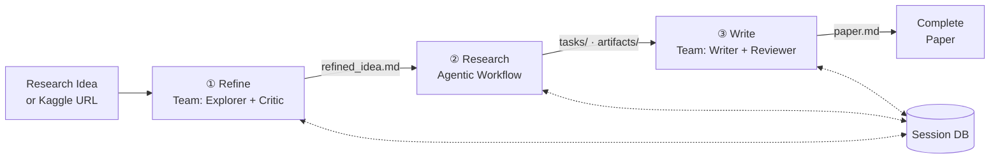
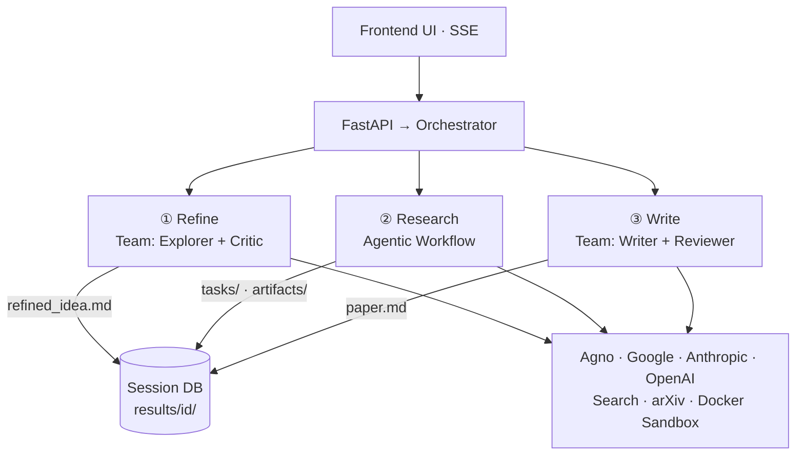

# MAARS

[中文](README_CN.md) | English

**Multi-Agent Automated Research System** — From one idea to a full research paper, fully automated.

MAARS is a hybrid multi-agent research system. Give it a research idea or a Kaggle competition URL, and it will refine the problem, decompose it into executable tasks, run experiments in a Docker sandbox, iterate based on results, and produce a complete paper — all autonomously.

## Demo

Input an idea, watch it think:

```
"Benchmark numerical ODE solvers across stiffness regimes —
 compare explicit vs implicit methods on efficiency-accuracy tradeoffs"
```

MAARS will autonomously: search literature → define methodology → write & execute benchmark code → generate plots → evaluate results → iterate → write a full paper with embedded figures.

## Architecture

### Data Flow



### System Architecture



The core design principle: **deterministic control stays in the runtime; open-ended execution goes to agents.**

MAARS is a **hybrid multi-agent system**: Refine and Write use Agno Team coordinate mode (multi-agent collaboration), while Research uses a runtime-controlled agentic workflow. The three stages communicate only through the file-based session DB — they are fully decoupled.

If you think in terms of [harness engineering](https://openai.com/index/harness-engineering/) (OpenAI, 2026), MAARS applies the same ideas — externalized state, tool boundaries, verification loops, feedback cycles — but at the **research-task level** rather than the repo-level scope OpenAI describes.

| Stage | Mode | What it does |
|-------|------|-------------|
| **Refine** | Multi-Agent Team | Explorer surveys literature + Critic challenges novelty/feasibility → refined proposal |
| **Research** | Agentic Workflow | Runtime-controlled: calibrate → strategy → decompose → execute → verify → evaluate → replan |
| **Write** | Multi-Agent Team | Writer produces draft + Reviewer gives feedback → revised paper |

## Research Pipeline Detail

The Research stage is where the real work happens. It runs as an **agentic workflow runtime** with feedback loops:

```
refined_idea.md
  ↓
Calibrate → Agent self-assesses what "atomic task" means for this domain
Strategy  → Agent researches best approaches, techniques, baselines
Decompose → Recursively break into atomic tasks with dependency DAG
  ↓
┌─ Execute  → Run tasks in topological batches (parallel where possible)
│  Verify   → Score each result: pass / fail+retry / redecompose
│  Evaluate → Compare scores across iterations, decide if improvement plateaued
│  Replan   → Add new tasks based on evaluation feedback
└─ Loop until: iteration limit OR score plateau (<0.5% improvement)
  ↓
Task outputs + artifacts ready for Write stage
```

Key capabilities:
- **Docker sandbox execution** — real code runs in isolated containers with pre-loaded ML stack
- **DAG scheduling** — tasks respect dependency order, parallelize where safe
- **Automatic redecomposition** — if a task is too complex, it splits into subtasks
- **Iteration with scoring** — tracks `best_score.json` across rounds, stops when improvement plateaus
- **Checkpoint/resume** — pause mid-run, resume later with all state preserved

## Kaggle Mode

Paste a Kaggle competition URL instead of a research idea:

```
https://www.kaggle.com/competitions/titanic
```

MAARS will automatically: fetch competition metadata → download dataset → build a context-rich research proposal → skip Refine → jump straight to Research with data mounted at `/workspace/data/`.

## Quick Start

### One-click (recommended)

```bash
# Windows — double-click start.bat, or:
start.bat

# Linux / macOS / Git Bash:
bash start.sh
```

The script handles everything: dependency install, `.env` check, Docker image build, server start, and opens your browser.

### Manual

```bash
git clone https://github.com/anthropics/MAARS.git && cd MAARS
pip install -r requirements.txt
cp .env.example .env          # add your API key
docker build -f Dockerfile.sandbox -t maars-sandbox:latest .   # optional, for code execution
uvicorn backend.main:app --host 0.0.0.0 --port 8000
# Open http://localhost:8000
```

## Configuration

All settings use the `MAARS_` prefix. Copy `.env.example` to `.env` and configure:

```env
# Choose provider: google (default), anthropic, or openai
MAARS_MODEL_PROVIDER=google

# Only the active provider's key is required
MAARS_GOOGLE_API_KEY=your-key
MAARS_GOOGLE_MODEL=gemini-2.5-flash

# MAARS_ANTHROPIC_API_KEY=your-key
# MAARS_ANTHROPIC_MODEL=claude-sonnet-4-5-20250514

# MAARS_OPENAI_API_KEY=your-key
# MAARS_OPENAI_MODEL=gpt-4o
```

| Setting | Default | Description |
|---------|---------|-------------|
| `MAARS_MODEL_PROVIDER` | `google` | LLM provider: `google`, `anthropic`, or `openai` |
| `MAARS_RESEARCH_MAX_ITERATIONS` | `3` | Max evaluation loops (1 = no iteration) |
| `MAARS_DOCKER_SANDBOX_TIMEOUT` | `600` | Per-container timeout in seconds |
| `MAARS_DOCKER_SANDBOX_MEMORY` | `4g` | Memory limit per container |
| `MAARS_DOCKER_SANDBOX_CONCURRENCY` | `2` | Max parallel containers (and parallel tasks) |
| `MAARS_KAGGLE_API_TOKEN` | — | Kaggle API token (or use `~/.kaggle/kaggle.json`) |

## Output Structure

Each run creates a timestamped session folder:

```
results/{timestamp}-{slug}/
├── idea.md                  # Original input
├── refined_idea.md          # Refined research proposal
├── calibration.md           # Atomic task definition
├── strategy.md              # Research strategy
├── plan_list.json           # Flat task list (execution view)
├── plan_tree.json           # Hierarchical decomposition tree
├── tasks/                   # Individual task outputs (markdown)
├── artifacts/               # Code scripts, plots, CSVs, models
│   ├── {task_id}/           # Per-task working directory
│   └── best_score.json      # Global best score tracker
├── evaluations/             # Iteration evaluation results
│   ├── eval_v0.json
│   └── eval_v1.json
├── paper.md                 # Final research paper
└── reproduce/               # Auto-generated reproduction files
    ├── Dockerfile
    ├── run.sh
    └── docker-compose.yml
```

## Frontend

The web UI provides real-time observability via SSE:

- **Progress bar** — 7-stage pipeline visualization (Refine → Calibrate → Strategy → Decompose → Execute → Evaluate → Write)
- **Command palette** (Ctrl+K) — start, pause, resume pipeline
- **Reasoning log** — live-streamed LLM reasoning, tool calls, and results
- **Process viewer** — task tree, execution batches, artifacts, documents
- **Docker status** — sandbox connectivity indicator

## Tech Stack

| Component | Technology |
|-----------|-----------|
| Backend | FastAPI, Python async |
| Agent framework | Agno (Team coordinate mode + single-client workflow) |
| LLM providers | Google Gemini, Anthropic Claude, OpenAI GPT |
| Code execution | Docker containers (Python 3.12 + ML stack) |
| Frontend | Vanilla JS, SSE, no build step |
| Storage | File-based session DB |
| Search tools | DuckDuckGo, arXiv, Wikipedia |

## Documentation

| Doc | Content |
|-----|---------|
| [Architecture Design (CN)](docs/CN/architecture.md) | System design rationale and evolution strategy |

## Community

[Contributing](.github/CONTRIBUTING.md) · [Code of Conduct](.github/CODE_OF_CONDUCT.md) · [Security](.github/SECURITY.md)

## License

MIT
