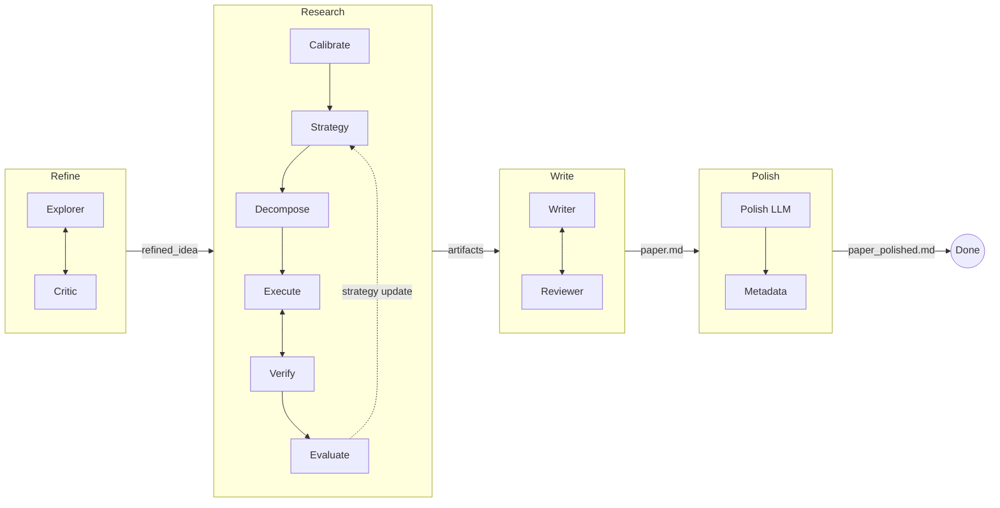

<p align="center">
  <h1 align="center">MAARS</h1>
  <p align="center"><b>Multi-Agent Automated Research System</b></p>
  <p align="center">From a research idea to a written paper — fully automated, end-to-end.</p>
  <p align="center">
    <a href="README_CN.md">中文</a> · English
  </p>
</p>

---

MAARS takes a vague research idea (or a Kaggle competition URL) and produces structured research artifacts and a polished paper through a four-stage pipeline: **Refine → Research → Write → Polish**.

Each stage is orchestrated by Python runtime with LLM agents executing the open-ended work — literature surveys, code experiments, paper writing, and peer review — all running autonomously with iterative self-improvement.

<p align="center">
  <video src="https://github.com/dozybot001/MAARS/raw/main/showcase/20260416-230413-lorenz-4-scipyintegratesolveivp-rk45-lorenz/demo.mp4" width="720" controls></video>
</p>

## Pipeline



- **Refine**: Explorer surveys literature and drafts a proposal; Critic reviews within declared scope. Iterates until zero issues remain.
- **Research**: Decomposes the proposal into atomic tasks, executes them in Docker sandboxes with parallel scheduling, verifies outputs, and evaluates results — looping with strategy updates when critical gaps exist.
- **Write**: Writer reads all research outputs and produces a complete paper; Reviewer critiques and drives revisions until zero issues remain.
- **Polish**: Single-pass LLM refinement for prose quality, plus a deterministic execution metadata appendix.

## Quick Start

**Requirements:** Python 3.10+, Docker running, a [Gemini API key](https://aistudio.google.com/apikey)

```bash
git clone https://github.com/dozybot001/MAARS.git && cd MAARS
bash start.sh
```

On Windows, use **Git Bash** (Git for Windows) in the project folder and run the same `bash start.sh`.

On first run, `start.sh` will:
1. Create a virtual environment and install dependencies
2. Generate `.env` from `.env.example` — fill in your `MAARS_GOOGLE_API_KEY`
3. Build the Docker sandbox image
4. Start the server at **http://localhost:8000**

<p align="center"></p>

Then paste your research idea, a Kaggle URL, or a UTF-8 text/markdown file path into the input box and press Enter.

<p align="center"></p>

## Kaggle Mode

Paste a Kaggle competition URL — MAARS auto-extracts the competition ID, downloads data, and skips the Refine stage.

## Configuration

All variables use the `MAARS_` prefix in `.env`:

| Variable | Default | Purpose |
|----------|---------|---------|
| `MAARS_GOOGLE_API_KEY` | — | **Required.** Gemini API key |
| `MAARS_GOOGLE_MODEL` | `gemini-3-flash-preview` | Default LLM model ID for all stages |
| `MAARS_REFINE_MODEL` | — | Optional override for the `refine` stage model |
| `MAARS_RESEARCH_MODEL` | — | Optional override for the `research` stage model |
| `MAARS_WRITE_MODEL` | — | Optional override for the `write` stage model |
| `MAARS_POLISH_MODEL` | — | Optional override for the `polish` stage (falls back to write model) |
| `MAARS_API_CONCURRENCY` | `1` | Max concurrent LLM requests |
| `MAARS_API_REQUEST_INTERVAL` | `0` | Min seconds between LLM calls (set 1-2 for free-tier rate limits) |
| `MAARS_OUTPUT_LANGUAGE` | `Chinese` | Prompt/output language (`Chinese` or `English`) |
| `MAARS_RESEARCH_MAX_ITERATIONS` | `3` | Max research evaluation rounds |
| `MAARS_TEAM_MAX_DELEGATIONS` | `5` | Max Refine/Write iteration rounds |
| `MAARS_KAGGLE_API_TOKEN` | — | Optional; `~/.kaggle/kaggle.json` also works |
| `MAARS_DATASET_DIR` | `data/` | Dataset directory mounted into sandbox |
| `MAARS_DOCKER_SANDBOX_IMAGE` | `maars-sandbox:latest` | Docker image for code execution |
| `MAARS_DOCKER_SANDBOX_TIMEOUT` | `600` | Per-container timeout (seconds) |
| `MAARS_DOCKER_SANDBOX_MEMORY` | `4g` | Container memory limit |
| `MAARS_DOCKER_SANDBOX_CPU` | `1.0` | Container CPU quota |
| `MAARS_DOCKER_SANDBOX_NETWORK` | `true` | Network access inside sandbox |
| `MAARS_DOCKER_SANDBOX_GPU` | `false` | GPU passthrough (requires NVIDIA Container Toolkit) |

## GPU Support

Deep learning tasks (PyTorch training, etc.) benefit significantly from GPU acceleration. To enable GPU support:

**1. Install NVIDIA Container Toolkit** (one-time setup, Ubuntu):

```bash
curl -fsSL https://nvidia.github.io/libnvidia-container/gpgkey | sudo gpg --dearmor -o /usr/share/keyrings/nvidia-container-toolkit-keyring.gpg
curl -s -L https://nvidia.github.io/libnvidia-container/stable/deb/nvidia-container-toolkit.list | \
  sed 's#deb https://#deb [signed-by=/usr/share/keyrings/nvidia-container-toolkit-keyring.gpg] https://#g' | \
  sudo tee /etc/apt/sources.list.d/nvidia-container-toolkit.list
sudo apt-get update && sudo apt-get install -y nvidia-container-toolkit
sudo nvidia-ctk runtime configure --runtime=docker
sudo systemctl restart docker
```

**2. Verify** the GPU is visible to Docker:

```bash
docker run --rm --gpus all nvidia/cuda:12.8.0-runtime-ubuntu24.04 nvidia-smi
```

**3. Enable** in `.env`:

```env
MAARS_DOCKER_SANDBOX_GPU=true
MAARS_DOCKER_SANDBOX_TIMEOUT=1800
MAARS_DOCKER_SANDBOX_MEMORY=16g
MAARS_DOCKER_SANDBOX_CPU=4.0
```

`start.sh` will automatically detect GPU availability on startup.

## Output Structure

Each run produces a session directory:

```
results/{session}/
├── idea.md                     # User raw input
├── refined_idea.md             # Refine final output
├── proposals/                  # Refine: Explorer draft versions
│   └── round_N.md
├── critiques/                  # Refine: Critic reviews
│   ├── round_N.md
│   └── round_N.json
├── calibration.md              # Research: atomic task definition
├── strategy/                   # Research: strategy versions
│   └── round_N.md
├── plan_tree.json              # Research: decomposition tree
├── plan_list.json              # Research: flat task list
├── tasks/                      # Research: task outputs
│   └── {id}.md
├── artifacts/                  # Research: code, figures, data
│   └── {id}/
├── evaluations/                # Research: evaluation versions
│   ├── round_N.json
│   └── round_N.md
├── drafts/                     # Write: Writer draft versions
│   └── round_N.md
├── reviews/                    # Write: Reviewer reviews
│   ├── round_N.md
│   └── round_N.json
├── paper.md                    # Write final output
├── paper_polished.md           # Polish final output (with metadata appendix)
├── meta.json                   # Metadata (tokens, score)
├── log.jsonl                   # Streaming chunk log
├── execution_log.jsonl         # Docker execution log
└── reproduce/                  # Reproduction files
    ├── Dockerfile
    ├── run.sh
    └── docker-compose.yml
```

## Documentation

| Document | Description |
|----------|-------------|
| [Architecture](docs/EN/architecture.md) | System overview, SSE protocol, storage layout |
| [Refine & Write](docs/EN/refine-write.md) | IterationState pattern, Multi-Agent loop details |
| [Research](docs/EN/research.md) | Task decomposition, parallel execution, evaluation loop |

## Tech Stack

- **Backend**: Python, FastAPI, Agno (agent framework), Gemini (with native Google Search)
- **Frontend**: Vanilla JS, SSE streaming, marked.js for markdown
- **Execution**: Docker sandboxes with configurable resource limits
- **Storage**: File-based session DB (JSON + Markdown)

## Community

[Contributing](.github/CONTRIBUTING.md) · [Code of Conduct](.github/CODE_OF_CONDUCT.md) · [Security](.github/SECURITY.md)

## License

MIT
