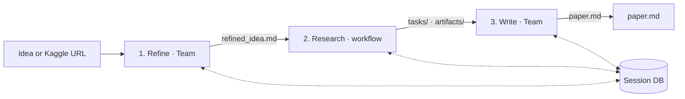

# MAARS

[中文](README_CN.md) | English

**Multi-Agent Automated Research System** — from a research idea (or a Kaggle competition) to a structured session with tasks, artifacts, and a written `paper.md`, orchestrated end-to-end.

## What it does

- **Refine** (Agno Team): shapes the input into a concrete research proposal (`refined_idea.md`).
- **Research** (runtime-driven workflow + Agno Agent): calibrate → strategy → decompose → execute ⇄ verify → evaluate; state and outputs live under `results/<session>/`.
- **Write** (Agno Team): turns research artifacts into `paper.md`.
- **Sandbox**: task code runs in Docker (`Dockerfile.sandbox`) when available; tools include search, arXiv, Wikipedia, and Kaggle dataset fetch for competition URLs.

Runtime keeps control flow, retries, and iteration caps; agents handle open-ended reasoning and coding. Stages only talk through the **file-based session DB** (`results/...`).

## Quick start

**Requirements:** Python **3.10+**, optional **Docker** for code execution.

### Recommended

```bash
bash start.sh
```

Creates `.venv`, installs dependencies, syncs `.env` keys from `.env.example`, optionally builds the sandbox image, starts **uvicorn with reload** on `MAARS_SERVER_PORT` (default **8000**), and opens the UI.

### Manual

```bash
git clone https://github.com/dozybot001/MAARS.git && cd MAARS
python3 -m venv .venv && source .venv/bin/activate   # Windows: .venv\Scripts\activate
pip install -r requirements.txt
cp .env.example .env   # set MAARS_GOOGLE_API_KEY
docker build -f Dockerfile.sandbox -t maars-sandbox:latest .   # optional
uvicorn backend.main:app --host 0.0.0.0 --port 8000
# http://localhost:8000
```

## Configuration

Copy `.env.example` → `.env`. All variables use the `MAARS_` prefix (see `backend/config.py`).

| Variable | Default | Purpose |
|----------|---------|---------|
| `MAARS_GOOGLE_API_KEY` | — | **Required.** Gemini API key (also sets `GOOGLE_API_KEY` for SDKs). |
| `MAARS_GOOGLE_MODEL` | `gemini-3-flash-preview` | Model id passed to Agno. |
| `MAARS_API_CONCURRENCY` | `1` | Max concurrent LLM requests. |
| `MAARS_OUTPUT_LANGUAGE` | `Chinese` | Prompt/output language bundle. |
| `MAARS_RESEARCH_MAX_ITERATIONS` | `3` | Max **evaluation rounds** (each round: strategy → decompose → execute → evaluate). Loop may stop earlier if Evaluate returns no `strategy_update`. |
| `MAARS_KAGGLE_API_TOKEN` | — | Optional; `~/.kaggle/kaggle.json` also works. |
| `MAARS_KAGGLE_COMPETITION_ID` | — | Usually set automatically when using a competition URL. |
| `MAARS_DATASET_DIR` | — | Set by Kaggle fetch for the active session. |
| `MAARS_DOCKER_SANDBOX_IMAGE` | `maars-sandbox:latest` | Image for `code_execute` / sandbox tools. |
| `MAARS_DOCKER_SANDBOX_TIMEOUT` | `600` | Per-container timeout (seconds). |
| `MAARS_DOCKER_SANDBOX_MEMORY` | `4g` | Memory limit (e.g. `512m`, `4g`). |
| `MAARS_DOCKER_SANDBOX_CPU` | `1.0` | CPU quota. |
| `MAARS_DOCKER_SANDBOX_NETWORK` | `true` | Network inside sandbox. |
| `MAARS_SERVER_PORT` | `8000` | Used by `start.sh` only. |

## Architecture (overview)

### Pipeline



### Stages

| Stage | Mechanism | Role |
|-------|-----------|------|
| **Refine** | Agno Team (Explorer + Critic) | Literature-aware refinement → `refined_idea.md` |
| **Research** | Workflow in `ResearchStage` + Agno Agent | Calibrate → strategy → decompose → execute ⇄ verify → evaluate; optional multi-round via `strategy_update` |
| **Write** | Agno Team (Writer + Reviewer) | Final `paper.md` |

### Class shape

```
Stage                    — lifecycle, unified SSE (_send), LLM streaming
├── ResearchStage        — agentic workflow (Agno Agent)
└── TeamStage            — Agno Team coordinate
    ├── RefineStage
    └── WriteStage
```

### Research loop (accurate)

Each **round**: Strategy → Decompose → Execute (batches, Docker when used) → Verify → **Evaluate**. The loop continues to the next round only if the evaluation JSON includes a non-empty **`strategy_update`**, and the round count stays within **`MAARS_RESEARCH_MAX_ITERATIONS`**. Scores can be tracked under `artifacts/` (e.g. `best_score.json` promotion from per-task outputs).

Details: [docs/CN/architecture.md](docs/CN/architecture.md).

## Kaggle mode

If the input contains a `kaggle.com/competitions/<id>` URL, the app fetches competition metadata, downloads data (Kaggle API / token), builds a rich prompt into `refined_idea.md`, **marks Refine complete**, and starts from **Research**.

## Session output

Each run uses a folder like `results/<timestamp>-<slug>/` (see `ResearchDB` in `backend/db.py`):

```
results/<session>/
├── idea.md
├── refined_idea.md
├── calibration.md
├── strategy/
│   └── round_<n>.md
├── plan_tree.json              # source of truth for the plan
├── plan_list.json              # derived flat task list
├── tasks/
├── artifacts/
│   ├── <task_id>/              # per-task workspace
│   ├── best_score.json         # session-level best (when promoted)
│   └── latest_score.json
├── evaluations/
│   ├── round_<n>.json
│   └── round_<n>.md
├── paper.md
├── meta.json
├── log.jsonl
├── execution_log.jsonl
└── reproduce/
```

## Web UI

Single-page app (static assets under `frontend/`), **SSE** for live logs and phase updates; the UI treats the session folder as the source of truth after “done” events. Command palette (**Cmd/Ctrl+K**) for pipeline control.

## Tech stack

| Layer | Stack |
|-------|--------|
| API | FastAPI, uvicorn |
| Agents | Agno (Team + Agent), Google Gemini |
| Tools | Docker sandbox, ddgs / arXiv / Wikipedia, Kaggle API |
| Storage | File-based session DB under `results/` |

## Documentation

| Doc | Description |
|-----|-------------|
| [Architecture (CN)](docs/CN/architecture.md) | Boundaries, Research stages, SSE, on-disk layout |

## Community

[Contributing](.github/CONTRIBUTING.md) · [Code of Conduct](.github/CODE_OF_CONDUCT.md) · [Security](.github/SECURITY.md)

## License

MIT
