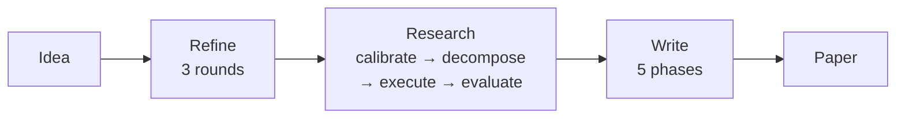
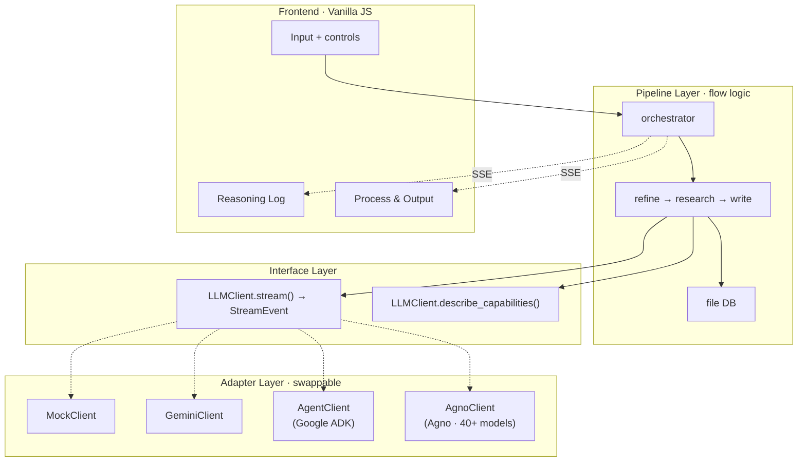

# MAARS

[中文](README_CN.md) | English

**Multi-Agent Automated Research System** — From one idea to a full research paper, fully automated.

## Pipeline

Three stages. Every mode runs the same pipeline — modes only swap the engine underneath.



| Stage | What it does |
|-------|-------------|
| **Refine** | Explore → Evaluate → Crystallize. Turns a vague idea into a structured research proposal |
| **Research** | Calibrate capability → recursive decompose → parallel execute with verify (pass / retry / redecompose) → evaluate. Iterates until satisfied |
| **Write** | Outline → Sections → Structure review → Style polish → Format check. Each section receives only its relevant task outputs |

## Modes

`.env` one-line switch:

```env
MAARS_LLM_MODE=mock      # or gemini, adk, or agno
MAARS_GOOGLE_API_KEY=your-key
```

Modes replace the engine, not the pipeline logic:

| Stage | Mock | Gemini | ADK | Agno |
|-------|------|--------|-----|------|
| **Refine** | replay | GeminiClient (3 rounds) | AgentClient + google_search (1 session) | AgnoClient + DuckDuckGo + arXiv (1 session) |
| **Research** | replay | GeminiClient (parallel calls) | AgentClient + search + code_execute + DB (parallel agent sessions) | AgnoClient + DuckDuckGo + arXiv + code + DB (parallel agent sessions) |
| **Write** | replay | GeminiClient (5 phases) | AgentClient + search + DB (1 session) | AgnoClient + DuckDuckGo + arXiv + DB (1 session) |

> All modes use the same pipeline stages. Only the `LLMClient` implementation differs.
> ADK uses Google ADK framework (Gemini-only). Agno uses Agno framework (40+ model providers).

## Architecture

Three-layer decoupling — pipeline depends on an interface, adapters implement it:



See [docs/EN/architecture.md](docs/EN/architecture.md) for detailed data flow and design principles.

## Quick start

```bash
git clone https://github.com/dozybot001/MAARS.git && cd MAARS
python3 -m venv .venv && source .venv/bin/activate
pip install -r requirements.txt
cp .env.example .env  # add your API key
uvicorn backend.main:app --host 0.0.0.0 --port 8000
# Open http://localhost:8000
```

## Output

Each run creates a timestamped folder:

```
results/{timestamp}-{slug}/
├── idea.md           # Input
├── refined_idea.md   # Refine output
├── plan.json         # Flat atomic task list
├── plan_tree.json    # Decomposition tree
├── tasks/            # Individual task outputs
├── artifacts/        # Code scripts + experiment outputs (Agent mode)
├── evaluations/      # Iteration evaluations (if multi-iteration)
├── paper.md          # Final paper
├── Dockerfile.experiment  # Auto-generated Docker reproduction
├── run.sh            # Experiment runner script
└── docker-compose.yml
```

## Documentation

| Doc | Content |
|-----|---------|
| [Architecture (EN)](docs/EN/architecture.md) | Three-layer design, data flow, mode comparison |
| [Architecture (CN)](docs/CN/architecture.md) | 同上，中文版 |
| [Research Workflow (CN)](docs/CN/research-workflow.md) | Calibrate → Decompose → Execute → Verify → Redecompose → Evaluate |
| [Prompt Engineering (CN)](docs/CN/prompt-engineering.md) | All prompts, modification guide |
| [Code Smells (CN)](docs/CN/code-smells.md) | Known issues and fix priorities |

## Community

[Contributing](.github/CONTRIBUTING.md) · [Code of Conduct](.github/CODE_OF_CONDUCT.md) · [Security](.github/SECURITY.md)

## License

MIT
