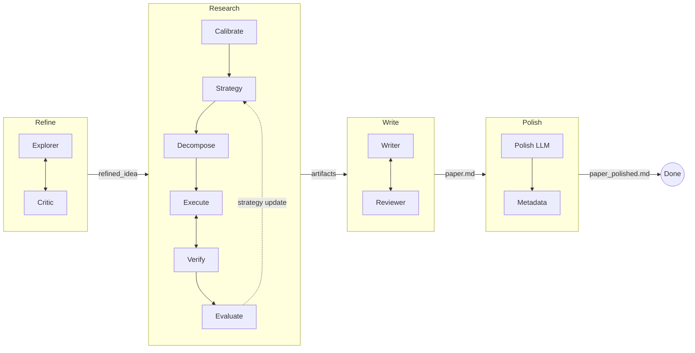

<p align="center">
  <h1 align="center">MAARS</h1>
  <p align="center"><b>Multi-Agent Automated Research System</b></p>
  <p align="center">From a research idea to a written paper — fully automated, end-to-end.</p>
  <p align="center">
    <a href="README_CN.md">中文</a> · English · <a href="https://dozybot001.github.io/MAARS/">Website</a>
  </p>
</p>

---

MAARS takes a vague research idea (or a Kaggle competition URL) and produces structured research artifacts and a polished paper through a four-stage pipeline: **Refine → Research → Write → Polish**.

Each stage is orchestrated by Python runtime with LLM agents executing the open-ended work — literature surveys, code experiments, paper writing, and peer review — all running autonomously with iterative self-improvement.

<p align="center">
  <video src="https://github.com/user-attachments/assets/f0d8ef94-c98e-4666-8dec-85e1332dc2df" width="720" controls></video>
</p>

## Pipeline



- **Refine**: Explorer surveys literature and drafts a proposal; Critic reviews within declared scope. Iterates until zero issues remain.
- **Research**: Decomposes the proposal into atomic tasks, executes them in a persistent Docker sandbox with parallel scheduling, verifies outputs, and evaluates results — looping with strategy updates when critical gaps exist.
- **Write**: Writer reads all research outputs and produces a complete paper; Reviewer critiques and drives revisions until zero issues remain.
- **Polish**: Single-pass LLM refinement for prose quality, plus a deterministic execution metadata appendix.

## Quick Start

**Requirements:** Python 3.10+, Docker running, a [Gemini API key](https://aistudio.google.com/apikey)

```bash
git clone https://github.com/dozybot001/MAARS.git && cd MAARS
bash start.sh
```

On Windows, use **Git Bash** (Git for Windows) in the project folder and run the same `bash start.sh`.

On first run, `start.sh` will:
1. Create a virtual environment and install dependencies
2. Generate `.env` from `.env.example` — fill in your `MAARS_GOOGLE_API_KEY`
3. Build the Docker sandbox image
4. Start the server at **http://localhost:8000**

Then paste your research idea, a Kaggle URL, or a UTF-8 text/markdown file path into the input box and press Enter. Pasting a Kaggle competition URL skips Refine and downloads the dataset automatically.

## Configuration

Key variables in `.env` (full list in `.env.example`):

| Variable | Default | Purpose |
|----------|---------|---------|
| `MAARS_GOOGLE_API_KEY` | — | **Required.** Gemini API key |
| `MAARS_GOOGLE_MODEL` | `gemini-3-flash-preview` | LLM model for all stages |
| `MAARS_OUTPUT_LANGUAGE` | `Chinese` | Prompt/output language (`Chinese` or `English`) |
| `MAARS_API_CONCURRENCY` | `1` | Max concurrent LLM requests |
| `MAARS_API_REQUEST_INTERVAL` | `0` | Min seconds between LLM calls (set `1`–`2` for free-tier) |

## Documentation

Full documentation and architecture details at **[dozybot001.github.io/MAARS](https://dozybot001.github.io/MAARS/)**.

## Community

[Contributing](.github/CONTRIBUTING.md) · [Code of Conduct](.github/CODE_OF_CONDUCT.md) · [Security](.github/SECURITY.md)

## License

MIT
