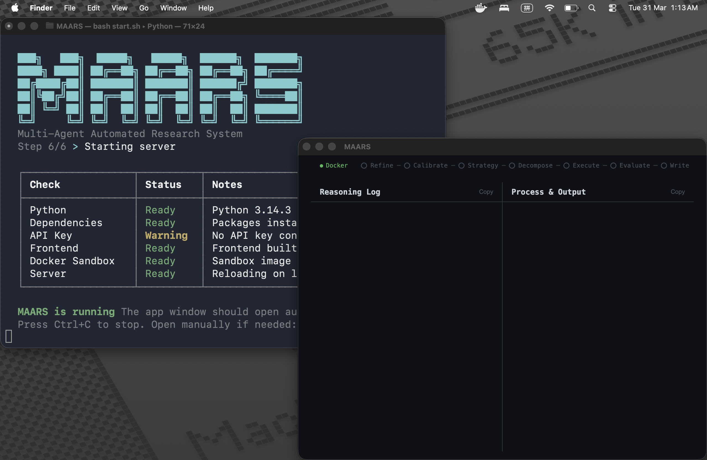
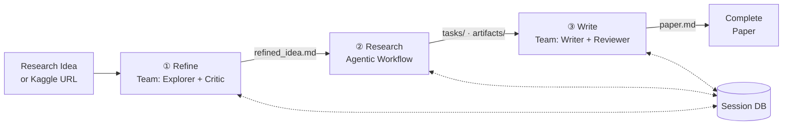

# MAARS

[中文](README_CN.md) | English

**Multi-Agent Automated Research System** — From one idea to a full research paper, fully automated.

MAARS is a hybrid multi-agent research system. Give it a research idea or a Kaggle competition URL, and it will refine the problem, decompose it into executable tasks, run experiments in a Docker sandbox, iterate based on results, and produce a complete paper — all autonomously.

## Quick Start



```bash
# Linux / macOS / Windows (Git Bash):
bash start.sh
```

Automatically installs dependencies, checks `.env` (and creates it if missing), builds the Docker image (and prompts you to press Enter to install Docker Desktop if needed), starts the server, and opens the browser. All you need: `Ctrl/CMD + K` -> type... -> Enter。

## Architecture

### Data Flow



### System Architecture


The core design principle: **deterministic control stays in the runtime; open-ended execution goes to agents.**

MAARS is a **hybrid multi-agent system**: Refine and Write use Agno Team coordinate mode (multi-agent collaboration), while Research uses a runtime-controlled agentic workflow. The three stages communicate only through the file-based session DB — they are fully decoupled.

| Stage | Mode | What it does |
|-------|------|-------------|
| **Refine** | Multi-Agent Team | Explorer surveys literature + Critic challenges novelty/feasibility → refined proposal |
| **Research** | Agentic Workflow | Runtime-controlled: calibrate → strategy → decompose → execute → verify → evaluate → replan |
| **Write** | Multi-Agent Team | Writer produces draft + Reviewer gives feedback → revised paper |

## Research Pipeline Detail

The Research stage is where the real work happens. It runs as an **agentic workflow runtime** with feedback loops:

```
refined_idea.md
  ↓
Calibrate → Agent self-assesses what "atomic task" means for this domain
Strategy  → Agent researches best approaches, techniques, baselines
Decompose → Recursively break into atomic tasks with dependency DAG
  ↓
┌─ Execute  → Run tasks in topological batches (parallel where possible)
│  Verify   → Score each result: pass / fail+retry / redecompose
│  Evaluate → Compare scores across iterations, decide if improvement plateaued
│  Replan   → Add new tasks based on evaluation feedback
└─ Loop until: iteration limit OR score plateau (<0.5% improvement)
  ↓
Task outputs + artifacts ready for Write stage
```

Key capabilities:
- **Docker sandbox execution** — real code runs in isolated containers with pre-loaded ML stack
- **DAG scheduling** — tasks respect dependency order, parallelize where safe
- **Automatic redecomposition** — if a task is too complex, it splits into subtasks
- **Iteration with scoring** — tracks scores across rounds, stops when improvement plateaus
- **Checkpoint/resume** — pause mid-run, resume later with all state preserved

## Kaggle Mode

Paste a Kaggle competition URL instead of a research idea:

```
https://www.kaggle.com/competitions/titanic
```

MAARS will automatically: fetch competition metadata → download dataset → build a context-rich research proposal → skip Refine → jump straight to Research with data mounted at `/workspace/data/`.

For the complete configuration reference, see [.env.example](.env.example). You can copy it to `.env` manually, or just run `bash start.sh` and let the startup script create `.env` automatically when missing. It is the single source of truth for supported `MAARS_` settings.

## Output Structure

Each run creates a timestamped session folder:

```
results/{timestamp}-{slug}/
├── idea.md                  # Original input
├── refined_idea.md          # Refined research proposal
├── calibration.md           # Atomic task definition
├── strategy.md              # Research strategy
├── plan_list.json           # Flat task list (execution view)
├── plan_tree.json           # Hierarchical decomposition tree
├── tasks/                   # Individual task outputs (markdown)
├── artifacts/               # Code scripts, plots, CSVs, models
│   ├── {task_id}/           # Per-task working directory
│   ├── latest_score.json    # Most recent score
│   └── best_score.json      # Global best score tracker
├── evaluations/             # Iteration evaluation results
├── paper.md                 # Final research paper
├── log.jsonl                # Append-only SSE event log (replayable)
└── reproduce/               # Auto-generated reproduction files
    ├── Dockerfile
    ├── run.sh
    └── docker-compose.yml
```

## Frontend

The web UI is built with Vue 3 + Pinia + Vite, providing real-time observability via SSE:

- **Progress bar** — 7-stage pipeline visualization (Refine → Calibrate → Strategy → Decompose → Execute → Evaluate → Write)
- **Command palette** (Ctrl+K) — start, pause, resume pipeline
- **Reasoning log** — live-streamed LLM reasoning, tool calls, and results
- **Process viewer** — task decomposition tree, execution batches, artifacts, documents
- **Session drawer** — browse, restore, and delete past sessions
- **Docker status** — sandbox connectivity indicator

## Tech Stack

| Component | Technology |
|-----------|-----------|
| Backend | FastAPI, Python async |
| Agent framework | Agno (Team coordinate mode + single-client agentic workflow) |
| LLM providers | Google Gemini, Anthropic Claude, OpenAI GPT |
| Code execution | Docker containers (Python 3.12 + ML stack) |
| Frontend | Vue 3, Pinia, Vite |
| Communication | SSE (Server-Sent Events) with Authorization header |
| Storage | File-based session DB |
| Search tools | DuckDuckGo, arXiv, Wikipedia |
| CI | GitHub Actions (Python lint + test, frontend build) |

## Documentation

| Doc | Content |
|-----|---------|
| [Architecture Design (CN)](docs/CN/architecture.md) | System design rationale and architectural decisions |
| [Roadmap](docs/ROADMAP.md) | Prioritized improvement items and status |

## Community

[Contributing](.github/CONTRIBUTING.md) · [Code of Conduct](.github/CODE_OF_CONDUCT.md) · [Security](.github/SECURITY.md)

## License

MIT
