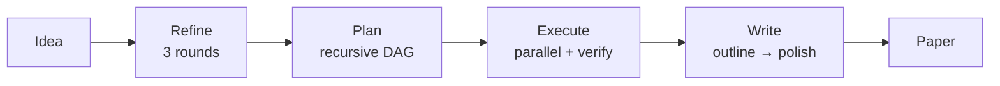
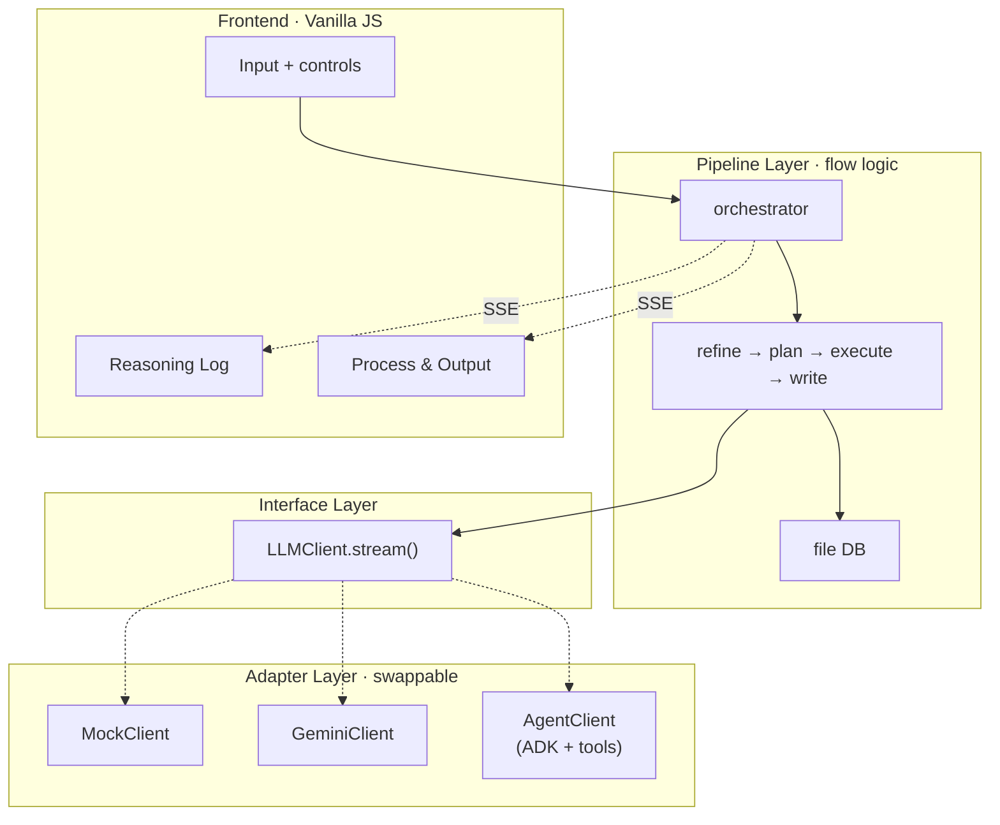

# MAARS

[中文](README_CN.md) | English

**Multi-Agent Automated Research System** — From one idea to a full research paper, fully automated.

## Pipeline

Four fixed stages. Every mode runs the same pipeline — modes only swap the engine underneath.



| Stage | What it does |
|-------|-------------|
| **Refine** | Explore → Evaluate → Crystallize. Turns a vague idea into a structured research proposal |
| **Plan** | Recursive decomposition into atomic tasks with dependency DAG (depth 3, batch-parallel) |
| **Execute** | Topological sort → parallel batch execution → verification → retry. Results stored in file DB |
| **Write** | Outline → section-by-section writing → polish. Each section receives only its relevant task outputs |

## Modes

`.env` one-line switch:

```env
MAARS_LLM_MODE=mock      # or gemini, adk, or agno
MAARS_GOOGLE_API_KEY=your-key
```

Modes replace the engine at each stage, not the pipeline logic:

| Stage | Mock | Gemini | Agent |
|-------|------|--------|-------|
| **Refine** | replay | GeminiClient | AgentClient + search tools |
| **Plan** | replay | GeminiClient | AgentClient (no tools) |
| **Execute** | replay | GeminiClient | AgentClient + search + code + DB tools |
| **Write** | replay | GeminiClient | AgentClient + search + DB tools |

> All three modes use the same pipeline stages. Only the `LLMClient` implementation differs.

## Architecture

Three-layer decoupling — pipeline depends on an interface, adapters implement it:



See [docs/CN/architecture.md](docs/CN/architecture.md) for detailed data flow and design principles.

## Quick start

```bash
git clone https://github.com/dozybot001/MAARS.git && cd MAARS
python3 -m venv .venv && source .venv/bin/activate
pip install -r requirements.txt
cp .env.example .env  # add your API key
uvicorn backend.main:app --host 0.0.0.0 --port 8000
# Open http://localhost:8000
```

## Output

Each run creates a timestamped folder:

```
research/{timestamp}-{slug}/
├── idea.md           # Input
├── refined_idea.md   # Refine output
├── plan.json         # Flat atomic task list
├── plan_tree.json    # Decomposition tree
├── tasks/            # Individual task outputs
├── artifacts/        # Code scripts + experiment outputs (Agent mode)
├── paper.md          # Final paper
├── Dockerfile.experiment  # Auto-generated Docker reproduction
├── run.sh            # Experiment runner script
└── docker-compose.yml
```

## Showcase

| Run | Mode | Topic | Tasks |
|-----|------|-------|-------|
| `20260325-212700-*` | Agent | ODE Numerical Solvers — accuracy, stability, and computational efficiency | 22 |

## Community

[Contributing](.github/CONTRIBUTING.md) · [Code of Conduct](.github/CODE_OF_CONDUCT.md) · [Security](.github/SECURITY.md)

## License

MIT
