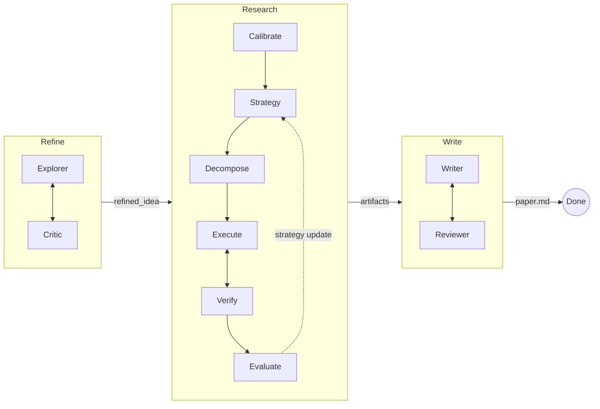

<p align="center">
  <h1 align="center">MAARS</h1>
  <p align="center"><b>Multi-Agent Automated Research System</b></p>
  <p align="center">From a research idea to a written paper — fully automated, end-to-end.</p>
  <p align="center">
    <a href="README_CN.md">中文</a> · English
  </p>
</p>

---

MAARS takes a vague research idea (or a Kaggle competition URL) and produces structured research artifacts and a complete `paper.md` through a three-stage pipeline: **Refine → Research → Write**.

Each stage is orchestrated by Python runtime with LLM agents executing the open-ended work — literature surveys, code experiments, paper writing, and peer review — all running autonomously with iterative self-improvement.

## Pipeline



- **Refine**: Explorer surveys literature and drafts a proposal; Critic reviews and pushes for stronger formulations. Iterates until the Critic is satisfied.
- **Research**: Decomposes the proposal into atomic tasks, executes them in Docker sandboxes with parallel scheduling, verifies outputs, and evaluates results — looping with strategy updates.
- **Write**: Writer reads all research outputs and produces a complete paper; Reviewer critiques and drives revisions.

## Quick Start

**Requirements:** Python 3.10+, Docker running, a [Gemini API key](https://aistudio.google.com/apikey)

```bash
git clone https://github.com/dozybot001/MAARS.git && cd MAARS
bash start.sh
```

On first run, `start.sh` will:
1. Create a virtual environment and install dependencies
2. Generate `.env` from `.env.example` — fill in your `MAARS_GOOGLE_API_KEY`
3. Build the Docker sandbox image
4. Start the server at **http://localhost:8000**

Then paste your research idea or a Kaggle URL into the input box and hit Start.

## Kaggle Mode

Paste a Kaggle competition URL — MAARS auto-extracts the competition ID, downloads data, and skips the Refine stage.

## Configuration

All variables use the `MAARS_` prefix in `.env`:

| Variable | Default | Purpose |
|----------|---------|---------|
| `MAARS_GOOGLE_API_KEY` | — | **Required.** Gemini API key |
| `MAARS_GOOGLE_MODEL` | `gemini-3-flash-preview` | LLM model ID |
| `MAARS_API_CONCURRENCY` | `1` | Max concurrent LLM requests |
| `MAARS_OUTPUT_LANGUAGE` | `Chinese` | Prompt/output language (`Chinese` or `English`) |
| `MAARS_RESEARCH_MAX_ITERATIONS` | `3` | Max research evaluation rounds |
| `MAARS_TEAM_MAX_DELEGATIONS` | `10` | Max Refine/Write iteration rounds |
| `MAARS_KAGGLE_API_TOKEN` | — | Optional; `~/.kaggle/kaggle.json` also works |
| `MAARS_DATASET_DIR` | `data/` | Dataset directory mounted into sandbox |
| `MAARS_DOCKER_SANDBOX_IMAGE` | `maars-sandbox:latest` | Docker image for code execution |
| `MAARS_DOCKER_SANDBOX_TIMEOUT` | `600` | Per-container timeout (seconds) |
| `MAARS_DOCKER_SANDBOX_MEMORY` | `4g` | Container memory limit |
| `MAARS_DOCKER_SANDBOX_CPU` | `1.0` | Container CPU quota |
| `MAARS_DOCKER_SANDBOX_NETWORK` | `true` | Network access inside sandbox |

## Output Structure

Each run produces a session directory:

```
results/{session}/
├── refined_idea.md          # Refine output
├── proposals/               # Refine draft versions
├── critiques/               # Refine review versions
├── calibration.md           # Research: task granularity
├── strategy/                # Research: strategy versions
├── tasks/                   # Research: task outputs
├── artifacts/               # Research: code, figures, data
├── evaluations/             # Research: evaluation versions
├── drafts/                  # Write draft versions
├── reviews/                 # Write review versions
├── paper.md                 # Final paper
└── meta.json                # Token usage, scores
```

## Documentation

| Document | Description |
|----------|-------------|
| [Architecture](docs/EN/architecture.md) | System overview, SSE protocol, storage layout |
| [Refine & Write](docs/EN/refine-write.md) | IterationState pattern, dual-agent loop details |
| [Research](docs/EN/research.md) | Task decomposition, parallel execution, evaluation loop |

## Tech Stack

- **Backend**: Python, FastAPI, Agno (agent framework), Gemini (with native Google Search)
- **Frontend**: Vanilla JS, SSE streaming, marked.js for markdown
- **Execution**: Docker sandboxes with configurable resource limits
- **Storage**: File-based session DB (JSON + Markdown)

## Community

[Contributing](.github/CONTRIBUTING.md) · [Code of Conduct](.github/CODE_OF_CONDUCT.md) · [Security](.github/SECURITY.md)

## License

MIT
