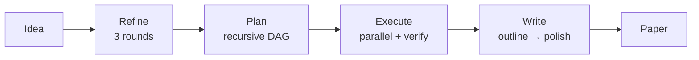
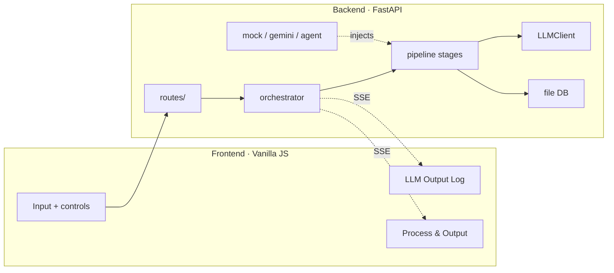

# MAARS

[中文](README_CN.md) | English

**Multi-Agent Automated Research System** — From one idea to a full research paper, fully automated.



## Modes

`.env` one-line switch:

```env
MAARS_LLM_MODE=mock      # or gemini, or agent
MAARS_GOOGLE_API_KEY=your-key
```

| Stage | Gemini | Agent |
|-------|--------|-------|
| **Refine** | 3-round LLM: Explore → Evaluate → Crystallize | ADK Agent + Google Search |
| **Plan** | Recursive decomposition → atomic task DAG (depth 3, batch-parallel) | **Same LLM recursive engine** — not an agent task |
| **Execute** | Topo sort → parallel batches → verify → retry | ADK Agent per task + Google Search → verify → retry |
| **Write** | Outline → section-by-section → polish | ADK Agent + DB tools + Google Search |

> **Why does Agent Plan use the LLM pipeline?** Each decomposition step is a structured JSON judgment (atomic? → yes / no + subtasks). Deterministic LLM calls are faster and more reliable than ReAct loops for this.

Mock mode replays recorded outputs at all stages — for development and UI testing.

## Architecture



| Principle | Detail |
|-----------|--------|
| Three-layer decoupling | `llm/` → `pipeline/` → `mode/` — pipeline never knows which mode is active |
| Unified streaming | Every LLM call emits `call_id`-tagged chunks; frontend routes by `call_id` |
| String in, string out | Stages communicate via `stage.output` — no shared memory |

## Quick start

```bash
git clone https://github.com/dozybot001/MAARS.git && cd MAARS
python3 -m venv .venv && source .venv/bin/activate
pip install -r requirements.txt
cp .env.example .env  # add your API key
uvicorn backend.main:app --host 0.0.0.0 --port 8000
# Open http://localhost:8000
```

## Output

Each run creates a timestamped folder:

```
research/{timestamp}-{slug}/
├── idea.md           # Input
├── refined_idea.md   # Refine output
├── plan.json         # Flat atomic task list
├── plan_tree.json    # Decomposition tree
├── paper.md          # Final paper
└── tasks/            # Individual task outputs
```

## Showcase

| Run | Mode | Topic | Tasks |
|-----|------|-------|-------|
| `20260323-210300-*` | Gemini | Cognitive Buffer Hypothesis — cultural modulation of news framing | 31 |
| `20260323-223406-*` | Agent | HMAO — adversarial multi-agent role specialization | 12 |

Build history: [Intent showcase/maars](https://github.com/dozybot001/Intent/tree/main/showcase/maars)

## Community

[Contributing](.github/CONTRIBUTING.md) · [Code of Conduct](.github/CODE_OF_CONDUCT.md) · [Security](.github/SECURITY.md)

## License

MIT
