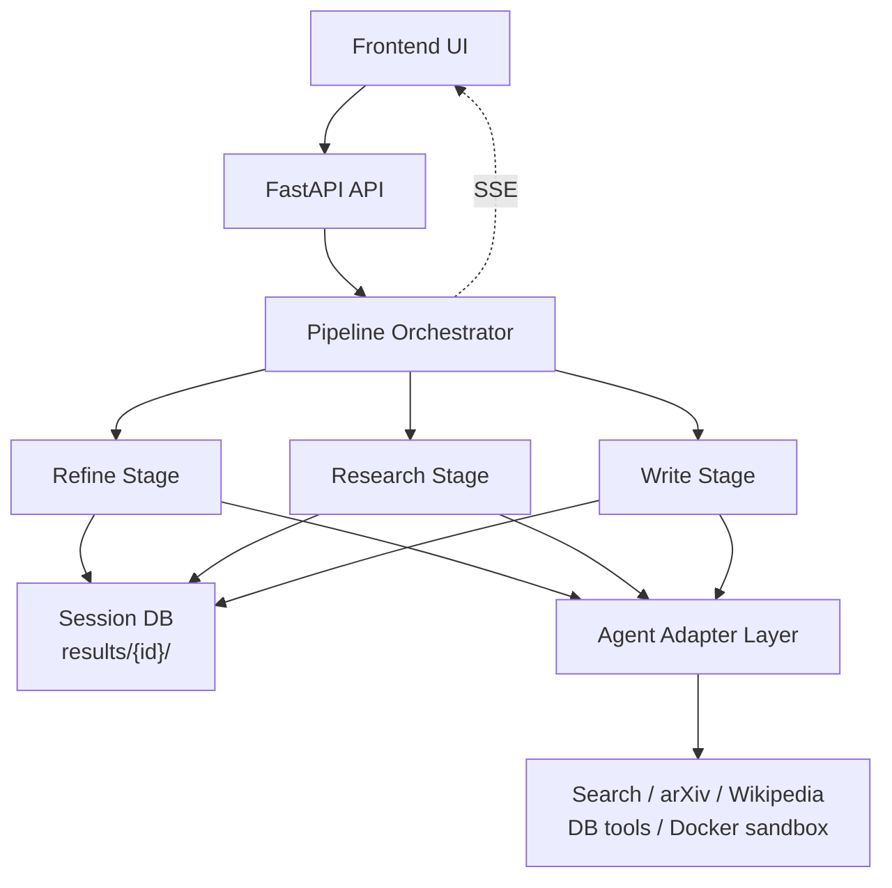

# MAARS

[中文](README_CN.md) | English

**Multi-Agent Automated Research System** — From one idea to a full research paper, fully automated.

MAARS follows a workflow-centered hybrid architecture: `Research` is the workflow spine and a form of research-task harness engineering, while `Refine` and `Write` are the stages that will evolve toward multi-agent collaboration.

Current status:

- `Refine`: single-agent stage today, multi-agent target
- `Research`: implemented as the agentic workflow core
- `Write`: single-agent stage today, multi-agent target

## Architecture



Three stages, powered by the Agno agent framework with multi-provider support (Google, Anthropic, OpenAI).

| Stage | Design Role | Current Implementation |
|-------|-------------|------------------------|
| **Refine** | Problem formation; ultimately suited for multi-agent exploration and convergence | Single-agent session |
| **Research** | Workflow spine: calibrate, decompose, execute, verify, evaluate, replan | Implemented as an agentic workflow runtime |
| **Write** | Paper synthesis; ultimately suited for multi-agent planning, drafting, and review | Single-agent session |

## Design Notes

- The top level is a three-stage orchestrated flow: `refine → research → write`.
- The core design judgment is: keep deterministic control in the runtime, and give open-ended execution to agents.
- Research is not just an agent loop; it is a harness: runtime control, externalized state, tool boundaries, and feedback loops working together.
- State is externalized into `results/{session}/` so runs are inspectable, resumable, and reproducible.
- Real code execution goes through a Docker sandbox; outputs are persisted under `artifacts/`.
- Frontend observability is built on SSE, so users can see stage state, research phases, task status, and streamed logs in real time.

## Configuration

```env
# .env
MAARS_GOOGLE_API_KEY=your-key

# Model provider: google (default), anthropic, or openai
# MAARS_AGNO_MODEL_PROVIDER=google
# MAARS_AGNO_MODEL_ID=claude-sonnet-4-5
# MAARS_ANTHROPIC_API_KEY=your-key
```

## Quick start

```bash
git clone https://github.com/dozybot001/MAARS.git && cd MAARS
python3 -m venv .venv && source .venv/bin/activate
pip install -r requirements.txt
cp .env.example .env  # add your API key
uvicorn backend.main:app --host 0.0.0.0 --port 8000
# Open http://localhost:8000
```

## Output

Each run creates a timestamped folder:

```
results/{timestamp}-{slug}/
├── idea.md           # Input
├── refined_idea.md   # Refine output
├── plan.json         # Flat atomic task list
├── plan_tree.json    # Decomposition tree
├── tasks/            # Individual task outputs
├── artifacts/        # Code scripts + experiment outputs
├── evaluations/      # Iteration evaluations (if multi-iteration)
├── paper.md          # Final paper
├── Dockerfile.experiment  # Auto-generated Docker reproduction
├── run.sh            # Experiment runner script
└── docker-compose.yml
```

## Documentation

| Doc | Content |
|-----|---------|
| [Architecture Design (CN)](docs/CN/architecture.md) | Current source of truth for the system design |

## Community

[Contributing](.github/CONTRIBUTING.md) · [Code of Conduct](.github/CODE_OF_CONDUCT.md) · [Security](.github/SECURITY.md)

## License

MIT
