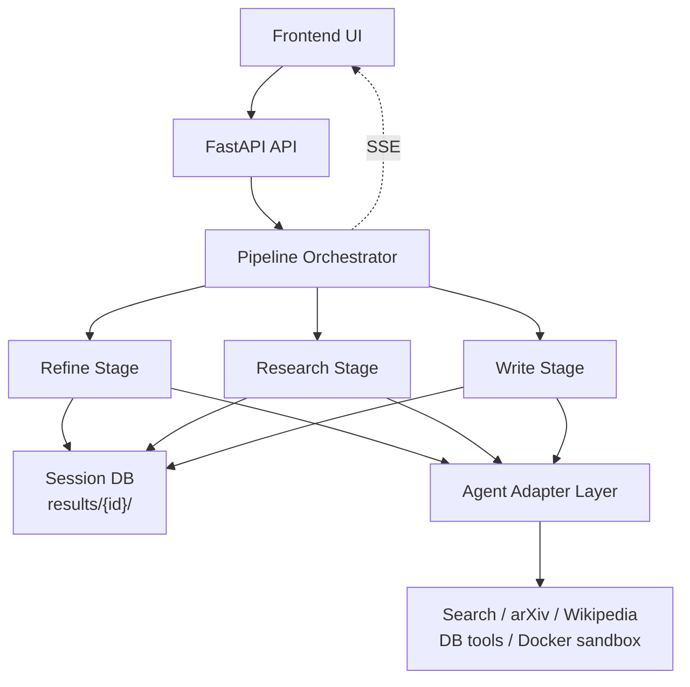

# MAARS

中文 | [English](README.md)

**多智能体自动化研究系统** — 从一个想法到一篇完整论文，全自动。

MAARS 更准确的设计定位，是一种以 workflow 为骨架的混合式研究架构：`Research` 既是 workflow 主干，也是一种 research-task 级的 harness engineering；`Refine` 和 `Write` 是未来优先演进为 multi-agent 的两个阶段。

当前状态：

- `Refine`：当前是单 agent stage，目标是 multi-agent
- `Research`：已实现为 agentic workflow 核心
- `Write`：当前是单 agent stage，目标是 multi-agent

## 架构



三个阶段，基于 Agno Agent 框架，支持多 provider（Google、Anthropic、OpenAI）。

| 阶段 | 设计职责 | 当前实现 |
|------|---------|---------|
| **精炼** | 研究问题形成，长期适合 multi-agent 探索与收敛 | 单 agent session |
| **研究** | workflow 主干：校准、分解、执行、验证、评估、重规划 | 已实现为 agentic workflow runtime |
| **写作** | 论文综合，长期适合 multi-agent 规划、分章与审稿 | 单 agent session |

## 设计说明

- 顶层是 `refine → research → write` 三阶段编排。
- 核心设计判断是：确定性控制逻辑交给 runtime，不确定性执行交给 agent。
- Research 不只是 agent 调用链，而是一个 harness：runtime 控制、状态外化、工具边界和反馈回路共同构成执行环境。
- 状态外化到 `results/{session}/`，这样执行过程可审计、可恢复、可复现。
- 真实代码执行统一走 Docker sandbox，产物落在 `artifacts/`。
- 前端通过 SSE 持续观察 stage 状态、research phase、task 状态和流式日志。

## 配置

```env
# .env
MAARS_GOOGLE_API_KEY=your-key

# 模型 provider：google（默认）、anthropic、openai
# MAARS_AGNO_MODEL_PROVIDER=google
# MAARS_AGNO_MODEL_ID=claude-sonnet-4-5
# MAARS_ANTHROPIC_API_KEY=your-key
```

## 快速开始

```bash
git clone https://github.com/dozybot001/MAARS.git && cd MAARS
python3 -m venv .venv && source .venv/bin/activate
pip install -r requirements.txt
cp .env.example .env  # 填入 API key
uvicorn backend.main:app --host 0.0.0.0 --port 8000
# 打开 http://localhost:8000
```

## 产出

每次运行创建带时间戳的文件夹：

```
results/{timestamp}-{slug}/
├── idea.md           # 输入
├── refined_idea.md   # 精炼输出
├── plan.json         # 扁平原子任务列表
├── plan_tree.json    # 分解树
├── tasks/            # 各任务输出
├── artifacts/        # 代码脚本 + 实验产出
├── evaluations/      # 迭代评估结果
├── paper.md          # 最终论文
├── Dockerfile.experiment  # 自动生成的 Docker 复现文件
├── run.sh            # 实验运行脚本
└── docker-compose.yml
```

## 文档

| 文档 | 内容 |
|------|------|
| [架构设计](docs/CN/architecture.md) | 当前系统设计的主文档 |

## 社区

[贡献指南](.github/CONTRIBUTING.md) · [行为准则](.github/CODE_OF_CONDUCT.md) · [安全策略](.github/SECURITY.md)

## 许可证

MIT
