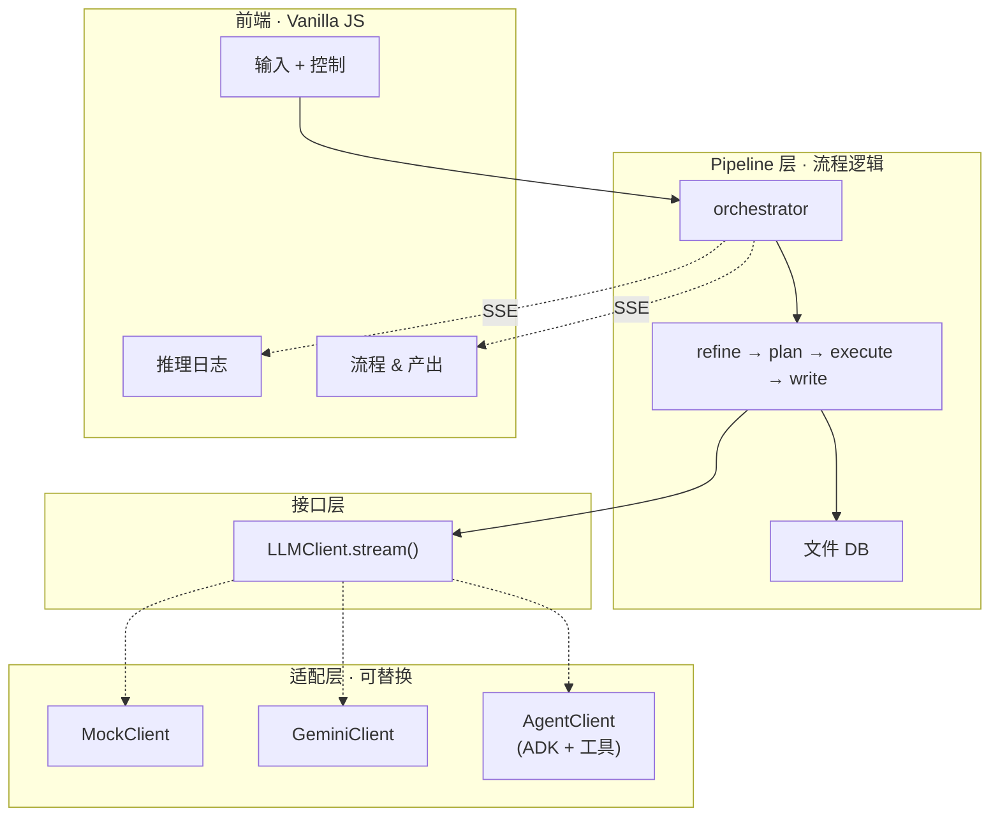

# MAARS

中文 | [English](README.md)

**多智能体自动化研究系统** — 从一个想法到一篇完整论文，全自动。

## 管线

四个固定阶段。所有模式运行相同管线 — 模式只替换底层引擎。


| 阶段 | 做什么 |
|------|-------|
| **精炼** | 探索 → 评估 → 结晶。将模糊想法转为结构化研究提案 |
| **规划** | 递归分解为原子任务 + 依赖 DAG（深度 3，批量并行） |
| **执行** | 拓扑排序 → 并行批次 → 验证 → 重试。结果存入文件 DB |
| **写作** | 大纲 → 逐章节写作 → 润色。每个章节只接收相关任务输出 |

## 模式

`.env` 一行切换：

```env
MAARS_LLM_MODE=mock      # 或 gemini，或 agent
MAARS_GOOGLE_API_KEY=your-key
```

模式替换的是各阶段的引擎，不是管线逻辑：

| 阶段 | Mock | Gemini | Agent |
|------|------|--------|-------|
| **精炼** | 回放 | GeminiClient | AgentClient + 搜索工具 |
| **规划** | 回放 | GeminiClient | AgentClient（无工具） |
| **执行** | 回放 | GeminiClient | AgentClient + 搜索 + 代码 + DB 工具 |
| **写作** | 回放 | GeminiClient | AgentClient + 搜索 + DB 工具 |

> 三种模式使用相同的 pipeline stages，只有 `LLMClient` 实现不同。

## 架构

三层解耦 — pipeline 依赖接口，适配器实现接口：



详细架构与数据流见 [docs/CN/architecture.md](docs/CN/architecture.md)。

## 快速开始

```bash
git clone https://github.com/dozybot001/MAARS.git && cd MAARS
python3 -m venv .venv && source .venv/bin/activate
pip install -r requirements.txt
cp .env.example .env  # 填入 API key
uvicorn backend.main:app --host 0.0.0.0 --port 8000
# 打开 http://localhost:8000
```

## 产出

每次运行创建带时间戳的文件夹：

```
research/{timestamp}-{slug}/
├── idea.md           # 输入
├── refined_idea.md   # 精炼输出
├── plan.json         # 扁平原子任务列表
├── plan_tree.json    # 分解树
├── tasks/            # 各任务输出
├── artifacts/        # 代码脚本 + 实验产出（Agent 模式）
├── paper.md          # 最终论文
├── Dockerfile.experiment  # 自动生成的 Docker 复现文件
├── run.sh            # 实验运行脚本
└── docker-compose.yml
```

## 展示

| 运行 | 模式 | 主题 | 任务数 |
|------|------|------|-------|
| `20260325-212700-*` | Agent | ODE 数值求解器 — 精度、稳定性与计算效率对比 | 22 |

## 社区

[贡献指南](.github/CONTRIBUTING.md) · [行为准则](.github/CODE_OF_CONDUCT.md) · [安全策略](.github/SECURITY.md)

## 许可证

MIT
