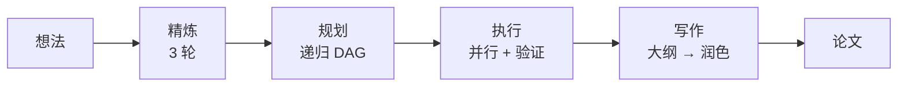
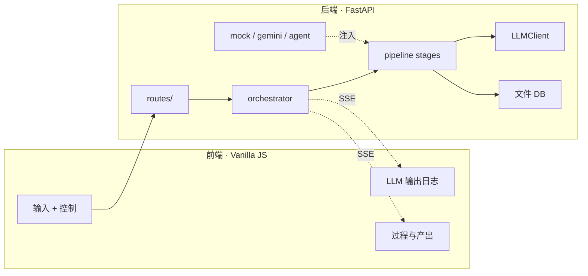

# MAARS

中文 | [English](README.md)

**多智能体自动化研究系统** — 从一个想法到一篇完整论文，全自动。



## 模式

`.env` 一行切换：

```env
MAARS_LLM_MODE=mock      # 或 gemini，或 agent
MAARS_GOOGLE_API_KEY=your-key
```

| 阶段 | Gemini | Agent |
|------|--------|-------|
| **精炼** | 3 轮 LLM：探索 → 评估 → 结晶 | ADK Agent + Google Search |
| **规划** | 递归分解 → 原子任务 DAG（深度 3，批量并行） | **复用 LLM 递归引擎** — 结构化操作，非推理任务 |
| **执行** | 拓扑排序 → 并行批次 → 验证 → 重试 | ADK Agent 逐任务 + Google Search → 验证 → 重试 |
| **写作** | 大纲 → 逐章节 → 润色 | ADK Agent + DB 工具 + Google Search |

> **为什么 Agent 规划用 LLM 管线？** 每步分解是结构化 JSON 判断（是否原子 → 是 / 否 + 子任务）。确定性 LLM 调用比 ReAct 循环更快更稳定。

Mock 模式在所有阶段回放录制输出 — 用于开发和 UI 测试。

## 架构



| 原则 | 细节 |
|------|------|
| 三层解耦 | `llm/` → `pipeline/` → `mode/` — 管线层不知道当前模式 |
| 统一流式 | 每次 LLM 调用发射带 `call_id` 标记的 chunk；前端按 `call_id` 路由 |
| 字符串进出 | 阶段间通过 `stage.output` 传递，无共享内存 |

## 快速开始

```bash
git clone https://github.com/dozybot001/MAARS.git && cd MAARS
python3 -m venv .venv && source .venv/bin/activate
pip install -r requirements.txt
cp .env.example .env  # 填入 API key
uvicorn backend.main:app --host 0.0.0.0 --port 8000
# 打开 http://localhost:8000
```

## 产出

每次运行创建带时间戳的文件夹：

```
research/{timestamp}-{slug}/
├── idea.md           # 输入
├── refined_idea.md   # 精炼输出
├── plan.json         # 扁平原子任务列表
├── plan_tree.json    # 分解树
├── paper.md          # 最终论文
└── tasks/            # 各任务输出
```

## 展示

| 运行 | 模式 | 主题 | 任务数 |
|------|------|------|-------|
| `20260323-210300-*` | Gemini | 认知缓冲假说 — 新闻框架效应的文化调节 | 31 |
| `20260323-223406-*` | Agent | HMAO — 对抗式多 Agent 角色专业化 | 12 |

构建历史：[Intent showcase/maars](https://github.com/dozybot001/Intent/tree/main/showcase/maars)

## 社区

[贡献指南](.github/CONTRIBUTING.md) · [行为准则](.github/CODE_OF_CONDUCT.md) · [安全策略](.github/SECURITY.md)

## 许可证

MIT
