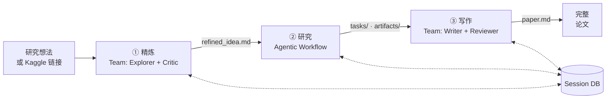

# MAARS

中文 | [English](README.md)

**多智能体自动化研究系统** — 从一个想法到一篇完整论文，全自动。

MAARS 是一个混合式多智能体研究系统。给它一个研究想法或一个 Kaggle 比赛链接，它会自动精炼问题、分解为可执行任务、在 Docker 沙箱中运行实验、基于结果迭代改进，最终产出一篇完整论文。

## 快速开始


```bash
# Linux / macOS / Windows（Git Bash）：
bash start.sh
```

自动安装依赖、检查 `.env`（没有则创建）、构建 Docker 镜像（未安装则会提示按下 Enter 自动安装）、启动服务、打开浏览器。你只需要：`Ctrl/CMD + K` -> 输入 -> Enter。

## 架构

### 数据流



### 系统架构


核心设计原则：**确定性控制交给 runtime，开放性执行交给 agent。**

MAARS 是一个**混合式多智能体系统**：精炼和写作阶段使用 Agno Team coordinate 模式（多 agent 协作），研究阶段使用 runtime 驱动的 agentic workflow。三个阶段仅通过文件型会话 DB 通信——完全解耦。

| 阶段 | 模式 | 做什么 |
|------|------|-------|
| **精炼** | Multi-Agent Team | Explorer 调研文献 + Critic 质疑新颖性/可行性 → 精炼后的研究方案 |
| **研究** | Agentic Workflow | Runtime 控制：校准 → 策略 → 分解 → 执行 → 验证 → 评估 → 重规划 |
| **写作** | Multi-Agent Team | Writer 写初稿 + Reviewer 审稿反馈 → 修订后的论文 |

## 研究流水线详解

Research 阶段是核心工作引擎，以 **agentic workflow runtime** 形式运行，带反馈回路：

```
refined_idea.md
  ↓
校准    → Agent 评估当前领域"原子任务"的粒度边界
策略    → Agent 调研最佳方法、技术路线、基准线
分解    → 递归拆解为带依赖关系的原子任务 DAG
  ↓
┌─ 执行  → 按拓扑序分批运行（可并行）
│  验证  → 逐任务评分：通过 / 失败重试 / 重新分解
│  评估  → 跨迭代比较分数，判断是否改进停滞
│  重规划 → 根据评估反馈追加新任务
└─ 循环直到：迭代上限 或 分数停滞（<0.5% 改进）
  ↓
任务产出 + 实验产物 → 交给写作阶段
```

核心能力：
- **Docker 沙箱执行** — 真实代码在隔离容器中运行，预装 ML 工具栈
- **DAG 调度** — 任务按依赖顺序执行，安全时并行化
- **自动重分解** — 任务过于复杂时自动拆分为子任务
- **带评分的迭代** — 跨轮次跟踪分数，改进停滞时自动停止
- **断点续跑** — 可以中途暂停，稍后恢复，所有状态完整保留

## Kaggle 模式

直接粘贴 Kaggle 比赛链接：

```
https://www.kaggle.com/competitions/titanic
```

MAARS 会自动：拉取比赛元数据 → 下载数据集 → 构建上下文丰富的研究方案 → 跳过精炼阶段 → 直接进入研究阶段，数据挂载在 `/workspace/data/`。

完整配置说明请直接查看 [.env.example](.env.example)。你可以手动复制为 `.env` 后按注释修改，也可以直接运行 `bash start.sh`，缺失时启动脚本会自动生成 `.env`；这里作为全部 `MAARS_` 配置项的唯一说明来源。

## 产出结构

每次运行创建带时间戳的会话文件夹：

```
results/{timestamp}-{slug}/
├── idea.md                  # 原始输入
├── refined_idea.md          # 精炼后的研究方案
├── calibration.md           # 原子任务定义
├── strategy.md              # 研究策略
├── plan_list.json           # 扁平任务列表（执行视图）
├── plan_tree.json           # 层级分解树
├── tasks/                   # 各任务输出（markdown）
├── artifacts/               # 代码脚本、图表、CSV、模型
│   ├── {task_id}/           # 每任务工作目录
│   ├── latest_score.json    # 最近一次分数
│   └── best_score.json      # 全局最佳分数追踪
├── evaluations/             # 迭代评估结果
├── paper.md                 # 最终论文
├── log.jsonl                # 追加式 SSE 事件日志（可回放）
└── reproduce/               # 自动生成的复现文件
    ├── Dockerfile
    ├── run.sh
    └── docker-compose.yml
```

## 前端

Web UI 基于 Vue 3 + Pinia + Vite 构建，通过 SSE 提供实时观测：

- **进度条** — 7 阶段流水线可视化（精炼 → 校准 → 策略 → 分解 → 执行 → 评估 → 写作）
- **命令面板** (Ctrl+K) — 启动、暂停、恢复流水线
- **推理日志** — 实时流式展示 LLM 推理过程、工具调用和返回结果
- **过程查看器** — 任务分解树、执行批次、产物、文档
- **会话侧边栏** — 浏览、恢复、删除历史会话
- **Docker 状态** — 沙箱连接指示器

## 技术栈

| 组件 | 技术 |
|------|------|
| 后端 | FastAPI, Python async |
| Agent 框架 | Agno（Team coordinate 模式 + 单 Client agentic workflow） |
| LLM 提供商 | Google Gemini, Anthropic Claude, OpenAI GPT |
| 代码执行 | Docker 容器（Python 3.12 + ML 工具栈） |
| 前端 | Vue 3, Pinia, Vite |
| 通信 | SSE（Server-Sent Events），Authorization header 认证 |
| 存储 | 文件型会话 DB |
| 搜索工具 | DuckDuckGo, arXiv, Wikipedia |
| CI | GitHub Actions（Python lint + test, 前端构建） |

## 文档

| 文档 | 内容 |
|------|------|
| [架构设计](docs/CN/architecture.md) | 系统设计理念与架构决策 |
| [路线图](docs/ROADMAP.md) | 优先级排序的改进事项与状态 |

## 社区

[贡献指南](.github/CONTRIBUTING.md) · [行为准则](.github/CODE_OF_CONDUCT.md) · [安全策略](.github/SECURITY.md)

## 许可证

MIT
