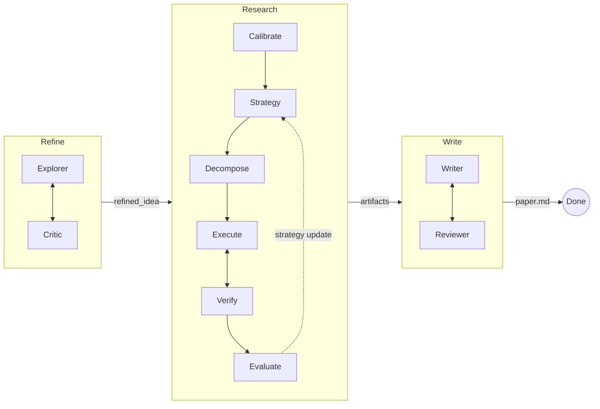
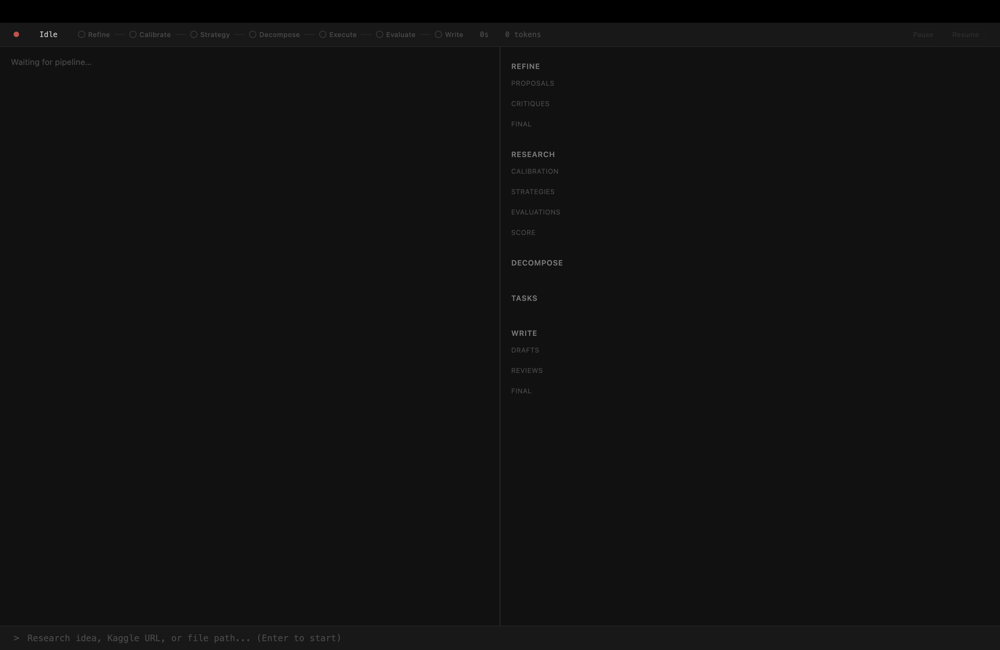

<p align="center">
  <h1 align="center">MAARS</h1>
  <p align="center"><b>多智能体自动化研究系统</b></p>
  <p align="center">从研究想法到完整论文——全自动、端到端。</p>
  <p align="center">
    中文 · <a href="README.md">English</a>
  </p>
</p>

---

MAARS 接受一个模糊的研究想法（或 Kaggle 比赛链接），通过三阶段流水线 **Refine -> Research -> Write** 产出结构化研究产物和完整的 `paper.md`。

每个阶段由 Python runtime 编排，LLM Agent 执行开放性工作——文献调研、代码实验、论文撰写、同行评审——全程自主运行，迭代自我改进。

## 流水线



- **Refine**：Explorer 调研文献并起草提案；Critic 评审并推动更强的表述。迭代直到 Critic 满意。
- **Research**：将提案分解为原子任务，在 Docker 沙箱中并行执行，验证产出，评估结果——通过策略更新进行多轮迭代。
- **Write**：Writer 读取所有研究产出撰写完整论文；Reviewer 评审并驱动修订。

## 快速开始

**环境要求：** Python 3.10+、Docker 已运行、[Gemini API 密钥](https://aistudio.google.com/apikey)

```bash
git clone https://github.com/dozybot001/MAARS.git && cd MAARS
bash start.sh
```

首次运行时，`start.sh` 会：
1. 创建虚拟环境并安装依赖
2. 从 `.env.example` 生成 `.env`——填入你的 `MAARS_GOOGLE_API_KEY`
3. 构建 Docker 沙箱镜像
4. 在 **http://localhost:8000** 启动服务

<p align="center"></p>

然后在输入框粘贴你的研究想法或 Kaggle 链接，按 Enter 启动。

<p align="center"></p>

## Kaggle 模式

粘贴 Kaggle 比赛链接——MAARS 自动提取比赛 ID、下载数据、跳过 Refine 阶段。

## 配置

所有变量使用 `MAARS_` 前缀，配置于 `.env`：

| 变量 | 默认值 | 说明 |
|------|--------|------|
| `MAARS_GOOGLE_API_KEY` | — | **必填。** Gemini API 密钥 |
| `MAARS_GOOGLE_MODEL` | `gemini-3-flash-preview` | LLM 模型 ID |
| `MAARS_API_CONCURRENCY` | `1` | LLM 最大并发数 |
| `MAARS_OUTPUT_LANGUAGE` | `Chinese` | 提示词/输出语言（`Chinese` 或 `English`） |
| `MAARS_RESEARCH_MAX_ITERATIONS` | `3` | Research 最大评估轮数 |
| `MAARS_TEAM_MAX_DELEGATIONS` | `10` | Refine/Write 最大迭代轮数 |
| `MAARS_KAGGLE_API_TOKEN` | — | 可选；也可用 `~/.kaggle/kaggle.json` |
| `MAARS_DATASET_DIR` | `data/` | 沙箱挂载的数据集目录 |
| `MAARS_DOCKER_SANDBOX_IMAGE` | `maars-sandbox:latest` | 代码执行 Docker 镜像 |
| `MAARS_DOCKER_SANDBOX_TIMEOUT` | `600` | 单容器超时（秒） |
| `MAARS_DOCKER_SANDBOX_MEMORY` | `4g` | 容器内存上限 |
| `MAARS_DOCKER_SANDBOX_CPU` | `1.0` | 容器 CPU 配额 |
| `MAARS_DOCKER_SANDBOX_NETWORK` | `true` | 沙箱内是否联网 |
| `MAARS_DOCKER_SANDBOX_GPU` | `false` | GPU 透传（需安装 NVIDIA Container Toolkit） |

## GPU 加速

深度学习任务（PyTorch 训练等）可通过 GPU 大幅提速。启用步骤：

**1. 安装 NVIDIA Container Toolkit**（仅需一次，Ubuntu）：

```bash
curl -fsSL https://nvidia.github.io/libnvidia-container/gpgkey | sudo gpg --dearmor -o /usr/share/keyrings/nvidia-container-toolkit-keyring.gpg
curl -s -L https://nvidia.github.io/libnvidia-container/stable/deb/nvidia-container-toolkit.list | \
  sed 's#deb https://#deb [signed-by=/usr/share/keyrings/nvidia-container-toolkit-keyring.gpg] https://#g' | \
  sudo tee /etc/apt/sources.list.d/nvidia-container-toolkit.list
sudo apt-get update && sudo apt-get install -y nvidia-container-toolkit
sudo nvidia-ctk runtime configure --runtime=docker
sudo systemctl restart docker
```

**2. 验证** Docker 能看到 GPU：

```bash
docker run --rm --gpus all nvidia/cuda:12.8.0-runtime-ubuntu24.04 nvidia-smi
```

**3. 在 `.env` 中启用**：

```env
MAARS_DOCKER_SANDBOX_GPU=true
MAARS_DOCKER_SANDBOX_TIMEOUT=1800
MAARS_DOCKER_SANDBOX_MEMORY=16g
MAARS_DOCKER_SANDBOX_CPU=4.0
```

`start.sh` 启动时会自动检测 GPU 是否可用。

## 产出结构

每次运行生成一个 session 目录：

```
results/{session}/
├── idea.md                     # 用户原始输入
├── refined_idea.md             # Refine 最终产出
├── proposals/                  # Refine: Explorer 各版提案
│   └── round_N.md
├── critiques/                  # Refine: Critic 各轮评审
│   ├── round_N.md
│   └── round_N.json
├── calibration.md              # Research: 原子任务定义
├── strategy/                   # Research: 策略版本
│   └── round_N.md
├── plan_tree.json              # Research: 分解树
├── plan_list.json              # Research: 扁平任务列表
├── tasks/                      # Research: 各任务产出
│   └── {id}.md
├── artifacts/                  # Research: 代码、图表等
│   └── {id}/
├── evaluations/                # Research: 评估版本
│   ├── round_N.json
│   └── round_N.md
├── drafts/                     # Write: Writer 各版论文
│   └── round_N.md
├── reviews/                    # Write: Reviewer 各轮评审
│   ├── round_N.md
│   └── round_N.json
├── paper.md                    # Write 最终产出
├── meta.json                   # 元信息（tokens、score）
├── log.jsonl                   # 流式 chunk 日志
├── execution_log.jsonl         # Docker 执行记录
└── reproduce/                  # 复现文件
    ├── Dockerfile
    ├── run.sh
    └── docker-compose.yml
```

## 文档

| 文档 | 内容 |
|------|------|
| [架构概览](docs/CN/architecture.md) | 系统概览、SSE 协议、存储结构 |
| [Refine & Write](docs/CN/refine-write.md) | IterationState 模式、双 Agent 循环详情 |
| [Research](docs/CN/research.md) | 任务分解、并行执行、评估循环 |

## 技术栈

- **后端**：Python、FastAPI、Agno（Agent 框架）、Gemini（内置 Google Search）
- **前端**：原生 JS、SSE 流式推送、marked.js 渲染 Markdown
- **执行**：Docker 沙箱，可配置资源限制
- **存储**：文件型 Session DB（JSON + Markdown）

## 社区

[贡献指南](.github/CONTRIBUTING.md) · [行为准则](.github/CODE_OF_CONDUCT.md) · [安全策略](.github/SECURITY.md)

## 许可证

MIT
