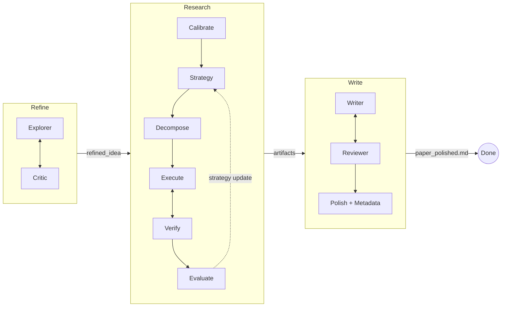

<p align="center">
  <h1 align="center">MAARS</h1>
  <p align="center"><b>多智能体自动化研究系统</b></p>
  <p align="center">从研究想法到完整论文——全自动、端到端。</p>
  <p align="center">
    中文 · <a href="README.md">English</a> · <a href="https://dozybot001.github.io/MAARS/">网站</a>
  </p>
</p>

---

MAARS 接受一个模糊的研究想法（或 Kaggle 比赛链接），通过三阶段流水线 **Refine → Research → Write** 产出结构化研究产物和打磨后的论文。

每个阶段由 Python runtime 编排，LLM Agent 执行开放性工作——文献调研、代码实验、论文撰写、同行评审——全程自主运行，迭代自我改进。

<p align="center">
  <video src="https://github.com/user-attachments/assets/f0d8ef94-c98e-4666-8dec-85e1332dc2df" width="720" controls></video>
</p>

## 流水线



- **Refine**：Explorer 调研文献并起草提案；Critic 在声明范围内评审。迭代直到零 issue。
- **Research**：将提案分解为原子任务，在持久化 Docker 沙箱中并行执行，验证产出，评估结果——存在关键空白时通过策略更新迭代。
- **Write**：Writer 读取研究产物撰写完整论文；Reviewer 评审并驱动修订直到零 issue。最后由 **Polish** 子步骤单次 LLM 打磨文笔，并附加确定性执行元数据附录。

## 快速开始

**环境要求：** Python 3.10+、Docker 已运行、[Gemini API 密钥](https://aistudio.google.com/apikey)

```bash
git clone https://github.com/dozybot001/MAARS.git && cd MAARS
bash start.sh
```

在 **Windows** 上请在项目目录打开 **Git Bash**（Git for Windows），同样执行 `bash start.sh`。

首次运行时，`start.sh` 会：
1. 创建虚拟环境并安装依赖
2. 从 `.env.example` 生成 `.env`——填入你的 `MAARS_GOOGLE_API_KEY`
3. 构建 Docker 沙箱镜像
4. 在 **http://localhost:8000** 启动服务

然后在输入框粘贴研究想法、Kaggle 比赛链接，或 UTF-8 编码的文本/Markdown 文件路径，按 Enter 启动。粘贴 Kaggle 链接会自动跳过 Refine 阶段并下载数据集。

## 配置

`.env` 中的关键变量（完整列表见 `.env.example`）：

| 变量 | 默认值 | 说明 |
|------|--------|------|
| `MAARS_GOOGLE_API_KEY` | — | **必填。** Gemini API 密钥 |
| `MAARS_GOOGLE_MODEL` | `gemini-3-flash-preview` | 所有阶段默认使用的 LLM 模型 |
| `MAARS_OUTPUT_LANGUAGE` | `Chinese` | 提示词/输出语言（`Chinese` 或 `English`） |
| `MAARS_API_CONCURRENCY` | `1` | LLM 最大并发数 |
| `MAARS_API_REQUEST_INTERVAL` | `0` | LLM 请求最小间隔秒数（免费 tier 建议设 `1`–`2`） |

## 文档

完整文档与架构说明见 **[dozybot001.github.io/MAARS](https://dozybot001.github.io/MAARS/)**。

## 社区

[贡献指南](.github/CONTRIBUTING.md) · [行为准则](.github/CODE_OF_CONDUCT.md) · [安全策略](.github/SECURITY.md)

## 许可证

MIT
