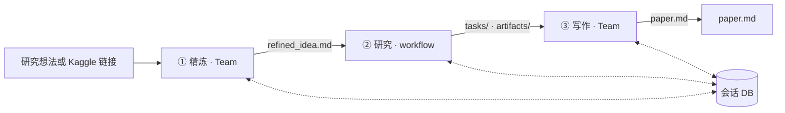

# MAARS

中文 | [English](README.md)

**多智能体自动化研究系统** — 从研究想法或 Kaggle 比赛链接，到可执行任务、实验产物与 `paper.md` 的端到端编排。

## 功能概览

- **精炼（Refine）**：Agno Team 把输入整理为可执行研究方案（`refined_idea.md`）。
- **研究（Research）**：runtime 驱动工作流 + Agno Agent：校准 → 策略 → 分解 → 执行 ⇄ 验证 → 评估；状态与产出在 `results/<会话>/`。
- **写作（Write）**：Agno Team 将研究结果整理为 `paper.md`。
- **沙箱**：在 Docker 中执行代码（`Dockerfile.sandbox`）；集成搜索、arXiv、Wikipedia，以及 Kaggle 赛题数据拉取。

控制流、重试与迭代上限由 runtime 管理；开放推理与编码由 agent 完成。各阶段仅通过**文件型会话 DB**（`results/...`）衔接。

## 快速开始

**环境：** Python **3.10+**；代码执行需可选安装 **Docker**。

### 推荐

```bash
bash start.sh
```

脚本会创建 `.venv`、安装依赖、从 `.env.example` 补全 `.env` 键、可选构建沙箱镜像、用 **热重载** 启动 uvicorn（端口 `MAARS_SERVER_PORT`，默认 **8000**），并尝试打开浏览器。

### 手动

```bash
git clone https://github.com/dozybot001/MAARS.git && cd MAARS
python3 -m venv .venv && source .venv/bin/activate
pip install -r requirements.txt
cp .env.example .env   # 填写 MAARS_GOOGLE_API_KEY
docker build -f Dockerfile.sandbox -t maars-sandbox:latest .   # 可选
uvicorn backend.main:app --host 0.0.0.0 --port 8000
# 浏览器打开 http://localhost:8000
```

## 配置

复制 `.env.example` 为 `.env`。变量均带 `MAARS_` 前缀（见 `backend/config.py`）。

| 变量 | 默认值 | 说明 |
|------|--------|------|
| `MAARS_GOOGLE_API_KEY` | — | **必填。** Gemini API 密钥（同时写入 `GOOGLE_API_KEY` 供 SDK 使用）。 |
| `MAARS_GOOGLE_MODEL` | `gemini-3-flash-preview` | 传给 Agno 的模型 id。 |
| `MAARS_API_CONCURRENCY` | `1` | LLM 并发上限。 |
| `MAARS_OUTPUT_LANGUAGE` | `Chinese` | 提示词/输出语言包。 |
| `MAARS_RESEARCH_MAX_ITERATIONS` | `3` | **评估轮数**上限（每轮：策略 → 分解 → 执行 → 评估）。若 Evaluate 不再输出 `strategy_update` 会提前结束。 |
| `MAARS_KAGGLE_API_TOKEN` | — | 可选；也可用 `~/.kaggle/kaggle.json`。 |
| `MAARS_KAGGLE_COMPETITION_ID` | — | 使用赛题链接时一般由程序写入。 |
| `MAARS_DATASET_DIR` | — | Kaggle 拉取数据后由会话设置。 |
| `MAARS_DOCKER_SANDBOX_IMAGE` | `maars-sandbox:latest` | 沙箱 / `code_execute` 使用的镜像。 |
| `MAARS_DOCKER_SANDBOX_TIMEOUT` | `600` | 单容器超时（秒）。 |
| `MAARS_DOCKER_SANDBOX_MEMORY` | `4g` | 内存上限（如 `512m`、`4g`）。 |
| `MAARS_DOCKER_SANDBOX_CPU` | `1.0` | CPU 配额。 |
| `MAARS_DOCKER_SANDBOX_NETWORK` | `true` | 沙箱内是否联网。 |
| `MAARS_SERVER_PORT` | `8000` | 仅 `start.sh` 使用。 |

## 架构概览

### 流水线



### 阶段

| 阶段 | 机制 | 作用 |
|------|------|------|
| **精炼** | Agno Team（Explorer + Critic） | 文献相关精炼 → `refined_idea.md` |
| **研究** | `ResearchStage` 工作流 + Agno Agent | 校准 → 策略 → 分解 → 执行 ⇄ 验证 → 评估；可因 `strategy_update` 多轮 |
| **写作** | Agno Team（Writer + Reviewer） | 输出 `paper.md` |

### 类关系

```
Stage                    — 生命周期、统一 SSE (_send)、LLM 流式
├── ResearchStage        — agentic workflow（Agno Agent）
└── TeamStage            — Agno Team coordinate
    ├── RefineStage
    └── WriteStage
```

### Research 主循环（与代码一致）

每**轮**：Strategy → Decompose → Execute → Verify → **Evaluate**。仅当评估结果里存在非空 **`strategy_update`**，且未超过 **`MAARS_RESEARCH_MAX_ITERATIONS`** 时进入下一轮。分数可在 `artifacts/` 中维护（如 `best_score.json` 的晋升逻辑）。

细则见 [docs/CN/architecture.md](docs/CN/architecture.md)。

## Kaggle 模式

输入包含 `kaggle.com/competitions/<id>` 时：拉取赛题元数据、下载数据、生成写入 `refined_idea.md` 的上下文、**跳过精炼阶段**，从 **Research** 开始（数据目录由会话配置，供沙箱挂载使用）。

## 会话产出目录

每次运行在 `results/<时间戳>-<slug>/`（见 `backend/db.py` 中 `ResearchDB`）：

```
results/<会话>/
├── idea.md
├── refined_idea.md
├── calibration.md
├── strategy/
│   └── round_<n>.md
├── plan_tree.json              # 分解树真值
├── plan_list.json              # 派生扁平任务列表
├── tasks/
├── artifacts/
│   ├── <task_id>/
│   ├── best_score.json
│   └── latest_score.json
├── evaluations/
│   ├── round_<n>.json
│   └── round_<n>.md
├── paper.md
├── meta.json
├── log.jsonl
├── execution_log.jsonl
└── reproduce/
```

## 前端

静态资源位于 `frontend/`，通过 **SSE** 推送阶段与日志；会话数据以磁盘为准。支持命令面板（**Cmd/Ctrl+K**）等交互。

## 技术栈

| 层级 | 技术 |
|------|------|
| API | FastAPI、uvicorn |
| Agent | Agno（Team + Agent）、Google Gemini |
| 工具 | Docker 沙箱、ddgs / arXiv / Wikipedia、Kaggle API |
| 存储 | `results/` 文件型会话 DB |

## 文档

| 文档 | 内容 |
|------|------|
| [架构设计](docs/CN/architecture.md) | 边界、Research 环节、SSE、落盘结构 |

## 社区

[贡献指南](.github/CONTRIBUTING.md) · [行为准则](.github/CODE_OF_CONDUCT.md) · [安全策略](.github/SECURITY.md)

## 许可证

MIT
