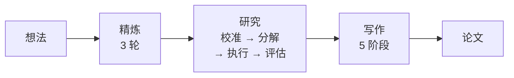
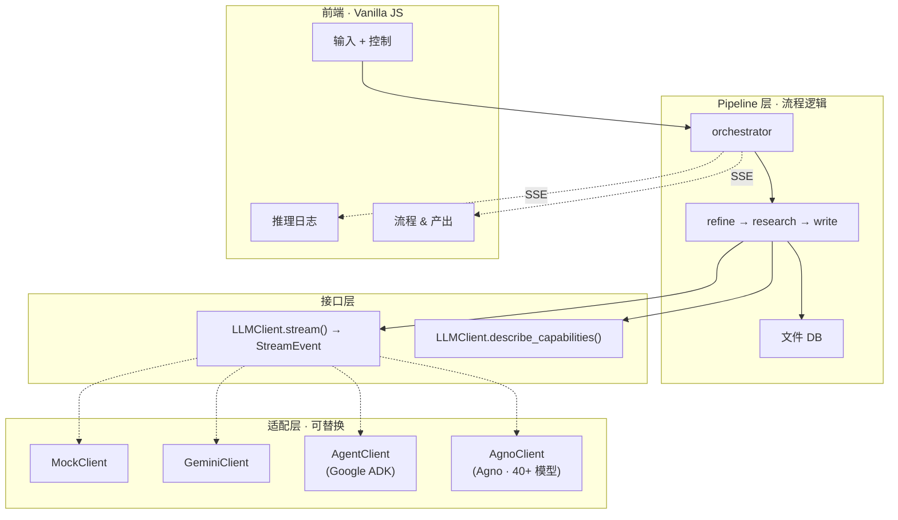

# MAARS

中文 | [English](README.md)

**多智能体自动化研究系统** — 从一个想法到一篇完整论文，全自动。

## 管线

三个阶段。所有模式运行相同管线 — 模式只替换底层引擎。



| 阶段 | 做什么 |
|------|-------|
| **精炼** | 探索 → 评估 → 结晶。将模糊想法转为结构化研究提案 |
| **研究** | 校准能力边界 → 递归分解 → 并行执行 + 验证（通过 / 重试 / 重新分解）→ 评估。不满足则迭代 |
| **写作** | 大纲 → 逐章节写作 → 结构审查 → 风格润色 → 格式规范。每个章节只接收相关任务输出 |

## 模式

`.env` 一行切换：

```env
MAARS_LLM_MODE=mock      # 或 gemini、adk、agno
MAARS_GOOGLE_API_KEY=your-key
```

模式替换的是引擎，不是管线逻辑：

| 阶段 | Mock | Gemini | ADK | Agno |
|------|------|--------|-----|------|
| **精炼** | 回放 | GeminiClient（3 轮） | AgentClient + google_search（1 session） | AgnoClient + DuckDuckGo + arXiv（1 session） |
| **研究** | 回放 | GeminiClient（并行调用） | AgentClient + 搜索 + code_execute + DB（并行 agent session） | AgnoClient + DuckDuckGo + arXiv + 代码 + DB（并行 agent session） |
| **写作** | 回放 | GeminiClient（5 阶段） | AgentClient + 搜索 + DB（1 session） | AgnoClient + DuckDuckGo + arXiv + DB（1 session） |

> 所有模式使用相同的 pipeline stages，只有 `LLMClient` 实现不同。
> ADK 使用 Google ADK 框架（仅 Gemini）。Agno 使用 Agno 框架（40+ 模型 provider）。

## 架构

三层解耦 — pipeline 依赖接口，适配器实现接口：



详细架构与数据流见 [架构文档](docs/CN/architecture.md)。

## 快速开始

```bash
git clone https://github.com/dozybot001/MAARS.git && cd MAARS
python3 -m venv .venv && source .venv/bin/activate
pip install -r requirements.txt
cp .env.example .env  # 填入 API key
uvicorn backend.main:app --host 0.0.0.0 --port 8000
# 打开 http://localhost:8000
```

## 产出

每次运行创建带时间戳的文件夹：

```
results/{timestamp}-{slug}/
├── idea.md           # 输入
├── refined_idea.md   # 精炼输出
├── plan.json         # 扁平原子任务列表
├── plan_tree.json    # 分解树
├── tasks/            # 各任务输出
├── artifacts/        # 代码脚本 + 实验产出（Agent 模式）
├── evaluations/      # 迭代评估结果
├── paper.md          # 最终论文
├── Dockerfile.experiment  # 自动生成的 Docker 复现文件
├── run.sh            # 实验运行脚本
└── docker-compose.yml
```

## 文档

| 文档 | 内容 |
|------|------|
| [架构](docs/CN/architecture.md) | 三层设计、数据流、模式对比 |
| [Research 工作流](docs/CN/research-workflow.md) | 校准 → 分解 → 执行 → 验证 → 重分解 → 评估 |
| [Prompt 工程](docs/CN/prompt-engineering.md) | 全部 prompt 清单与修改指南 |
| [代码坏味道](docs/CN/code-smells.md) | 已知问题与修复优先级 |

## 社区

[贡献指南](.github/CONTRIBUTING.md) · [行为准则](.github/CODE_OF_CONDUCT.md) · [安全策略](.github/SECURITY.md)

## 许可证

MIT
