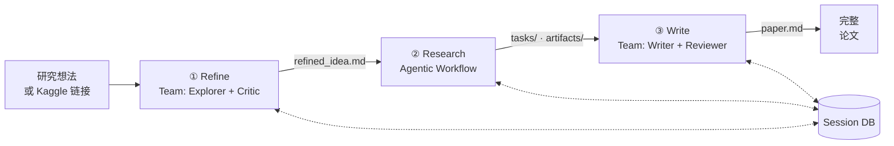
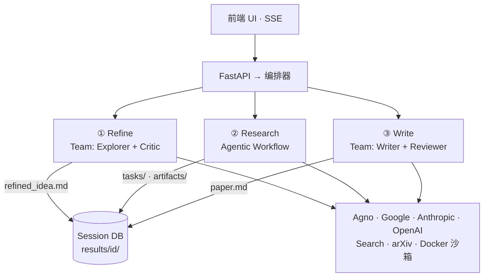
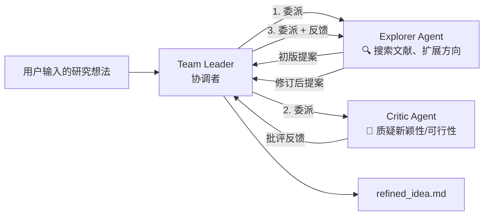
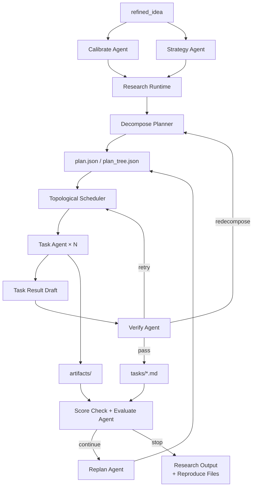

# MAARS 架构设计

> 本文是 MAARS 的架构设计文档，不是代码导读。
> 它回答的是"系统为什么这样设计、核心边界在哪里"，而不是逐文件解释实现。

## 1. 设计目标

MAARS 要解决的问题不是"让一个模型写一篇长文"，而是把一项研究工作拆成可控、可恢复、可审计的系统流程。

系统设计目标有四个：

1. **端到端自动化**：从研究想法或 Kaggle 比赛入口出发，最终产出结构化研究结果和论文。
2. **控制权外化**：把阶段切换、依赖调度、重试、迭代停止等确定性逻辑交给系统，而不是交给模型临场决定。
3. **智能能力内聚**：把搜索、分析、代码执行、写作等开放性工作交给 agent 完成，让模型在自己最擅长的地方发挥价值。
4. **结果可恢复、可复盘**：所有重要状态和产出落盘，前端能看到执行过程，失败后能恢复，结束后能追溯。

## 2. 核心设计判断

MAARS 的架构建立在一个核心判断上：

**把不确定性留给 agent，把确定性留给 runtime。**

更具体地说：

- 如果一个决策可以稳定地写成 `if / for / while`，就应该由系统 runtime 负责。
- 如果一个任务依赖检索、比较、写代码、解释结果、组织文本，就应该交给 agent。

这直接导出了 MAARS 的整体形态：**一个 hybrid multi-agent research system。**

- Research 阶段的骨架是 workflow runtime（DAG 调度、checkpoint、反馈循环由代码控制）
- Refine 和 Write 阶段是真正的 multi-agent 协作（Agno Team coordinate 模式，agent 间有真实的信息流动）
- 三个阶段通过文件型 DB 解耦，彼此不知道对方的实现方式

### 2.1 与 Harness Engineering 的关系

如果借用 OpenAI 在 2026 年提出的 `harness engineering` 视角，MAARS 的 `Research` 可以被理解为一种 **research-task 级别的 harness engineering**：

- session DB 是 system of record
- Docker sandbox 是执行环境
- verify / evaluate / replan 是反馈回路
- runtime 负责控制，agent 负责执行

MAARS 做的是面向 research workflow 的 harness engineering，而不是面向整个软件仓库生命周期的 harness engineering。

## 3. 总体架构

### 数据流



### 系统架构



这个架构分成五个层次：

1. **入口层**：前端 + FastAPI，用于启动、暂停、恢复和观察执行过程。
2. **编排层**：负责三阶段顺序和生命周期控制。
3. **阶段层**：每个 stage 是一个稳定边界，输入输出通过 session DB 连接。
4. **智能执行层**：Agno Team（multi-agent 协作）或 AgnoClient（单 client workflow）。
5. **工具与状态层**：工具负责和外部世界交互，文件型 DB 负责保存系统状态。

### 类继承

```
Stage                          — 生命周期 + SSE（所有阶段共享）
├── AgentStage                 — 单 Client 执行（AgnoClient + _stream_llm）
│   └── ResearchStage          — agentic workflow 引擎
└── TeamStage                  — 多 Agent 执行（Agno Team coordinate）
    ├── RefineStage            — Explorer + Critic
    └── WriteStage             — Writer + Reviewer
```

`TeamStage` 是 Refine 和 Write 的共享基类，提供通用的 `run()` 执行循环和 `_handle_event()` 事件映射。子类只需定义 `_create_team()`、`_finalize()` 和两个配置属性（`_member_map`、`_capture_member`）。

## 4. 三阶段设计

MAARS 把研究过程拆成三个阶段，不是因为"论文流程天然就有三步"，而是因为这三个阶段面对的是三类不同问题。

### 4.1 Refine：研究问题形成（Multi-Agent）

Refine 负责把输入意图转化为可执行的研究目标。

它的设计职责是：

- 明确研究问题
- 收敛研究方向
- 补齐背景、假设、方法大纲和目标
- 产出可交给 Research 阶段分解的 `refined_idea`

Refine 本质上是一个**探索与收敛问题**，天然适合多视角交叉验证。因此它使用 Agno Team coordinate 模式，两个 agent 协作：



- **Explorer**：有搜索工具（DuckDuckGo, arXiv, Wikipedia），负责发散探索和产出研究提案。
- **Critic**：无工具，负责从学术严谨性角度批判提案的新颖性、可行性和影响力。
- **Leader**：编排委派顺序（Explorer → Critic → Explorer），不参与具体内容生产。

`share_member_interactions=True` 确保 Critic 能看到 Explorer 的初稿，Explorer 能看到 Critic 的反馈。

### 4.2 Research：执行型工作流核心（Agentic Workflow）

Research 是 MAARS 的核心。

它负责把一个研究目标转化为一组可执行任务，并在运行中持续判断：

- 任务是否拆得合理
- 结果是否足够
- 是否需要重试
- 是否需要重新分解
- 是否需要下一轮改进

Research 的设计定位是：

**一个带反馈回路、DAG 调度、运行时重规划能力的 agentic workflow runtime。**



Research 是当前 MAARS 最重要、也最应该保持稳定的架构核心。它使用 `AgentStage` + `AgnoClient`，由 runtime 代码精确控制每一步的执行和判断。

### 4.3 Write：结果综合与论文生产（Multi-Agent）

Write 负责把 Research 阶段生成的任务结果、图表、实验输出和背景上下文，综合成一篇完整论文。

Write 不是简单拼接，而是一个**全局一致性与叙事组织问题**。它使用 Agno Team coordinate 模式：


- **Writer**：有 DB 工具（read_task_output, list_artifacts 等）和搜索工具，负责写作。
- **Reviewer**：无工具，从结构、完整性、深度、准确性等维度审查论文。
- **Leader**：编排委派顺序（Writer → Reviewer → Writer）。

### Refine 与 Write 的对称性

两个 Team stage 共享同一个 `TeamStage` 基类，执行流程完全一致：

| 概念 | Refine | Write |
|------|--------|-------|
| 主角 Agent | Explorer（探索） | Writer（写作） |
| 审查 Agent | Critic（批判） | Reviewer（审稿） |
| 输入 | 用户原始想法 | 所有 task 输出 + artifacts |
| 输出 | refined_idea.md | paper.md |
| 主角工具 | 搜索工具 | DB 工具 + 搜索工具 |
| 审查工具 | 无 | 无 |

## 5. 跨阶段支撑设计

### 5.1 状态外化

MAARS 把状态中心设计成 `results/{session_id}/` 下的一组文件，而不是隐藏在 agent 上下文里。

核心意义：**阶段之间通过文件契约衔接，而不是通过内存耦合。**

```text
results/{id}/
├── idea.md
├── refined_idea.md
├── plan.json / plan_tree.json
├── tasks/
├── artifacts/
├── evaluations/
└── paper.md
```

### 5.2 工具边界

- **检索工具**：负责搜索、查论文、补背景。
- **DB 工具**：负责读取任务、计划和已有结果。
- **Docker 工具**：负责真实代码执行和 artifact 生成。

核心设计原则：**让 agent 按需取上下文，而不是让 orchestrator 预先拼一个巨大的 prompt。**

### 5.3 可观测性

系统交互被拆成两层：

- **控制面**：`start / stop / resume / status`
- **观测面**：SSE 持续推送 stage、phase、task 和 agent 事件

前端不是调度者，而是 runtime 的观察器。

## 6. 代码结构

```
backend/
├── pipeline/                    # 编排层 + Agentic Workflow
│   ├── orchestrator.py          #   三阶段顺序控制
│   ├── stage.py                 #   Stage + AgentStage 基类
│   ├── research.py              #   ResearchStage — workflow 引擎
│   ├── decompose.py             #   任务分解 DAG
│   └── prompts.py               #   Research 专属 prompts
│
├── team/                        # Multi-Agent 协作模式
│   ├── stage.py                 #   TeamStage — 共享 run() + 事件映射
│   ├── refine.py                #   RefineStage: Explorer + Critic
│   ├── write.py                 #   WriteStage: Writer + Reviewer
│   └── prompts.py               #   所有 Team prompts
│
├── agno/                        # Agno 基础设施
│   ├── __init__.py              #   Stage factory
│   ├── client.py                #   AgnoClient + StreamEvent
│   ├── models.py                #   Model factory
│   └── tools/                   #   Agent 工具（DB, Docker）
│
├── main.py                      # FastAPI 入口
├── config.py                    # 环境变量
├── db.py                        # 文件型 Session DB
├── kaggle.py                    # Kaggle 竞赛集成
└── routes/                      # API 路由
```

## 7. 最终口径

**MAARS 是一个混合式多智能体研究系统：Refine 和 Write 使用 Agno Team coordinate 模式实现 agent 间的真实协作，Research 使用 runtime 驱动的 agentic workflow 实现带反馈回路的任务执行。三个阶段通过文件型 DB 完全解耦，共享 Stage 基类的生命周期语义。**
