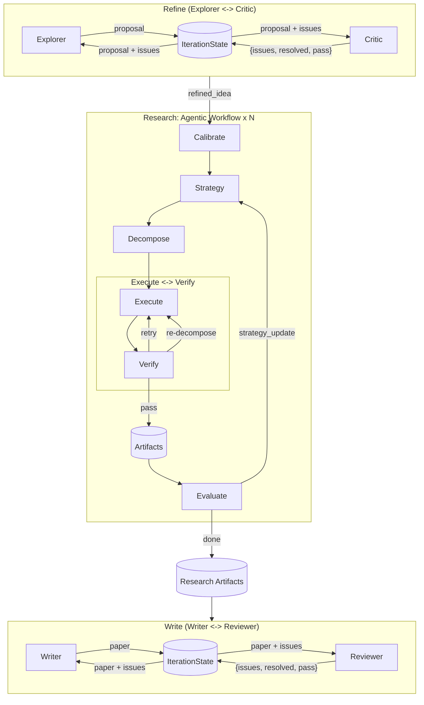

# MAARS 架构设计 v13.3.0

> 架构边界：runtime 管控制流与状态；agent 管开放任务。三阶段经文件型 session DB 衔接。

## 1. 目标与分工

**目标**：入口到论文端到端；状态落盘可恢复。

**分工**：`if/for/while`、调度、重试、迭代终止 → runtime；检索、编码、解释 → agent。

**形态**：Research = agentic workflow（DAG、checkpoint、反馈在代码里）；Refine / Write = 自编排双 Agent 循环（IterationState 状态管理）。

## 2. 系统全景

### 2.1 五层架构

1. **入口层**：前端 + FastAPI
2. **编排层**：三阶段顺序和生命周期控制
3. **阶段层**：每个 stage 是稳定边界，通过 session DB 连接
4. **智能执行层**：自编排双 Agent 循环（Refine/Write）或单 Agent workflow（Research）
5. **工具与状态层**：工具与外部交互，文件型 DB 保存状态

### 2.2 阶段继承关系

```
Stage                          -- 生命周期 + 统一 SSE (_send) + LLM streaming (_stream_llm)
+-- ResearchStage              -- agentic workflow（直接调用 Agno Agent）
+-- TeamStage                  -- 自编排双 Agent 循环（primary + reviewer + IterationState）
    +-- RefineStage
    +-- WriteStage
```

### 2.3 三阶段工作流（端到端）



### 2.4 阶段职责

- **Refine**：意图 -> 可执行研究目标（双 Agent 循环）。
- **Research**：分解 -> 执行 <-> 验证 -> 评估，产出 artifacts（agentic workflow）。
- **Write**：综合为论文（双 Agent 循环，Writer + Reviewer）。

## 3. Refine 阶段

### 3.1 设计原则

- **Python 编排，Agent 执行**：循环、状态管理、终止判断在 runtime；文献调研、提案撰写、批判评审在 Agent。
- **恒定上下文**：每轮 Agent 收到的 prompt 大小恒定（原始 idea + 最新提案 + 未解决 issues），不随迭代轮数增长。
- **结构化通信**：Critic 输出 JSON `{pass, issues, resolved}`，runtime 机械执行状态更新，不依赖 LLM 做状态管理。

### 3.2 IterationState

```python
@dataclass
class IterationState:
    proposal: str           # 最新一版完整提案
    issues: list[dict]      # [{id, severity, section, problem, suggestion}]
    iteration: int           # 当前轮次
```

**状态更新规则**：
- `proposal`：每轮由 Explorer 产出，直接覆盖
- `issues`：Critic 输出 `resolved` 列表 -> 按 id 移除；Critic 输出 `issues` 列表 -> 追加
- `iteration`：每轮 +1

**上下文注入**：IterationState 不是 Agent 可感知的对象，而是通过 `_build_primary_prompt()` / `_build_reviewer_prompt()` 拼接到 user_text 中。

### 3.3 工作流

```
for round in range(max_delegations):
    Explorer(idea + state.proposal + state.issues)  -> proposal
    state.proposal = proposal

    Critic(idea + state.proposal + state.issues)    -> JSON {pass, issues, resolved}
    if pass: break

    state.update(proposal, feedback)
    # issues = remove resolved + append new
```

### 3.4 典型 IterationState 生命周期

```
Round 0:
  Explorer(idea)                           -> proposal v1
  Critic(idea + v1)                        -> {pass:false, issues:[A,B,C]}
  state = {proposal: v1, issues: [A,B,C], iteration: 1}

Round 1:
  Explorer(idea + v1 + [A,B,C])            -> proposal v2
  Critic(idea + v2 + [A,B,C])              -> {pass:false, issues:[D], resolved:[A,B]}
  state = {proposal: v2, issues: [C,D], iteration: 2}

Round 2:
  Explorer(idea + v2 + [C,D])              -> proposal v3
  Critic(idea + v3 + [C,D])                -> {pass:true}
  break -> save refined_idea.md
```

### 3.5 与 Research 的对比

| | Research | Refine |
|---|---|---|
| 循环 | strategy -> decompose -> execute -> evaluate | primary -> reviewer -> primary -> reviewer |
| 状态 | task_results + plan_tree + score | IterationState (proposal + issues) |
| 编排者 | Python runtime (`_run_loop`) | Python runtime (`_execute` for 循环) |
| Agent 角色 | 每个 task 独立 Agent | 两个固定角色交替 |
| 通信方式 | 通过 artifacts/DB | 通过 IterationState 注入 prompt |
| 持久化 | 有（checkpoint/resume） | 无（一次性，最终产物持久化） |
| 终止条件 | Evaluate 无 strategy_update | Critic pass=true 或达到 max_delegations |

核心模式一致：**Python 控制流程，Agent 只负责执行单步，状态在 runtime 层管理。**

## 4. Research 阶段

主循环开始前会调用 `_preflight_docker`：须本机 Docker daemon 可用，并已构建 `MAARS_DOCKER_SANDBOX_IMAGE` 指向的沙箱镜像（默认 `maars-sandbox:latest`）。

### 4.1 原则

- 每轮 LLM 带能力画像 `_build_capability_profile`。
- 链路：Calibrate -> Strategy -> Decompose -> Execute -> Evaluate，上下文显式传递。

### 4.2 关键环节（输入 / 输出 / 落盘）

**Calibrate**（一次性）

| 输入  | 能力画像 + 数据集 + 研究课题                      |
| --- | -------------------------------------- |
| 输出  | 原子定义（3-5 句），注入 Decompose system prompt |
| 存储  | `calibration.md`                       |

**Strategy**（每轮）

| 输入  | 能力画像 + 数据集 + 原子定义 + 研究课题（首轮）/ 旧策略 + 评估反馈（后续轮） |
| --- | --------------------------------------------- |
| 输出  | 策略文档 + score_direction                        |
| 存储  | `strategy/round_N.md`                         |

**Decompose**（每轮）

| 输入  | 研究课题（或迭代上下文）+ 原子定义 + 策略 + 兄弟上下文              |
| --- | -------------------------------------------- |
| 输出  | 扁平任务列表 + 树结构                                 |
| 存储  | `plan_tree.json`（真值）+ `plan_list.json`（派生缓存） |
| 机制  | 递归分解、`root_id` 支持任意节点、可调用搜索/阅读工具             |

**Execute**（每个任务）

| 输入  | 任务描述 + 沙箱约束 + 依赖摘要                    |
| --- | ------------------------------------- |
| 输出  | Markdown 结果 + artifacts + SUMMARY 行   |
| 存储  | `tasks/{id}.md` + `artifacts/{id}/`   |
| 机制  | Semaphore 原子化 execute->verify->retry 周期 |

**Verify**（每个任务）

| 输入  | 任务描述 + 执行结果                                      |
| --- | ------------------------------------------------ |
| 输出  | `{pass, review, redecompose}`                    |
| 机制  | 鼓励调用 list_artifacts 验证文件存在；fallback=`pass:false` |

**Evaluate**（每轮）

| 输入  | 研究目标 + 策略 + 分数趋势 + 历史评估 + 能力画像 + 任务摘要                   |
| --- | ------------------------------------------------------- |
| 输出  | `{feedback, suggestions, strategy_update?}`             |
| 存储  | `evaluations/round_N.json` + `evaluations/round_N.md`   |
| 机制  | `strategy_update` 存在 -> 继续迭代；`is_final` -> prompt 要求总结不继续 |

### 4.3 关键决策

| 决策          | 选择                                   |
| ----------- | ------------------------------------ |
| 迭代控制        | Evaluate 输出 `strategy_update` 决定是否继续 |
| 迭代反馈        | Strategy 更新后重新 Decompose             |
| 粒度校准        | 能力画像 + LLM                           |
| 重分解         | `decompose(root_id=task_id)`         |
| Summary     | Execute agent 写 SUMMARY 行            |
| 验证 fallback | `pass=False`                         |
| 数据真值        | `plan_tree.json`；`plan_list.json` 派生 |

### 4.4 主循环骨架

```python
# Calibrate (一次性)
await _calibrate_once(idea)

# 主循环
evaluation = None
while True:
    Strategy -> Decompose -> Execute -> Evaluate
    if not strategy_update: break
    iteration += 1
```

`evaluation = None`：首轮与后续轮分支在循环外处理。

## 5. Prompt、SSE、存储

### 5.1 Prompt

```
prompts.py              <- 分发层：根据 output_language 选择
prompts_zh.py           <- 全中文指令 + _PREFIX
prompts_en.py           <- 全英文指令 + _PREFIX
```

`_PREFIX` + system prompts（CALIBRATE / STRATEGY / ...）+ builder；指令语言 = `output_language`；约束来自能力画像，模板不写死规则。

Team prompts 额外包含 `_REVIEWER_OUTPUT_FORMAT`（JSON 结构化输出要求），由 Critic/Reviewer 的 system prompt 追加。

### 5.2 SSE

#### 约定

1. **统一事件格式**：`{stage, phase?, chunk?, status?, task_id?, error?}`
2. **有 chunk = 进行中**：流式文本，左面板渲染
3. **无 chunk = 结束信号**：DB 已写入，右面板从 DB 刷新
4. **有 status**：任务中间状态（running / verifying / retrying）
5. **DB 为唯一数据源**：SSE 只是通知，数据由前端从 DB 获取

#### 后端发送

```python
def _send(self, chunk=None, **extra):
    event = {"stage": self.name}
    if self._current_phase:
        event["phase"] = self._current_phase
    if chunk:
        event["chunk"] = chunk
        self.db.append_log(...)   # 持久化到 log.jsonl
    event.update(extra)
    self._broadcast(event)
```

**先写 DB，再发无 chunk 的结束信号。**

#### 标签职责

所有 level-2 标签（`Strategy · round 1` 等）由 `_run_loop` 循环体发出。内部方法（`_research_strategy`、`_calibrate`、`_decompose_round`）不发标签。

TeamStage 的 level-2 标签（`Explorer`、`Critic` 等）由 `_stream_llm(label=True, label_level=2)` 自动发出。

#### 前端三组件

| 组件             | 职责       | 消费方式                                         |
| -------------- | -------- | -------------------------------------------- |
| pipeline-ui    | 顶层进度条    | 首次出现新 stage/phase -> 点亮                       |
| log-viewer     | 左面板流式日志  | chunk -> 按 call_id 分组渲染；label chunk -> 创建 fold |
| process-viewer | 右面板状态仪表盘 | done signal -> fetch DB -> 更新固定容器              |

#### 右面板（状态仪表盘）

固定布局，非累积式：

```
+---------------------------+
| DOCUMENTS                 |  文件卡片横排（calibration, strategy_v0, strategy_v1...）
+---------------------------+
| SCORE                     |  分数逐轮追加
+---------------------------+
| DECOMPOSE                 |  单实例分解树，增量更新
+---------------------------+
| TASKS                     |  单实例执行列表，状态实时变
+---------------------------+
```

文档卡片：每次 done signal 扫描后端 `list_documents(prefix)` 获取版本列表。
任务点击：fetch `tasks/{id}.md` 全文，弹窗 markdown 渲染（marked.js）。
分数：每轮 evaluate 追加新分数元素。
状态缓冲：`pendingStatuses` 缓冲先于 DOM 到达的 running 事件。

### 5.3 数据存储

```
results/{session}/
+-- idea.md                     # 用户原始输入
+-- proposals/                  # Refine: Explorer 各版提案
|   +-- round_1.md
|   +-- round_2.md
+-- critiques/                  # Refine: Critic 各轮评审
|   +-- round_1.md + .json
|   +-- round_2.md + .json
+-- refined_idea.md             # Refine 最终产出
+-- calibration.md              # Research: 原子任务定义（一次性）
+-- strategy/                   # Research: 策略版本
|   +-- round_1.md
+-- plan_tree.json              # Research: 分解树（真值）
+-- plan_list.json              # Research: 扁平任务列表（派生缓存，含 status/batch/summary）
+-- tasks/                      # Research: 各任务 markdown 产出
+-- artifacts/                  # Research: 代码、图表等产出文件
+-- evaluations/                # Research: 评估版本
|   +-- round_1.json + .md
+-- drafts/                     # Write: Writer 各版论文草稿
|   +-- round_1.md
|   +-- round_2.md
+-- reviews/                    # Write: Reviewer 各轮评审
|   +-- round_1.md + .json
|   +-- round_2.md + .json
+-- paper.md                    # Write 最终产出
+-- meta.json                   # 元信息（tokens、score、score_direction）
+-- log.jsonl                   # 流式 chunk 日志
+-- execution_log.jsonl         # Docker 执行记录
+-- reproduce/                  # 复现文件
```

`plan_tree.json` 是唯一真值。`plan_list.json` 是派生缓存，由 `save_plan` / `append_tasks` / `bulk_update_tasks` 维护。

## 6. 代码结构

```
backend/
+-- pipeline/
|   +-- orchestrator.py          # 三阶段顺序控制
|   +-- stage.py                 # Stage 基类（生命周期 + SSE + _stream_llm）
|   +-- research.py              # ResearchStage -- workflow 引擎
|   +-- decompose.py             # 通用分解引擎（支持 root_id）
|   +-- prompts.py               # 语言分发层
|   +-- prompts_zh.py            # 全中文 prompt + builder 函数
|   +-- prompts_en.py            # 全英文 prompt + builder 函数
+-- team/
|   +-- stage.py                 # TeamStage -- 自编排双 Agent 循环 + IterationState
|   +-- refine.py                # RefineStage: Explorer + Critic
|   +-- write.py                 # WriteStage: Writer + Reviewer
|   +-- prompts.py               # 语言分发层
|   +-- prompts_zh.py            # 全中文 Team prompts + _REVIEWER_OUTPUT_FORMAT
|   +-- prompts_en.py            # 全英文 Team prompts + _REVIEWER_OUTPUT_FORMAT
+-- agno/
|   +-- __init__.py              # Stage factory
|   +-- models.py                # Model factory
|   +-- tools/                   # Agent 工具（DB, Docker）
+-- main.py                      # FastAPI 入口（含 NoCacheStaticMiddleware）
+-- config.py                    # 环境变量（含 output_language）
+-- db.py                        # 文件型 Session DB
+-- routes/                      # API 路由
```
