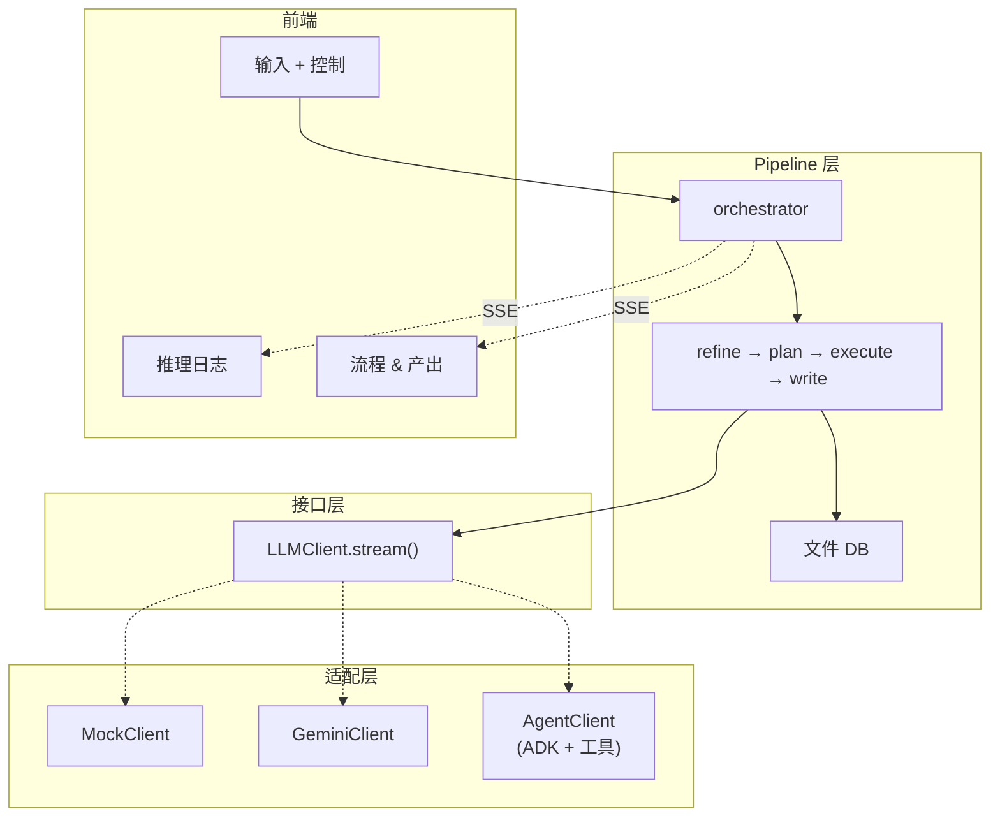

# 架构与数据流

## 三层架构

```
Pipeline 层（流程逻辑）
    ↓ 依赖
Interface 层（LLMClient.stream()）
    ↓ 实现
Adapter 层（Mock / Gemini / Agent）
```

Pipeline 定义通用流程，Adapter 只负责 LLM 通信方式的差异。



## 设计原则

| 原则 | 说明 |
|------|------|
| **三层解耦** | `pipeline/` → `LLMClient` → `mock/gemini/adk/agno` — pipeline 不知道当前是哪个适配器 |
| **阶段间仅通过 DB 通信** | 每个阶段从 DB 读输入，写产出到 DB，不通过内存传递字符串 |
| **读写分离** | **读**：Agent 用工具自主读取；Gemini/Mock 由 pipeline 预加载。**写**：始终由 `finalize()` 确定性写入 |
| **统一广播** | 所有 Client yield `StreamEvent`，pipeline 通过 `_dispatch_stream()` 统一广播。Client 不持有 broadcast 回调 |
| **工具策略** | ADK 内置 > MCP 生态 > 自建（仅限内部 DB 工具） |

## 数据流：Gemini 模式

Pipeline 预加载所有内容到 prompt，GeminiClient 流式输出文本。

```
用户输入 idea
  ↓
REFINE
  ├── load_input() → db.get_idea()         [pipeline 预加载]
  ├── 3 轮：Explore → Evaluate → Crystallize
  ├── GeminiClient.stream() → yield chunks → pipeline emit → UI
  └── finalize() → db.save_refined_idea()

PLAN
  ├── load_input() → db.get_refined_idea()  [pipeline 预加载]
  ├── 递归分解 → LLM 判断 atomic/decompose
  └── _finalize_output() → db.save_plan(json, tree)

EXECUTE
  ├── load_input() → db.get_plan_json()     [pipeline 预加载]
  ├── topological_batches() → 并行批次执行
  ├── 每个任务：
  │   ├── 依赖内容从 DB 预加载到 prompt
  │   ├── exec → verify → 失败则 retry
  │   └── db.save_task_output(id, result)
  └── _build_final_output()

WRITE
  ├── load_input() → ""                     [build_messages 内部读 DB]
  ├── outline: db.get_refined_idea() + 任务列表
  ├── sections: db.get_task_output(tid) 按章节读取
  ├── polish: 组装全文润色
  └── finalize() → db.save_paper()
```

## 数据流：Agent 模式

Agent 通过工具自主读取输入。Refine 和 Write 使用独立的 Agent stage（单 session），
Plan 和 Execute 复用 pipeline stage（共享逻辑，Agent 作为 LLM client）。

```
用户输入 idea
  ↓
REFINE ← AgentRefineStage（单 session，max_rounds=1）
  ├── load_input() → db.get_idea()
  ├── AgentClient.stream()：
  │   ├── Agent 自主执行 Explore → Evaluate → Crystallize
  │   ├── 使用 search/arXiv/fetch 工具查找真实文献
  │   ├── Think/Tool/Result → broadcast → UI
  │   └── 最终研究提案 → yield → pipeline
  └── finalize() → db.save_refined_idea()

PLAN ← PlanStage（共用，同 Gemini 模式）
  ├── load_input() → db.get_refined_idea()
  ├── AgentClient(tools=[]) → 退化为普通 LLM 调用
  ├── 递归分解（同 Gemini 模式）
  └── _finalize_output() → db.save_plan(json, tree)

EXECUTE ← ExecuteStage（共用，但每个任务由独立 Agent session 执行）
  ├── load_input() → db.get_plan_json()     [结构化数据，pipeline 直接读]
  ├── topological_batches() → 并行批次执行
  ├── 每个任务 → 独立 Agent session：
  │   ├── prompt 列出依赖 ID，Agent 用 read_task_output 工具读取
  │   ├── Agent 自主决策：search / code_execute / fetch
  │   │   └── code_execute → Docker 容器 → artifacts/ 落盘
  │   ├── verify → 失败则 retry → 再失败则阶段停止
  │   └── db.save_task_output(id, result)
  └── _build_final_output() + generate_reproduce_files()

WRITE ← AgentWriteStage（单 session，max_rounds=1）
  ├── load_input() → 指令文本（Agent 通过工具读取所有内容）
  ├── AgentClient.stream()：
  │   ├── Agent 调用 list_tasks → read_task_output → read_refined_idea
  │   ├── Agent 自主决定论文结构并逐章节撰写
  │   ├── 可调用 search 工具补充引用
  │   └── 完整论文 → yield → pipeline
  └── finalize() → db.save_paper()
```

## 模式对比

| | Gemini/Mock | Agent |
|---|---|---|
| Refine | RefineStage（3 轮 LLM 调用） | AgentRefineStage（1 个 Agent session 自主完成） |
| Plan | PlanStage（共用） | PlanStage（共用） |
| Execute | ExecuteStage（并行 LLM 调用） | ExecuteStage（并行 Agent session，各带工具） |
| Write | WriteStage（outline→sections→polish 多 phase） | AgentWriteStage（1 个 Agent session 自主完成） |
| 读输入 | Pipeline 从 DB 预加载到 prompt | Refine/Plan：DB 预加载；Execute/Write：Agent 用工具读取 |
| 写输出 | `finalize()` 确定性写 DB | 同左 |
| 依赖注入 | 内容塞进 prompt | 列出 ID，Agent 调 `read_task_output` |
| 工具 | 无 | 搜索、代码执行、DB、网页抓取 |
| UI 广播 | Pipeline emit chunks | AgentClient broadcast |
| 文件产出 | 无 artifacts | `artifacts/` + Docker 复现文件 |

## 阶段间通信

阶段之间**仅通过 DB** 通信，不传递内存字符串。

```
research/{id}/
├── idea.md              Refine 读取
├── refined_idea.md      Plan 读取      ← Refine 写入
├── plan.json            Execute 读取   ← Plan 写入
├── plan_tree.json       (UI + Write)   ← Plan 写入
├── tasks/*.md           Write 读取     ← Execute 写入
├── artifacts/           Write 引用     ← Execute/Docker 写入
└── paper.md                            ← Write 写入
```

## 阶段控制：Stop / Resume / Retry

| 操作 | 行为 |
|------|------|
| **Stop** | 取消当前 stage 的 asyncio task，状态 → PAUSED。Agent 的 ReAct loop 被 break，不产生不完整结果 |
| **Resume** | 重启 `run()`。Execute 从 DB 加载 checkpoint（`tasks/*.md` 存在 = 已完成），跳过已完成任务，只跑剩余。其他 stage 等同于 retry（单 session 无 checkpoint 概念） |
| **Retry** | 清空 stage 内存状态 + DB task 文件，完全从头重跑。同时重置所有下游 stage |

```
Stop 流程：
  orchestrator.stop_stage()
    → llm_client.request_stop()    // Agent ReAct break
    → stage._run_id += 1           // 让当前 run 的 stale check 失效
    → cancel_task(stage + pipeline) // CancelledError 传播
    → state = PAUSED

Resume 流程（Execute）：
  orchestrator.resume_stage()
    → stage.run()
      → _load_checkpoint()         // DB 读取已完成 task
      → topological_batches()      // 重算（确定性，结果相同）
      → 跳过 _task_results 中已有的 task
      → 执行剩余 task
```

## 工具策略

```
优先级：
ADK 模式：ADK 内置（google_search, url_context）+ MCP（Fetch）+ 自建（DB、Docker）
Agno 模式：Agno 内置（DuckDuckGo、arXiv、Wikipedia）+ 自建（DB、Docker）
代码执行统一走 Docker code_execute
```

不设 Skill 层 — 模型原生 ReAct 推理替代显式 Skill 编排。
