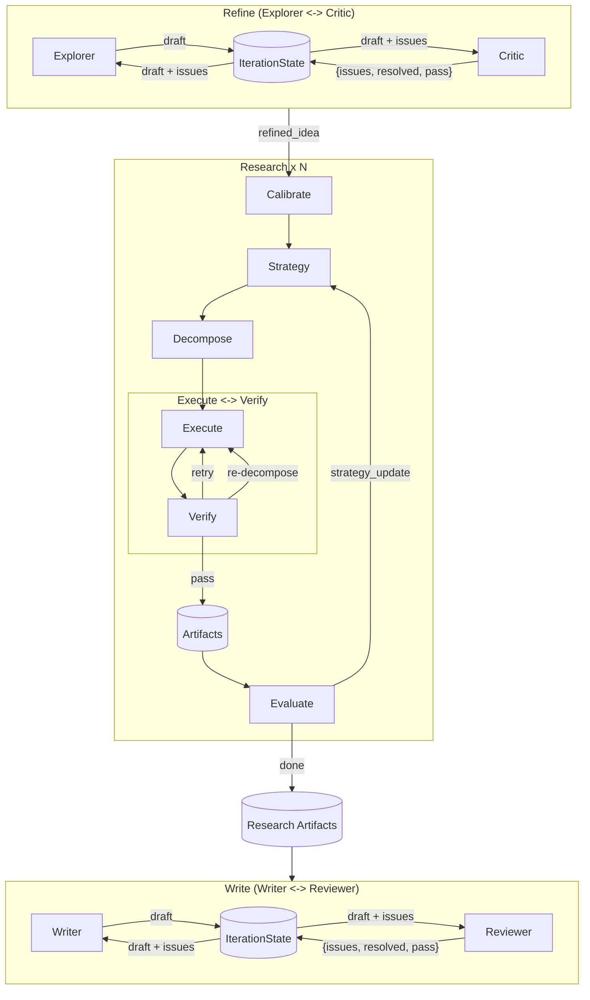

# MAARS 架构设计 v13.4.0

中文 | [English](../EN/architecture.md)

> 架构边界：runtime 管控制流与状态；agent 管开放任务。三阶段经文件型 session DB 衔接。
>
> 阶段详情：[Refine / Write](refine-write.md) | [Research](research.md)

## 1. 目标与分工

**目标**：入口到论文端到端；状态落盘可恢复。

**分工**：`if/for/while`、调度、重试、迭代终止 -> runtime；检索、编码、解释 -> agent。

**形态**：三个阶段均为 Multi-Agent——agent 产出落盘，runtime 编排，下一个 agent 从持久化文件恢复上下文。各阶段复杂度不同，但核心一致：Python 控制流程，Agent 执行开放性工作，状态存于磁盘。

## 2. 系统全景

### 2.1 五层架构

1. **入口层**：前端 + FastAPI
2. **编排层**：三阶段顺序和生命周期控制
3. **阶段层**：每个 stage 是稳定边界，通过 session DB 连接
4. **智能执行层**：Multi-Agent（所有阶段）
5. **工具与状态层**：工具与外部交互，文件型 DB 保存状态

### 2.2 阶段继承关系

```
Stage                          -- 生命周期 + 统一 SSE (_send) + LLM streaming (_stream_llm)
├── ResearchStage              -- Multi-Agent（任务分解 + 并行执行 + 评估循环）
└── TeamStage                  -- Multi-Agent（primary + reviewer + IterationState）
    ├── RefineStage
    └── WriteStage
```

### 2.3 三阶段工作流（端到端）



### 2.4 阶段职责

| 阶段 | 模式 | 职责 | 详情 |
|---|---|---|---|
| **Refine** | Multi-Agent（Explorer + Critic） | 意图 -> 可执行研究目标 | [refine-write.md](refine-write.md) |
| **Research** | Multi-Agent（Decompose + Execute + Evaluate） | 分解 -> 执行 <-> 验证 -> 评估 | [research.md](research.md) |
| **Write** | Multi-Agent（Writer + Reviewer） | 综合为论文 | [refine-write.md](refine-write.md) |

## 3. SSE

### 3.1 约定

1. **统一事件格式**：`{stage, phase?, chunk?, status?, task_id?, error?}`
2. **有 chunk = 进行中**：流式文本，左面板渲染
3. **无 chunk = 结束信号**：DB 已写入，右面板从 DB 刷新
4. **有 status**：任务中间状态（running / verifying / retrying）
5. **DB 为唯一数据源**：SSE 只是通知，数据由前端从 DB 获取

### 3.2 后端发送

```python
def _send(self, chunk=None, **extra):
    event = {"stage": self.name}
    if self._current_phase:
        event["phase"] = self._current_phase
    if chunk:
        event["chunk"] = chunk
        self.db.append_log(...)
    event.update(extra)
    self._broadcast(event)
```

### 3.3 标签层级

| level | 用途 | 来源 |
|---|---|---|
| 2 | stage/phase 标签 | Research `_run_loop` / TeamStage `_stream_llm(label_level=2)` |
| 3 | agent/member 内容 | TeamStage `_stream_llm(content_level=3)` |
| 4 | task 执行内容 | Research `_execute_task` |

### 3.4 前端三组件

| 组件 | 职责 | 消费方式 |
|---|---|---|
| pipeline-ui | 顶层进度条 | 首次出现新 stage/phase -> 点亮 |
| log-viewer | 左面板流式日志 | chunk -> 按 call_id 分组渲染；label chunk -> 创建 fold |
| process-viewer | 右面板状态仪表盘 | done signal -> fetch DB -> 更新固定容器 |

### 3.5 右面板布局

```
REFINE      Proposals [round_1] [round_2] ...
            Critiques [round_1] [round_2] ...
            Final     [refined_idea]

RESEARCH    Calibration [calibration]
            Strategies  [round_1] [round_2] ...
            Evaluations [round_1] [round_2] ...
            Score       0.82 -> 0.79

DECOMPOSE   (tree)

TASKS       (execution list)

WRITE       Drafts  [round_1] [round_2] ...
            Reviews [round_1] [round_2] ...
            Final   [paper]
```

## 4. 数据存储

```
results/{session}/
├── idea.md                     # 用户原始输入
├── refined_idea.md             # Refine 最终产出
├── proposals/                  # Refine: Explorer 各版提案
│   └── round_N.md
├── critiques/                  # Refine: Critic 各轮评审
│   ├── round_N.md
│   └── round_N.json
├── calibration.md              # Research: 原子任务定义
├── strategy/                   # Research: 策略版本
│   └── round_N.md
├── plan_tree.json              # Research: 分解树（真值）
├── plan_list.json              # Research: 扁平任务列表（派生缓存）
├── tasks/                      # Research: 各任务产出
│   └── {id}.md
├── artifacts/                  # Research: 代码、图表等
│   └── {id}/
├── evaluations/                # Research: 评估版本
│   ├── round_N.json
│   └── round_N.md
├── drafts/                     # Write: Writer 各版论文
│   └── round_N.md
├── reviews/                    # Write: Reviewer 各轮评审
│   ├── round_N.md
│   └── round_N.json
├── paper.md                    # Write 最终产出
├── meta.json                   # 元信息（tokens、score）
├── log.jsonl                   # 流式 chunk 日志
├── execution_log.jsonl         # Docker 执行记录
└── reproduce/                  # 复现文件
    ├── Dockerfile
    ├── run.sh
    └── docker-compose.yml
```

## 5. 代码结构

```
backend/
├── pipeline/
│   ├── orchestrator.py          # 三阶段顺序控制
│   ├── stage.py                 # Stage 基类（生命周期 + SSE + _stream_llm）
│   ├── research.py              # ResearchStage -- Multi-Agent 引擎
│   ├── decompose.py             # 通用分解引擎（支持 root_id）
│   ├── prompts.py               # 语言分发层
│   └── prompts_zh.py / _en.py   # Research prompts + builder 函数
├── team/
│   ├── stage.py                 # TeamStage -- IterationState + Multi-Agent 循环
│   ├── refine.py                # RefineStage: Explorer + Critic
│   ├── write.py                 # WriteStage: Writer + Reviewer
│   ├── prompts.py               # 语言分发层
│   └── prompts_zh.py / _en.py   # Team prompts + _REVIEWER_OUTPUT_FORMAT
├── agno/
│   ├── __init__.py              # Stage factory + 工具组装
│   ├── models.py                # Model factory（Gemini search=True）
│   └── tools/                   # Agent 工具（DB, Docker）
├── main.py                      # FastAPI 入口
├── config.py                    # 环境变量
├── db.py                        # 文件型 Session DB
└── routes/                      # API 路由
```
