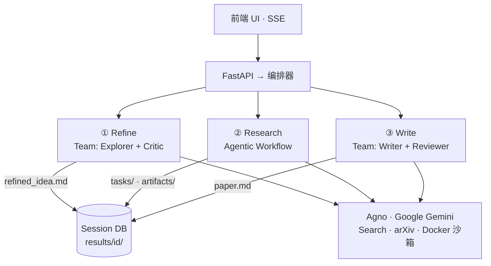

# MAARS 架构设计 v13.0.0

> 本文是 MAARS 的架构设计文档。回答"系统为什么这样设计、核心边界在哪里"。

## 1. 设计目标

1. **端到端自动化**：从研究想法或 Kaggle 入口出发，最终产出结构化研究结果和论文。
2. **控制权外化**：阶段切换、依赖调度、重试、迭代停止等确定性逻辑交给系统 runtime。
3. **智能能力内聚**：搜索、分析、代码执行、写作等开放性工作交给 agent。
4. **结果可恢复、可复盘**：所有状态和产出落盘，前端可观测，失败后可恢复。

## 2. 核心设计判断

**把不确定性留给 agent，把确定性留给 runtime。**

- `if / for / while` → 系统 runtime
- 检索、比较、写代码、解释结果 → agent

MAARS 是一个 **hybrid multi-agent research system**：
- Research 阶段：workflow runtime（DAG 调度、checkpoint、反馈循环由代码控制）
- Refine / Write 阶段：multi-agent 协作（Agno Team coordinate 模式）
- 三个阶段通过文件型 DB 解耦

## 3. 总体架构



五个层次：
1. **入口层**：前端 + FastAPI
2. **编排层**：三阶段顺序和生命周期控制
3. **阶段层**：每个 stage 是稳定边界，通过 session DB 连接
4. **智能执行层**：Agno Team（multi-agent）或 Agno Agent（单 agent workflow）
5. **工具与状态层**：工具与外部交互，文件型 DB 保存状态

### 类继承

```
Stage                          — 生命周期 + 统一 SSE (_send) + LLM streaming (_stream_llm)
├── ResearchStage              — agentic workflow（直接调用 Agno Agent）
└── TeamStage                  — 多 Agent（Agno Team coordinate）
    ├── RefineStage
    └── WriteStage
```

## 4. 三阶段设计

### 4.1 Refine：研究问题形成（Multi-Agent）

把输入意图转化为可执行的研究目标。使用 Agno Team coordinate 模式：

```
Leader → Explorer（搜索文献、产出提案） → Critic（批判新颖性/可行性） → Explorer（修订）→ refined_idea.md
```

### 4.2 Research：执行型工作流核心（Agentic Workflow）

```
refined_idea → Calibrate → Strategy → Decompose → Execute ⇄ Verify → Evaluate
                              ↑                                          │
                              └──────── strategy_update ─────────────────┘
```

Execute ⇄ Verify 内部：

```
Task Agent (execute + SUMMARY)
    ↓
  Verify (list_artifacts)
    ├── pass → ✓ 完成
    └── fail → Retry (携带 review)
                  ↓
                Verify
                  ├── pass → ✓ 完成
                  ├── fail + redecompose → decompose(root_id) → 回到 Task
                  └── fail → ✗ 失败
```

#### 设计原则

**能力接地**：每个 LLM 调用接收确定性能力画像（`_build_capability_profile`），决策基于真实约束。

**上下文连续性**：Calibrate → Strategy → Decompose → Execute → Evaluate，信息显式传递不丢弃。

#### 环节详解

**Calibrate**（一次性）
| 输入 | 能力画像 + 数据集 + 研究课题 |
|---|---|
| 输出 | 原子定义（3-5 句），注入 Decompose system prompt |
| 存储 | `calibration.md` |

**Strategy**（每轮）
| 输入 | 能力画像 + 数据集 + 原子定义 + 研究课题（首轮）/ 旧策略 + 评估反馈（后续轮） |
|---|---|
| 输出 | 策略文档 + score_direction |
| 存储 | `strategy/round_N.md` |

**Decompose**（每轮）
| 输入 | 研究课题（或迭代上下文）+ 原子定义 + 策略 + 兄弟上下文 |
|---|---|
| 输出 | 扁平任务列表 + 树结构 |
| 存储 | `plan_tree.json`（真值）+ `plan_list.json`（派生缓存） |
| 机制 | 递归分解、`root_id` 支持任意节点、可调用搜索/阅读工具 |

**Execute**（每个任务）
| 输入 | 任务描述 + 沙箱约束 + 依赖摘要 |
|---|---|
| 输出 | Markdown 结果 + artifacts + SUMMARY 行 |
| 存储 | `tasks/{id}.md` + `artifacts/{id}/` |
| 机制 | Semaphore 原子化 execute→verify→retry 周期 |

**Verify**（每个任务）
| 输入 | 任务描述 + 执行结果 |
|---|---|
| 输出 | `{pass, review, redecompose}` |
| 机制 | 鼓励调用 list_artifacts 验证文件存在；fallback=`pass:false` |

**Evaluate**（每轮）
| 输入 | 研究目标 + 策略 + 分数趋势 + 历史评估 + 能力画像 + 任务摘要 |
|---|---|
| 输出 | `{feedback, suggestions, strategy_update?}` |
| 存储 | `evaluations/round_N.json` + `evaluations/round_N.md` |
| 机制 | `strategy_update` 存在 → 继续迭代；`is_final` → prompt 要求总结不继续 |

#### 关键设计决策

| 决策 | 选择 | 理由 |
|------|------|------|
| 迭代控制 | Evaluate LLM 通过 `strategy_update` 决定 | 比硬编码分数阈值更灵活 |
| 迭代反馈 | 更新 Strategy → 重新 Decompose | 复用完整分解流程 |
| 粒度校准 | 确定性能力画像 + LLM 微调 | 同配置产出相同画像 |
| 重分解 | `decompose(root_id=task_id)` | 零 ID 重映射 |
| Summary | Execute agent 写 SUMMARY 行 | 执行者最了解产出 |
| 验证 fallback | `pass=False` | 不放过质量问题 |
| 数据真值 | `plan_tree.json` | `plan_list.json` 为派生缓存 |

#### 循环结构

```python
# Calibrate (一次性)
await _calibrate_once(idea)

# 主循环
evaluation = None
while True:
    Strategy → Decompose → Execute → Evaluate
    if not strategy_update: break
    iteration += 1
```

`evaluation=None` 区分首轮和后续轮，循环体无条件分支。

### 4.3 Write：结果综合（Multi-Agent）

```
Leader → Writer（读取所有产出、写论文） → Reviewer（审查） → Writer（修订） → paper.md
```

## 5. Prompt 架构

```
prompts.py              ← 分发层：根据 output_language 选择
prompts_zh.py           ← 全中文指令 + _PREFIX
prompts_en.py           ← 全英文指令 + _PREFIX
```

每个文件包含：
- `_PREFIX`：自动化模式 + 语言指令
- System prompts：CALIBRATE / STRATEGY / EXECUTE / VERIFY / EVALUATE / DECOMPOSE_TEMPLATE
- Builder 函数：动态拼接 user prompt（能力画像、依赖摘要、分数历史等）

指令语言与输出语言一致。Prompt 模板中零硬编码约束——所有限制来自动态能力画像。

## 6. SSE 事件系统

### 设计原则

1. **统一事件格式**：`{stage, phase?, chunk?, status?, task_id?, error?}`
2. **有 chunk = 进行中**：流式文本，左面板渲染
3. **无 chunk = 结束信号**：DB 已写入，右面板从 DB 刷新
4. **有 status**：任务中间状态（running / verifying / retrying）
5. **DB 为唯一数据源**：SSE 只是通知，数据由前端从 DB 获取

### 后端发送

```python
def _send(self, chunk=None, **extra):
    event = {"stage": self.name}
    if self._current_phase:
        event["phase"] = self._current_phase
    if chunk:
        event["chunk"] = chunk
        self.db.append_log(...)   # 持久化到 log.jsonl
    event.update(extra)
    self._broadcast(event)
```

关键规则：**先写 DB，再发结束信号**。

### 标签职责

所有 level-2 标签（`Strategy · round 1` 等）由 `_run_loop` 循环体发出。内部方法（`_research_strategy`、`_calibrate`、`_decompose_round`）不发标签。

### 前端三组件

| 组件 | 职责 | 消费方式 |
|------|------|----------|
| pipeline-ui | 顶层进度条 | 首次出现新 stage/phase → 点亮 |
| log-viewer | 左面板流式日志 | chunk → 按 call_id 分组渲染；label chunk → 创建 fold |
| process-viewer | 右面板状态仪表盘 | done signal → fetch DB → 更新固定容器 |

### 右面板（状态仪表盘）

固定布局，非累积式：

```
┌───────────────────────────┐
│ DOCUMENTS                 │  文件卡片横排（calibration, strategy_v0, strategy_v1...）
├───────────────────────────┤
│ SCORE                     │  分数逐轮追加
├───────────────────────────┤
│ DECOMPOSE                 │  单实例分解树，增量更新
├───────────────────────────┤
│ TASKS                     │  单实例执行列表，状态实时变
└───────────────────────────┘
```

文档卡片：每次 done signal 扫描后端 `list_documents(prefix)` 获取版本列表。
任务点击：fetch `tasks/{id}.md` 全文，弹窗 markdown 渲染（marked.js）。
分数：每轮 evaluate 追加新分数元素。
状态缓冲：`pendingStatuses` 缓冲先于 DOM 到达的 running 事件。

## 7. 数据存储

```
results/{session}/
├── calibration.md              # 原子任务定义（一次性）
├── strategy/                   # 策略版本
│   ├── round_0.md
│   └── round_1.md
├── evaluations/                # 评估版本
│   ├── round_0.json            # 结构化数据（代码消费）
│   ├── round_0.md              # 可读格式（前端展示）
│   ├── round_1.json
│   └── round_1.md
├── plan_tree.json              # 分解树（真值）
├── plan_list.json              # 扁平任务列表（派生缓存，含 status/batch/summary）
├── tasks/                      # 各任务 markdown 产出
├── artifacts/                  # 代码、图表等产出文件
├── idea.md                     # 用户原始输入
├── refined_idea.md             # Refine 阶段产出
├── paper.md                    # Write 阶段产出
├── meta.json                   # 元信息（tokens、score、score_direction）
├── log.jsonl                   # 流式 chunk 日志
├── execution_log.jsonl         # Docker 执行记录
└── reproduce/                  # 复现文件
```

`plan_tree.json` 是唯一真值。`plan_list.json` 是派生缓存，由 `save_plan` / `append_tasks` / `bulk_update_tasks` 维护。

## 8. 代码结构

```
backend/
├── pipeline/
│   ├── orchestrator.py          # 三阶段顺序控制
│   ├── stage.py                 # Stage 基类（生命周期 + SSE + _stream_llm）
│   ├── research.py              # ResearchStage — workflow 引擎
│   ├── decompose.py             # 通用分解引擎（支持 root_id）
│   ├── prompts.py               # 语言分发层
│   ├── prompts_zh.py            # 全中文 prompt + builder 函数
│   └── prompts_en.py            # 全英文 prompt + builder 函数
├── team/
│   ├── stage.py                 # TeamStage — Agno Team 事件处理
│   ├── refine.py                # RefineStage: Explorer + Critic
│   ├── write.py                 # WriteStage: Writer + Reviewer
│   ├── prompts.py               # 语言分发层
│   ├── prompts_zh.py            # 全中文 Team prompts
│   └── prompts_en.py            # 全英文 Team prompts
├── agno/
│   ├── __init__.py              # Stage factory
│   ├── models.py                # Model factory
│   └── tools/                   # Agent 工具（DB, Docker）
├── main.py                      # FastAPI 入口（含 NoCacheStaticMiddleware）
├── config.py                    # 环境变量（含 output_language）
├── db.py                        # 文件型 Session DB
└── routes/                      # API 路由
```
