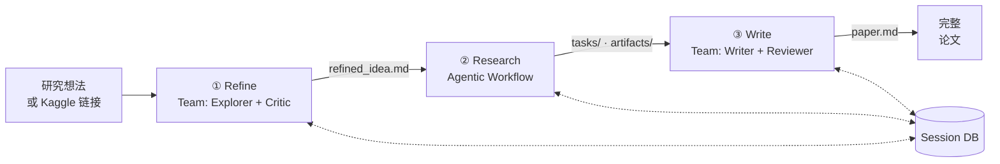
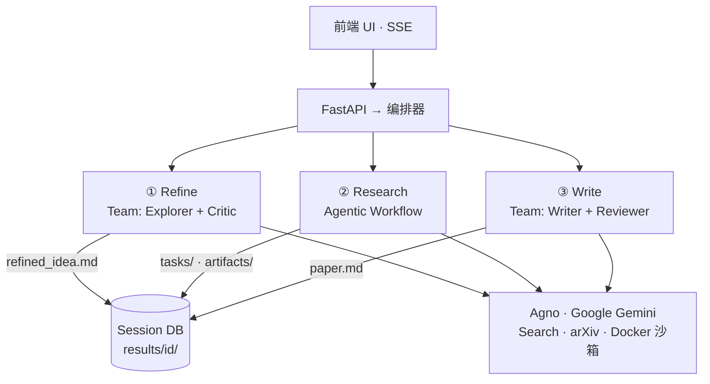
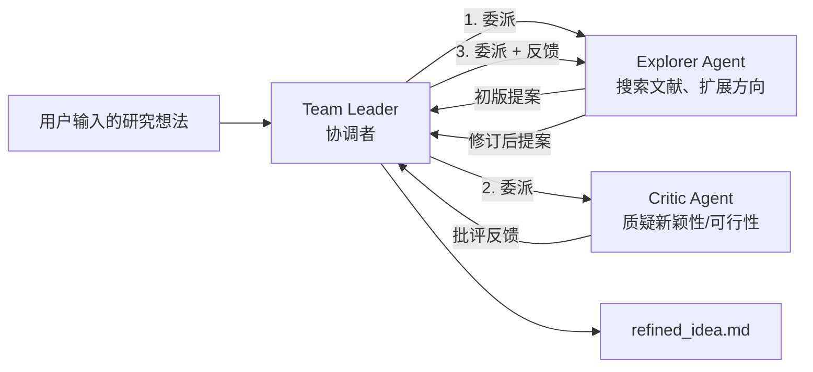
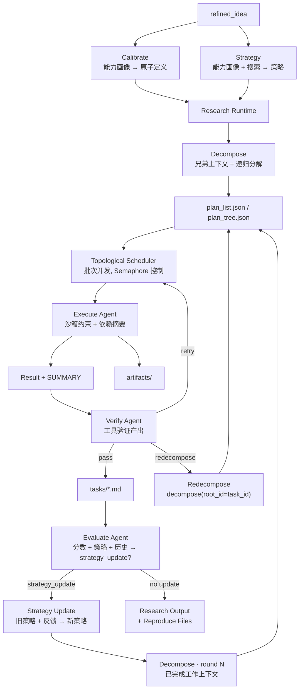
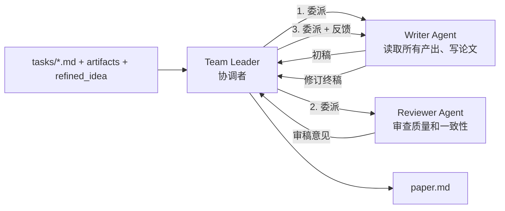

# MAARS 架构设计 v13.0.0

> 本文是 MAARS 的架构设计文档，不是代码导读。
> 它回答的是"系统为什么这样设计、核心边界在哪里"，而不是逐文件解释实现。

## 1. 设计目标

MAARS 要解决的问题不是"让一个模型写一篇长文"，而是把一项研究工作拆成可控、可恢复、可审计的系统流程。

系统设计目标有四个：

1. **端到端自动化**：从研究想法或 Kaggle 比赛入口出发，最终产出结构化研究结果和论文。
2. **控制权外化**：把阶段切换、依赖调度、重试、迭代停止等确定性逻辑交给系统，而不是交给模型临场决定。
3. **智能能力内聚**：把搜索、分析、代码执行、写作等开放性工作交给 agent 完成，让模型在自己最擅长的地方发挥价值。
4. **结果可恢复、可复盘**：所有重要状态和产出落盘，前端能看到执行过程，失败后能恢复，结束后能追溯。

## 2. 核心设计判断

MAARS 的架构建立在一个核心判断上：

**把不确定性留给 agent，把确定性留给 runtime。**

更具体地说：

- 如果一个决策可以稳定地写成 `if / for / while`，就应该由系统 runtime 负责。
- 如果一个任务依赖检索、比较、写代码、解释结果、组织文本，就应该交给 agent。

这直接导出了 MAARS 的整体形态：**一个 hybrid multi-agent research system。**

- Research 阶段的骨架是 workflow runtime（DAG 调度、checkpoint、反馈循环由代码控制）
- Refine 和 Write 阶段是真正的 multi-agent 协作（Agno Team coordinate 模式，agent 间有真实的信息流动）
- 三个阶段通过文件型 DB 解耦，彼此不知道对方的实现方式

### 2.1 与 Harness Engineering 的关系

如果借用 OpenAI 在 2026 年提出的 `harness engineering` 视角，MAARS 的 `Research` 可以被理解为一种 **research-task 级别的 harness engineering**：

- session DB 是 system of record
- Docker sandbox 是执行环境
- verify / evaluate / strategy update 是反馈回路
- runtime 负责控制，agent 负责执行

MAARS 做的是面向 research workflow 的 harness engineering，而不是面向整个软件仓库生命周期的 harness engineering。

## 3. 总体架构

### 数据流



### 系统架构



这个架构分成五个层次：

1. **入口层**：前端 + FastAPI，用于启动、暂停、恢复和观察执行过程。
2. **编排层**：负责三阶段顺序和生命周期控制。
3. **阶段层**：每个 stage 是一个稳定边界，输入输出通过 session DB 连接。
4. **智能执行层**：Agno Team（multi-agent 协作）或 Agno Agent（单 agent workflow，通过 `_stream_llm` 直接调用）。
5. **工具与状态层**：工具负责和外部世界交互，文件型 DB 负责保存系统状态。

### 类继承

```
Stage                          — 生命周期 + 统一 SSE (_send)
├── ResearchStage              — agentic workflow（直接调用 Agno Agent）
└── TeamStage                  — 多 Agent 执行（Agno Team coordinate）
    ├── RefineStage
    └── WriteStage
```

`Stage` 基类提供统一的生命周期管理（`run()` → `_execute()`）、SSE 广播（`_send()`）和 LLM 流式调用（`_stream_llm()`）。`ResearchStage` 直接继承 `Stage`，通过 `_stream_llm` 调用 Agno Agent 完成各环节。`TeamStage` 是 Refine 和 Write 的共享基类，在 `_execute()` 中内联处理 Agno Team 事件流，子类只需定义 `_create_team()`、`_finalize()` 和两个配置属性（`_member_map`、`_capture_member`）。

## 4. 三阶段设计

MAARS 把研究过程拆成三个阶段，不是因为"论文流程天然就有三步"，而是因为这三个阶段面对的是三类不同问题。

### 4.1 Refine：研究问题形成（Multi-Agent）

Refine 负责把输入意图转化为可执行的研究目标。

它的设计职责是：

- 明确研究问题
- 收敛研究方向
- 补齐背景、假设、方法大纲和目标
- 产出可交给 Research 阶段分解的 `refined_idea`

Refine 本质上是一个**探索与收敛问题**，天然适合多视角交叉验证。因此它使用 Agno Team coordinate 模式，两个 agent 协作：



- **Explorer**：有搜索工具（DuckDuckGo, arXiv, Wikipedia），负责发散探索和产出研究提案。
- **Critic**：无工具，负责从学术严谨性角度批判提案的新颖性、可行性和影响力。
- **Leader**：编排委派顺序（Explorer → Critic → Explorer），不参与具体内容生产。

`share_member_interactions=True` 确保 Critic 能看到 Explorer 的初稿，Explorer 能看到 Critic 的反馈。

### 4.2 Research：执行型工作流核心（Agentic Workflow）

Research 是 MAARS 的核心。

它负责把一个研究目标转化为一组可执行任务，并在运行中持续判断：

- 任务是否拆得合理
- 结果是否足够
- 是否需要重试或重新分解
- 策略是否需要调整
- 是否需要下一轮改进

Research 的设计定位是：

**一个带反馈回路、DAG 调度、策略自适应能力的 agentic workflow runtime。**



#### 设计原则

Research 的每个环节都遵循两个核心设计原则：

**1. 能力接地（Capability Grounding）**

每个 LLM 调用都接收确定性的能力画像（`_build_capability_profile`）——沙箱超时、内存、工具列表——确保模型的决策基于真实约束而非想象。Calibrate 和 Strategy 都以此为锚点，Evaluate 同样传入能力画像评判方案可行性。

**2. 上下文连续性（Context Continuity）**

信息在阶段间显式传递而非丢弃：Calibrate 的原子定义注入 Strategy，Strategy 的策略注入 Decompose，Execute 的 SUMMARY 行传给下游任务的 dep_summaries，Evaluate 的历史评估传给下一轮 Evaluate 避免重复建议。每个环节都知道前序环节做了什么。

#### 执行结构

- **`_prepare()`**：calibrate（能力画像 → 原子任务粒度）→ strategy（能力画像 + 搜索 → 研究策略）→ decompose（递归分解 + 兄弟上下文）
- **`_run_iterations()`**：execute → evaluate → strategy update → decompose round N 循环，由 Evaluate 的 `strategy_update` 字段控制是否继续
- **`_execute_all_tasks()`**：拓扑批次调度，API semaphore 确保每个任务的 execute→verify→retry 原子化执行

#### 关键设计决策

| 决策 | 选择 | 理由 |
|------|------|------|
| 迭代控制 | Evaluate LLM 通过 `strategy_update` 字段决定 | 比硬编码分数阈值更灵活，LLM 能综合判断 |
| 迭代反馈 | 更新 Strategy → 重新 Decompose | 比旧的 Replan（直接追加任务）更结构化，复用完整分解流程 |
| 任务粒度校准 | 确定性能力画像 + LLM 微调 | 同配置产出相同画像，减少分解随机性 |
| 重分解 | `decompose(root_id=task_id)` | 复用完整分解引擎，零 ID 重映射，兄弟上下文自动生效 |
| Summary 归属 | Execute agent 写 SUMMARY 行 | 执行者最了解产出；Verify 专注于验证产出是否存在 |
| 验证 fallback | `pass=False` | JSON 解析失败时不放过质量问题 |

### 4.3 Write：结果综合与论文生产（Multi-Agent）

Write 负责把 Research 阶段生成的任务结果、图表、实验输出和背景上下文，综合成一篇完整论文。

Write 不是简单拼接，而是一个**全局一致性与叙事组织问题**。它使用 Agno Team coordinate 模式：



- **Writer**：有 DB 工具（read_task_output, list_artifacts 等）和搜索工具，负责写作。
- **Reviewer**：无工具，从结构、完整性、深度、准确性等维度审查论文。
- **Leader**：编排委派顺序（Writer → Reviewer → Writer）。

### Refine 与 Write 的对称性

两个 Team stage 共享同一个 `TeamStage` 基类，执行流程完全一致：

| 概念 | Refine | Write |
|------|--------|-------|
| 主角 Agent | Explorer（探索） | Writer（写作） |
| 审查 Agent | Critic（批判） | Reviewer（审稿） |
| 输入 | 用户原始想法 | 所有 task 输出 + artifacts |
| 输出 | refined_idea.md | paper.md |
| 主角工具 | 搜索工具 | DB 工具 + 搜索工具 |
| 审查工具 | 无 | 无 |

## 5. 跨阶段支撑设计

### 5.1 状态外化

MAARS 把状态中心设计成 `results/{session_id}/` 下的一组文件，而不是隐藏在 agent 上下文里。

核心意义：**阶段之间通过文件契约衔接，而不是通过内存耦合。**

```text
results/{id}/
├── idea.md                    # 用户原始想法
├── refined_idea.md            # Refine 阶段产出
├── calibration.md             # 原子任务粒度定义
├── strategy.md                # 研究策略
├── plan_list.json             # 扁平任务列表（含 status 字段）
├── plan_tree.json             # 任务树结构
├── meta.json                  # 会话元信息（token 计数、score 方向等）
├── log.jsonl                  # SSE 流式日志（所有阶段的 chunk 记录）
├── execution_log.jsonl        # Docker 代码执行记录
├── tasks/                     # 各任务的产出 markdown
├── artifacts/                 # 代码、图表等产出文件
├── evaluations/               # 各轮次评估结果
├── reproduce/                 # 可复现文件（Dockerfile, run.sh, docker-compose.yml）
└── paper.md                   # Write 阶段产出的最终论文
```

`plan_list.json` 中每个任务带有 `status` 字段（pending / running / verifying / retrying / done / failed），由 runtime 在执行过程中实时更新，是前端 process-viewer 的数据来源。`meta.json` 记录 token 用量和评分方向等全局元信息。`log.jsonl` 是所有阶段的流式输出日志，供 log-viewer 回放和断点恢复使用。

### 5.2 工具边界

- **检索工具**：负责搜索、查论文、补背景。
- **DB 工具**：负责读取任务、计划和已有结果。
- **Docker 工具**：负责真实代码执行和 artifact 生成。

核心设计原则：**让 agent 按需取上下文，而不是让 orchestrator 预先拼一个巨大的 prompt。**

### 5.3 可观测性

MAARS 采用统一的 SSE 架构实现前端可观测性。

#### 统一事件格式

所有阶段共享同一个事件格式：

```json
{"stage": "research", "phase": "execute", "chunk": {"text": "...", "call_id": "Task 1.1", "level": 3}, "task_id": "1.1"}
```

核心规则：

- **有 chunk**：流式内容，表示执行正在进行中，前端左面板实时渲染
- **无 chunk**：完成信号，表示对应阶段/环节已完成，DB 已保存，前端右面板从 DB 刷新
- **有 status**：任务中间状态变更（running / verifying / retrying）

这个设计的核心思想是 **DB 是唯一的 truth source**。SSE 事件只是通知前端"有新数据了"，具体数据由前端从 DB 文件中获取。

#### 持久化日志

`Stage._send()` 在广播 SSE 事件的同时，将所有带 chunk 的事件写入 `log.jsonl`，实现流式输出的持久化。`execution_log.jsonl` 独立记录 Docker 代码执行的脚本和参数，用于复现和审计。

#### 前端三组件

前端通过三个独立的 listener 消费 SSE 事件：

1. **pipeline-ui**：顶层 pipeline 进度条。节点状态由事件的首次出现驱动（stage 首次出现 → 激活），不依赖事件顺序。
2. **log-viewer**：左面板流式输出。渲染 chunk 中的 text，按 call_id 分组、按 level 缩进。
3. **process-viewer**：右面板任务状态。从 `plan_list.json` 读取任务树和 status，从 `plan_tree.json` 渲染层级结构。

## 6. 代码结构

```
backend/
├── pipeline/                    # 编排层 + Agentic Workflow
│   ├── orchestrator.py          #   三阶段顺序控制
│   ├── stage.py                 #   Stage 基类（生命周期 + SSE + _stream_llm）
│   ├── research.py              #   ResearchStage — workflow 引擎
│   ├── decompose.py             #   任务分解 DAG
│   ├── prompts.py               #   语言分发层（选择 zh/en）
│   ├── prompts_zh.py            #   全中文 prompt + builder 函数
│   └── prompts_en.py            #   全英文 prompt + builder 函数
│
├── team/                        # Multi-Agent 协作模式
│   ├── stage.py                 #   TeamStage — 共享 run() + 内联事件处理
│   ├── refine.py                #   RefineStage: Explorer + Critic
│   ├── write.py                 #   WriteStage: Writer + Reviewer
│   ├── prompts.py               #   语言分发层
│   ├── prompts_zh.py            #   全中文 Team prompts
│   └── prompts_en.py            #   全英文 Team prompts
│
├── agno/                        # Agno 基础设施
│   ├── __init__.py              #   Stage factory
│   ├── models.py                #   Model factory
│   └── tools/                   #   Agent 工具（DB, Docker）
│
├── main.py                      # FastAPI 入口
├── config.py                    # 环境变量
├── db.py                        # 文件型 Session DB
├── kaggle.py                    # Kaggle 竞赛集成
└── routes/                      # API 路由
    ├── pipeline.py              #   Pipeline 控制（start/stop/resume/status）
    ├── events.py                #   SSE 事件流
    └── session.py               #   会话管理
```

## 7. 最终口径

**MAARS 是一个混合式多智能体研究系统。Refine 和 Write 使用 Agno Team coordinate 模式实现 agent 间的真实协作，Research 使用 runtime 驱动的 agentic workflow 实现带反馈回路的任务执行。Research 的迭代由 Evaluate agent 通过 `strategy_update` 字段自主决策：有更新则驱动 Strategy → Decompose → Execute 新一轮循环，无更新则停止。所有 LLM 调用基于确定性能力画像接地，prompt 支持中英双语按配置切换。三个阶段通过文件型 DB 完全解耦，DB 是唯一的 truth source。前端作为 runtime 的观察器，通过 SSE 事件驱动三个独立组件实现全流程可视化。**
