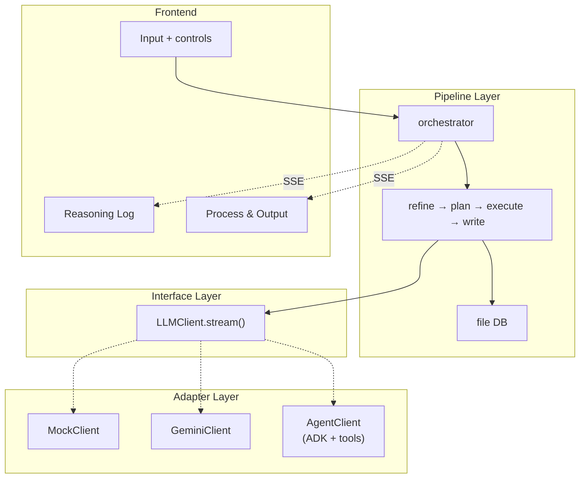

# Architecture & Data Flow

## Three-Layer Architecture

```
Pipeline Layer (flow logic)
    ↓ depends on
Interface Layer (LLMClient.stream())
    ↓ implemented by
Adapter Layer (Mock / Gemini / Agent)
```

Pipeline defines universal flow. Adapters only differ in how they communicate with LLMs.



## Design Principles

| Principle | Detail |
|-----------|--------|
| **Three-layer decoupling** | `pipeline/` → `LLMClient` → `mock/gemini/agent` — pipeline never knows which adapter is active |
| **DB-only inter-stage communication** | Stages read input from DB, write output to DB. No string passing between stages |
| **Read/write split** | **Read**: Agent uses tools autonomously; Gemini/Mock pre-loaded by pipeline. **Write**: always deterministic via `finalize()` |
| **Broadcast split** | `has_broadcast=False` (Gemini/Mock): pipeline emits chunks. `has_broadcast=True` (Agent): adapter broadcasts Think/Tool/Result |
| **Tool strategy** | ADK built-in > MCP ecosystem > custom (internal DB only) |

## Data Flow: Gemini Mode

Pipeline pre-loads all content into prompts. GeminiClient streams text.

```
User idea
  ↓
REFINE
  ├── load_input() → db.get_idea()         [pipeline pre-loads]
  ├── 3 rounds: Explore → Evaluate → Crystallize
  ├── GeminiClient.stream() → yield chunks → pipeline emit → UI
  └── finalize() → db.save_refined_idea()

PLAN
  ├── load_input() → db.get_refined_idea()  [pipeline pre-loads]
  ├── recursive decompose → LLM judges atomic/split
  └── _finalize_output() → db.save_plan(json, tree)

EXECUTE
  ├── load_input() → db.get_plan_json()     [pipeline pre-loads]
  ├── topological_batches() → parallel execution
  ├── each task:
  │   ├── deps pre-loaded from DB into prompt
  │   ├── exec → verify → retry if needed
  │   └── db.save_task_output(id, result)
  └── _build_final_output()

WRITE
  ├── load_input() → ""                     [reads DB in build_messages]
  ├── outline: db.get_refined_idea() + task list
  ├── sections: db.get_task_output(tid) per section
  ├── polish: combine and refine
  └── finalize() → db.save_paper()
```

## Data Flow: Agent Mode

Agent reads inputs via tools autonomously. Refine and Write use dedicated Agent stages
(single session). Plan and Execute reuse pipeline stages (shared logic, Agent as LLM client).

```
User idea
  ↓
REFINE ← AgentRefineStage (single session, max_rounds=1)
  ├── load_input() → db.get_idea()
  ├── AgentClient.stream():
  │   ├── Agent autonomously: Explore → Evaluate → Crystallize
  │   ├── Uses search/arXiv/fetch tools for real literature
  │   ├── Think/Tool/Result → broadcast → UI
  │   └── Final research proposal → yield → pipeline
  └── finalize() → db.save_refined_idea()

PLAN ← PlanStage (shared, same as Gemini)
  ├── load_input() → db.get_refined_idea()
  ├── AgentClient(tools=[]) → degrades to plain LLM
  ├── recursive decompose (same as Gemini)
  └── _finalize_output() → db.save_plan(json, tree)

EXECUTE ← ExecuteStage (shared, but each task runs as independent Agent session)
  ├── load_input() → db.get_plan_json()     [structural, pipeline reads]
  ├── topological_batches() → parallel execution
  ├── each task → independent Agent session:
  │   ├── prompt lists dep IDs (Agent reads via read_task_output tool)
  │   ├── Agent decides: search / code_execute / fetch
  │   │   └── code_execute → Docker → artifacts/ on disk
  │   ├── verify → retry if needed
  │   └── db.save_task_output(id, result)
  └── _build_final_output() + generate_reproduce_files()

WRITE ← AgentWriteStage (single session, max_rounds=1)
  ├── load_input() → directive text (Agent reads all content via tools)
  ├── AgentClient.stream():
  │   ├── Agent calls list_tasks → read_task_output → read_refined_idea
  │   ├── Agent designs paper structure and writes section by section
  │   ├── May search for additional citations
  │   └── Complete paper → yield → pipeline
  └── finalize() → db.save_paper()
```

## Mode Comparison

| | Gemini/Mock | Agent |
|---|---|---|
| Refine | RefineStage (3 LLM rounds) | AgentRefineStage (1 Agent session, self-directed) |
| Plan | PlanStage (shared) | PlanStage (shared) |
| Execute | ExecuteStage (parallel LLM calls) | ExecuteStage (parallel Agent sessions with tools) |
| Write | WriteStage (outline→sections→polish) | AgentWriteStage (1 Agent session, self-directed) |
| Read input | Pipeline pre-loads from DB | Refine/Plan: DB pre-loaded; Execute/Write: Agent reads via tools |
| Write output | `finalize()` writes DB | Same (deterministic) |
| Dependencies | Content in prompt | Agent calls `read_task_output` |
| Tools | None | search, code, DB, fetch |
| UI broadcast | Pipeline emits chunks | AgentClient broadcasts |
| Artifacts | None | `artifacts/` + Docker reproduction files |

## Inter-Stage Communication

Stages communicate **only through DB**. No `stage.output` string passing.

```
research/{id}/
├── idea.md              Refine reads
├── refined_idea.md      Plan reads      ← Refine writes
├── plan.json            Execute reads   ← Plan writes
├── plan_tree.json       (UI + Write)    ← Plan writes
├── tasks/*.md           Write reads     ← Execute writes
├── artifacts/           Write refs      ← Execute/Docker writes
└── paper.md                             ← Write writes
```

## Stage Control: Stop / Resume / Retry

| Action | Behavior |
|--------|----------|
| **Stop** | Cancels the stage's asyncio task. State → PAUSED. Agent's ReAct loop is broken cleanly — no partial results saved |
| **Resume** | Restarts `run()`. Execute loads checkpoint from DB (`tasks/*.md` exists = completed), skips completed tasks, runs remaining. Other stages restart from scratch (single-session, no checkpoint) |
| **Retry** | Clears in-memory state + DB task files, reruns everything. Also resets all downstream stages |

```
Stop flow:
  orchestrator.stop_stage()
    → llm_client.request_stop()    // Agent ReAct break
    → stage._run_id += 1           // invalidate stale check
    → cancel_task(stage + pipeline) // CancelledError propagates
    → state = PAUSED

Resume flow (Execute):
  orchestrator.resume_stage()
    → stage.run()
      → _load_checkpoint()         // load completed tasks from DB
      → topological_batches()      // recompute (deterministic, same result)
      → skip tasks already in _task_results
      → execute remaining tasks
```

## Tool Strategy

```
Priority:
1. ADK built-in (google_search, url_context, BuiltInCodeExecutor)
2. MCP ecosystem (arXiv MCP, Fetch MCP)
3. Custom (DB tools, Docker tools — internal data only)
```

No Skill layer — model-native ReAct reasoning replaces explicit skill orchestration.
