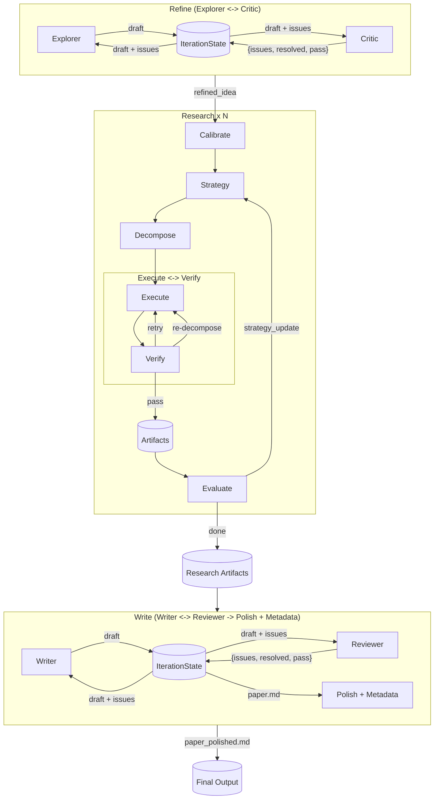

# MAARS Architecture v13.4.0

[中文](../CN/architecture.md) | English

> Boundary: runtime controls flow and state; agents handle open-ended tasks. Three stages connected via file-based session DB.
>
> Stage details: [Refine / Write](refine-write.md) | [Research](research.md)

## 1. Goals & Responsibilities

**Goal**: End-to-end from input to paper; state persisted and recoverable.

**Split**: `if/for/while`, scheduling, retries, termination -> runtime; search, coding, reasoning -> agent.

**Pattern**: All three stages are multi-agent — agents produce artifacts, runtime orchestrates, next agent restores context from persisted files. Stages differ in complexity but share the same core: Python controls flow, agents execute open-ended work, state lives on disk.

## 2. System Overview

### 2.1 Five-Layer Architecture

1. **Entry layer**: Frontend + FastAPI
2. **Orchestration layer**: Three-stage sequencing and lifecycle control
3. **Stage layer**: Each stage is a stable boundary, connected via session DB
4. **Execution layer**: Multi-Agent (all stages)
5. **Tools & State layer**: Tools for external interaction, file-based DB for state

### 2.2 Stage Inheritance

```
Stage                          -- lifecycle + SSE (_send) + LLM streaming (_stream_llm)
├── ResearchStage              -- multi-agent (task decomposition + parallel execution + evaluation loop)
└── TeamStage                  -- Multi-Agent (primary + reviewer + IterationState)
    ├── RefineStage
    └── WriteStage             -- overrides _execute() to add polish + metadata sub-phases after the Writer/Reviewer loop
```

### 2.3 End-to-End Pipeline



### 2.4 Stage Responsibilities

| Stage | Pattern | Role | Details |
|---|---|---|---|
| **Refine** | Multi-Agent (Explorer + Critic) | Intent -> actionable research goal | [refine-write.md](refine-write.md) |
| **Research** | Multi-Agent (Decompose + Execute + Evaluate) | Decompose -> Execute <-> Verify -> Evaluate | [research.md](research.md) |
| **Write** | Multi-Agent (Writer + Reviewer) + polish/metadata sub-phases | Synthesize into paper, then polish + append metadata | [refine-write.md](refine-write.md) |

## 3. SSE

### 3.1 Conventions

1. **Unified event format**: `{stage, phase?, chunk?, status?, task_id?, error?}`
2. **With chunk = in progress**: streaming text, left panel renders
3. **Without chunk = done signal**: DB written, right panel fetches from DB
4. **With status**: task intermediate state (running / verifying / retrying)
5. **DB is the single source of truth**: SSE is notification only

### 3.2 Backend Broadcast

```python
def _send(self, chunk=None, **extra):
    event = {"stage": self.name}
    if self._current_phase:
        event["phase"] = self._current_phase
    if chunk:
        event["chunk"] = chunk
        self.db.append_log(...)
    event.update(extra)
    self._broadcast(event)
```

### 3.3 Label Levels

| Level | Purpose | Source |
|---|---|---|
| 2 | Stage/phase labels | Research `_run_loop` / TeamStage `_stream_llm(label_level=2)` |
| 3 | Agent/member content | TeamStage `_stream_llm(content_level=3)` |
| 4 | Task execution content | Research `_execute_task` |

### 3.4 Frontend Components

| Component | Role | Consumption |
|---|---|---|
| pipeline-ui | Top progress bar | First appearance of new stage/phase -> highlight |
| log-viewer | Left panel streaming log | chunk -> group by call_id; label chunk -> create fold |
| process-viewer | Right panel state dashboard | done signal -> fetch DB -> update containers |

### 3.5 Right Panel Layout

```
REFINE      Proposals [round_0] [round_1] ...
            Critiques [round_0] [round_1] ...
            Final     [refined_idea]

RESEARCH    Calibration [calibration]
            Strategies  [round_0] [round_1] ...
            Evaluations [round_0] [round_1] ...
            Score       0.82 -> 0.79

DECOMPOSE   (tree)

TASKS       (execution list)

WRITE       Drafts   [round_0] [round_1] ...
            Reviews  [round_0] [round_1] ...
            Draft    [paper]
            Polished [paper_polished]
```

> Note: round files are 0-indexed (`round_0`, `round_1`, ...).

## 4. Data Storage

```
results/{session}/
├── idea.md                     # User raw input
├── refined_idea.md             # Refine final output
├── proposals/                  # Refine: Explorer draft versions
│   └── round_N.md
├── critiques/                  # Refine: Critic reviews
│   ├── round_N.md
│   └── round_N.json
├── calibration.md              # Research: atomic task definition
├── strategy/                   # Research: strategy versions
│   └── round_N.md
├── plan_tree.json              # Research: decomposition tree (source of truth)
├── plan_list.json              # Research: flat task list (derived cache)
├── tasks/                      # Research: task outputs
│   └── {id}.md
├── artifacts/                  # Research: code, figures, data
│   └── {id}/
├── evaluations/                # Research: evaluation versions
│   ├── round_N.json
│   └── round_N.md
├── drafts/                     # Write: Writer draft versions
│   └── round_N.md
├── reviews/                    # Write: Reviewer reviews
│   ├── round_N.md
│   └── round_N.json
├── paper.md                    # Write: draft output (after Writer/Reviewer loop)
├── paper_polished.md           # Write: final output (after polish + metadata sub-phases)
├── meta.json                   # Metadata (tokens, score)
├── log.jsonl                   # Streaming chunk log
├── execution_log.jsonl         # Docker execution log
└── reproduce/                  # Reproduction files
    ├── Dockerfile
    ├── run.sh
    └── docker-compose.yml
```

## 5. Code Structure

```
backend/
├── pipeline/
│   ├── orchestrator.py          # Three-stage sequencing
│   ├── stage.py                 # Stage base class (lifecycle + SSE + _stream_llm)
│   ├── research.py              # ResearchStage -- Multi-Agent engine
│   ├── decompose.py             # Recursive decomposition engine
│   ├── prompts.py               # Language dispatcher
│   └── prompts_zh.py / _en.py   # Research prompts + builder functions
├── team/
│   ├── stage.py                 # TeamStage -- IterationState + Multi-Agent loop
│   ├── refine.py                # RefineStage: Explorer + Critic
│   ├── write.py                 # WriteStage: Writer + Reviewer + polish/metadata sub-phases
│   ├── polish.py                # Utility module: build_polish_input, build_metadata_appendix
│   ├── prompts.py               # Language dispatcher
│   └── prompts_zh.py / _en.py   # Team prompts + _REVIEWER_OUTPUT_FORMAT + POLISH_SYSTEM
├── agno/
│   ├── __init__.py              # Stage factory + tool assembly
│   ├── models.py                # Model factory (Gemini search=True)
│   └── tools/                   # Agent tools (DB, Docker)
├── main.py                      # FastAPI entry
├── config.py                    # Environment config
├── db.py                        # File-based Session DB
└── routes/                      # API routes
```
