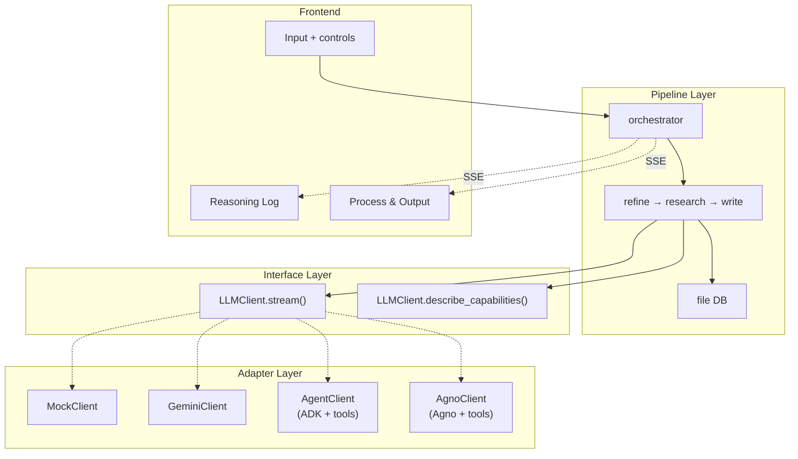

# Architecture & Data Flow

## Three-Layer Architecture

```
Pipeline Layer (flow logic)
    ↓ depends on
Interface Layer (LLMClient.stream())
    ↓ implemented by
Adapter Layer (Mock / Gemini / ADK Agent / Agno)
```

Pipeline defines universal flow. Adapters only differ in how they communicate with LLMs.



## Design Principles

| Principle | Detail |
|-----------|--------|
| **Three-layer decoupling** | `pipeline/` → `LLMClient` → `mock/gemini/agent/agno` — pipeline never knows which adapter is active |
| **DB-only inter-stage communication** | Stages read input from DB, write output to DB. No in-memory passing |
| **Read/write split** | **Read**: Agent uses tools autonomously; Gemini/Mock pre-loaded by pipeline. **Write**: always deterministic via `finalize()` |
| **Unified broadcast** | All clients yield `StreamEvent`, pipeline dispatches via `_dispatch_stream()` |
| **Dynamic capability calibration** | Atomic task definition is no longer hardcoded — calibrated by LLM/Agent before each run |
| **Tool strategy** | ADK built-in > MCP ecosystem > custom (DB/Docker only) |

## Three-Stage Pipeline

```
Refine → Research → Write
```

| Stage | Responsibility | Class |
|-------|---------------|-------|
| **Refine** | Refine vague idea into actionable research proposal | `RefineStage` / `AgentRefineStage` |
| **Research** | Calibrate → Decompose → Execute → Verify → Evaluate loop | `ResearchStage` (shared across all modes) |
| **Write** | Synthesize research outputs into complete paper | `WriteStage` / `AgentWriteStage` |

The Research stage combines the functionality of the former Plan and Execute stages, supporting:
- Capability calibration (Calibrate)
- Recursive task decomposition (Decompose)
- Topological parallel execution (Execute)
- Three-way verification: pass / retry / redecompose (Verify)
- Result evaluation and iteration (Evaluate)

## Data Flow: Gemini Mode

Pipeline pre-loads all content into prompts. GeminiClient streams text.

```
User idea
  ↓
REFINE (3 LLM rounds)
  ├── load_input() → db.get_idea()
  ├── 3 rounds: Explore → Evaluate → Crystallize
  ├── GeminiClient.stream() → yield chunks → pipeline emit → UI
  └── finalize() → db.save_refined_idea()

RESEARCH (calibrate + decompose + execute + evaluate loop)
  ├── Phase 0: Calibrate
  │   └── LLM self-assesses capability boundaries → dynamic atomic definition
  ├── Phase 1: Decompose
  │   └── Recursive decomposition → LLM judges atomic/split → plan.json
  ├── Phase 2: Execute + Verify
  │   ├── topological_batches() → parallel batch execution
  │   ├── Each task: execute → verify
  │   │   ├── pass=true → save
  │   │   ├── pass=false, redecompose=false → retry once
  │   │   └── pass=false, redecompose=true → split into subtasks, re-batch
  │   └── db.save_task_output(id, result)
  ├── Phase 3: Evaluate (optional iteration)
  │   ├── Judge whether results sufficiently cover the research goal
  │   ├── satisfied → done
  │   └── not satisfied → decompose feedback tasks → back to Phase 2
  └── _build_final_output()

WRITE (5 phases)
  ├── Outline: design paper structure, map tasks to sections
  ├── Sections: write each section from assigned task outputs
  ├── Structure: cross-section consistency check
  ├── Style: academic polish + References
  ├── Format: formatting normalization
  └── finalize() → db.save_paper()
```

## Data Flow: Agent Mode

Agent reads inputs via tools autonomously. Refine and Write use dedicated Agent stages
(single session). Research reuses the shared pipeline stage (Agent as LLM client).

```
User idea
  ↓
REFINE ← AgentRefineStage (single session)
  ├── AgentClient.stream():
  │   ├── Agent autonomously: Explore → Evaluate → Crystallize
  │   ├── Uses search/fetch tools for real literature
  │   └── Think/Tool/Result → broadcast → UI
  └── finalize() → db.save_refined_idea()

RESEARCH ← ResearchStage (shared, but LLM client is Agent)
  ├── Phase 0: Calibrate (full Agent session)
  │   ├── Agent knows its tools (describe_capabilities())
  │   ├── May test tools to probe real availability
  │   └── Output: topic-specific atomic task definition
  ├── Phase 1: Decompose (uses calibrated definition)
  │   └── Same as Gemini, but granularity adapts to Agent capabilities
  ├── Phase 2: Execute + Verify
  │   ├── Each task → independent Agent session:
  │   │   ├── Prompt lists dep IDs, Agent reads via read_task_output tool
  │   │   ├── Agent decides: search / code_execute / fetch
  │   │   │   └── code_execute → Docker → artifacts/ on disk
  │   │   └── verify → pass / retry / redecompose
  │   └── Redecomposed subtasks inherit parent's partial output as context
  └── _build_final_output() + generate_reproduce_files()

WRITE ← AgentWriteStage (single session)
  ├── AgentClient.stream():
  │   ├── Agent calls list_tasks → read_task_output → read_refined_idea
  │   ├── Agent designs paper structure and writes autonomously
  │   └── Complete paper → yield → pipeline
  └── finalize() → db.save_paper()
```

## Mode Comparison

| | Gemini/Mock | ADK Agent | Agno |
|---|---|---|---|
| Refine | RefineStage (3 LLM rounds) | AgentRefineStage (1 session) | AgentRefineStage (1 session) |
| Research | ResearchStage (parallel LLM calls) | ResearchStage (parallel Agent sessions) | ResearchStage (parallel Agent sessions) |
| Write | WriteStage (5-phase multi-round) | AgentWriteStage (1 session) | AgentWriteStage (1 session) |
| Atomic calibration | Text LLM self-assessment | Agent session (with tools) | Agent session (with tools) |
| Dependency injection | Content in prompt | Agent calls `read_task_output` | Agent calls `read_task_output` |
| Tools | None | google_search, url_context, code_execute, Fetch MCP | DuckDuckGo, arXiv, Wikipedia |
| Code execution | None | Docker sandbox | Docker sandbox |
| Artifacts | paper.md only | paper.md + artifacts/ + Docker reproduction files | paper.md + artifacts/ + Docker reproduction files |

## Inter-Stage Communication

Stages communicate **only through DB**.

```
results/{timestamp-slug}/
├── idea.md              Refine reads
├── refined_idea.md      Research reads    ← Refine writes
├── plan.json            Research internal ← Research.decompose writes
├── plan_tree.json       Frontend/Write    ← Research.decompose writes
├── tasks/*.md           Write reads       ← Research.execute writes
├── artifacts/           Write refs        ← Docker writes (Agent mode)
├── evaluations/*.json   Research internal ← Research.evaluate writes
└── paper.md                              ← Write writes
```

## Stage Control: Stop / Resume / Retry

| Action | Behavior |
|--------|----------|
| **Stop** | Cancel asyncio task, state → PAUSED. Agent ReAct loop broken cleanly |
| **Resume** | Restart `run()`. Research loads checkpoint from DB (`tasks/*.md` = completed), skips done tasks. Other stages restart from scratch |
| **Retry** | Clear state + DB files, rerun from scratch. Also resets all downstream stages |

```
Stop:
  orchestrator.stop_stage()
    → llm_client.request_stop()
    → stage._run_id += 1    // invalidate stale check
    → cancel_task()          // CancelledError propagates
    → state = PAUSED

Resume (Research):
  orchestrator.resume_stage()
    → stage.run()
      → _load_checkpoint()   // load completed tasks from DB
      → skip tasks in _task_results
      → execute remaining tasks
```

## File Structure

```
backend/
├── main.py                          # FastAPI entry
├── config.py                        # Settings (env vars)
├── db.py                            # ResearchDB: file storage
├── utils.py                         # JSON parsing utility
├── reproduce.py                     # Docker reproduction file generation
│
├── pipeline/                        # Pipeline layer (mode-agnostic)
│   ├── stage.py                     # BaseStage abstract class
│   ├── refine.py                    # RefineStage
│   ├── research.py                  # ResearchStage (calibrate/decompose/execute/evaluate)
│   ├── decompose.py                 # Recursive task decomposition
│   ├── evaluate.py                  # Result evaluation
│   ├── write.py                     # WriteStage (5 phases)
│   └── orchestrator.py              # Orchestrator: stage sequencing + SSE broadcast
│
├── llm/                             # Interface layer
│   ├── client.py                    # LLMClient abstract base + StreamEvent
│   ├── gemini_client.py             # Gemini API
│   ├── agent_client.py              # ADK Agent → StreamEvent
│   └── agno_client.py               # Agno Agent → StreamEvent
│
├── gemini/                          # Gemini mode factory
├── mock/                            # Mock mode factory + test data
├── agent/                           # ADK mode factory + tools
│   ├── __init__.py                  # create_agent_stages()
│   ├── stages.py                    # AgentRefineStage, AgentWriteStage
│   └── tools/shared/               # DB tools, Docker tools
└── agno/                            # Agno mode factory
    ├── __init__.py                  # create_agno_stages()
    └── models.py                    # Multi-provider model creation
```

## Tool Strategy

```
ADK mode: ADK built-in (google_search, url_context) + MCP (Fetch) + custom (DB, Docker)
Agno mode: Agno built-in (DuckDuckGo, arXiv, Wikipedia) + custom (DB, Docker)
Code execution unified through Docker sandbox (isolated container, resource limits, no network)
```

No Skill layer — model-native ReAct reasoning replaces explicit skill orchestration.
