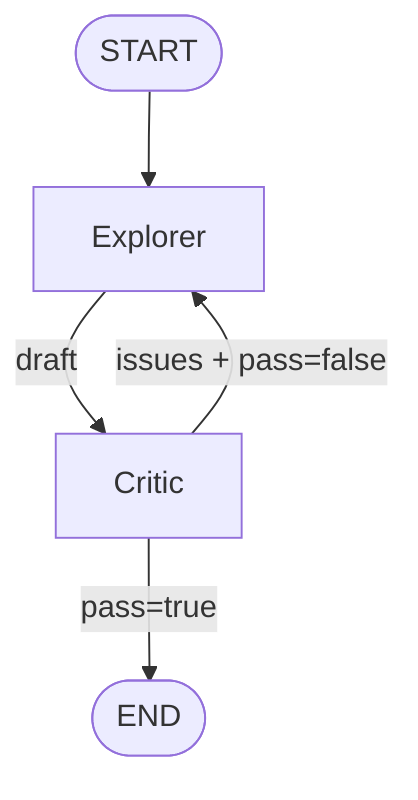
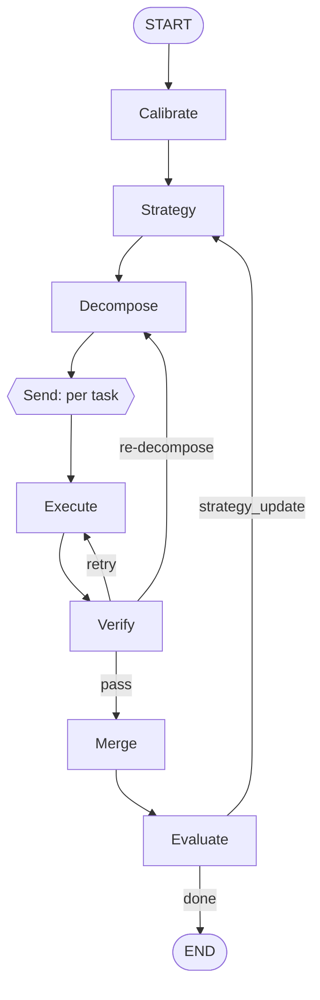
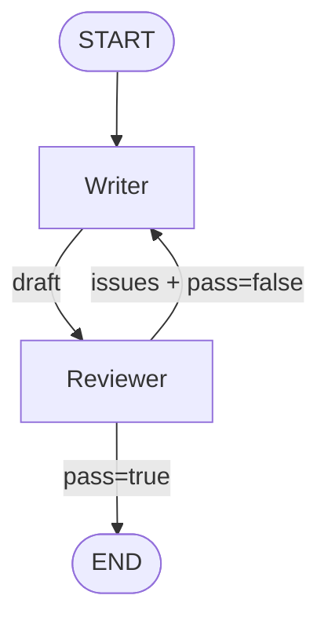

# MAARS Graph 设计

> 这份文档讲**每个阶段的 graph 结构、State schema、Node/Edge**。它是从 [`concept.md`](concept.md) 的思想到 [`architecture.md`](architecture.md) 的技术栈之间的桥——看完这份,代码基本就定了。
>
> **当前状态**:骨架,每个阶段都只给到"图画好、State 框架画好、Node 列清单"的粒度。具体的 prompt、tool 绑定、错误处理要在实现阶段填。

## 0. 通用约定

### 0.1 State 设计原则

- 用 `TypedDict` + `Annotated` + reducer 定义 State。
- **可追加的字段**(list、dict 合并)显式用 reducer,例如:
  ```python
  from typing import Annotated
  from operator import add
  messages: Annotated[list[BaseMessage], add]
  ```
- **可覆盖的字段**不加 reducer,后写覆盖先写。
- **不要往 State 里塞大 blob**(长文本、代码、图表)——那些走文件 side effect,State 里只存路径或 ID。

### 0.2 Checkpointer 约定

- 每次运行一个 `thread_id`,对应一个 session。
- Checkpoint 粒度:默认每个 node 结束后自动 checkpoint(LangGraph 默认行为)。
- Resume:CLI 支持 `--resume <thread_id>`,从最后一个 checkpoint 继续。

### 0.3 Stream 约定

- 所有 node 都通过 `astream_events(v2)` 对外可见。
- Node 内部的 LLM 调用走 `.astream()`,让 token 级别的事件也能透传出去。
- Node 名字就是 stream event 的标签,不要额外打 tag。

---

## 1. Refine Graph

> **目标**:把模糊的研究想法精炼成可执行的研究目标。
>
> **思想参照**:[`concept.md` §2.3 迭代对抗循环](concept.md#23-迭代对抗循环primary--reviewer)

### 1.1 图



### 1.2 State Schema(草图)

```python
class RefineState(TypedDict):
    # 输入
    raw_idea: str

    # 迭代状态
    draft: str                          # 当前 Explorer 的提案
    issues: Annotated[list[Issue], add] # Critic 提出的累计 issues
    resolved: Annotated[list[str], add] # 已解决 issue 的 id 列表
    round: int                          # 当前迭代轮次
    passed: bool                        # Critic 是否认为 pass

    # 输出
    refined_idea: str | None
```

> **待定**:`draft` 是否也需要 append-only?(便于追溯历史版本)。
> 倾向:不需要,checkpoint time-travel 就能看到历史。

### 1.3 Nodes

| Node | 角色 | 输入 | 输出(写入 State) | Tool |
|---|---|---|---|---|
| `explorer` | 起草研究提案 | `raw_idea`, `draft`, `issues` | `draft`, `round += 1` | web search |
| `critic` | 评审提案 | `draft` | `issues`, `resolved`, `passed` | 无(纯 LLM judge) |

### 1.4 Edges

- `START -> explorer`(无条件)
- `explorer -> critic`(无条件)
- `critic -> explorer`(条件:`not passed and round < MAX_ROUND`)
- `critic -> END`(条件:`passed or round >= MAX_ROUND`)

### 1.5 终止条件

- 正常终止:`critic.passed == True`
- 强制终止:`round >= MAX_ROUND`(防止无限循环,默认 5)
- 异常终止:Critic 返回 malformed,按 fallback 策略(TBD)

---

## 2. Research Graph

> **目标**:把研究目标执行成实验结果。
>
> **思想参照**:[`concept.md` §2.4 分解验证循环](concept.md#24-分解验证循环decompose--execute--verify--evaluate)

### 2.1 图(完整版)



### 2.2 State Schema(草图)

```python
class ResearchState(TypedDict):
    # 输入
    refined_idea: str

    # Strategy 层
    calibration: str | None
    strategy: str | None
    strategy_round: int

    # 分解层
    task_tree: dict               # 分解结果
    tasks: list[TaskSpec]         # 扁平化任务列表

    # 执行层(并行)
    task_results: Annotated[dict[str, TaskResult], merge_dict]
    retry_counts: Annotated[dict[str, int], merge_dict]

    # 评估层
    evaluation: dict | None
    overall_score: float | None

    # 输出
    artifacts_dir: str            # 产物落盘路径
    done: bool
```

### 2.3 Nodes

| Node | 角色 | 输入 | 输出 | Tool |
|---|---|---|---|---|
| `calibrate` | 定义原子任务标准 | `refined_idea` | `calibration` | 无 |
| `strategy` | 生成/更新研究策略 | `refined_idea`, `calibration`, `evaluation?` | `strategy`, `strategy_round += 1` | 无 |
| `decompose` | 把策略拆成任务树 | `strategy` | `task_tree`, `tasks` | 无 |
| `execute` | 执行单个原子任务 | `TaskSpec`(via Send) | `task_results[id]` | code exec + search |
| `verify` | 检查任务产出 | `task_results[id]`, `TaskSpec` | pass / retry / re-decompose | 无 |
| `merge` | 等所有任务完成后聚合 | `task_results` | `artifacts_dir` | 无(纯聚合) |
| `evaluate` | 整体评估研究结果 | `task_results`, `strategy` | `evaluation`, `overall_score` | 无 |

### 2.4 并行 Execute:Send API

**核心难点**。`decompose` 生成多个 `TaskSpec` 后,需要用 `Send` 把每个 spec fan-out 到 `execute` node:

```python
def dispatch_tasks(state: ResearchState) -> list[Send]:
    return [Send("execute", {"task": t}) for t in state["tasks"]]

graph.add_conditional_edges("decompose", dispatch_tasks, ["execute"])
```

Fan-in 靠 State reducer(`task_results` 用 dict merge reducer)。

### 2.5 条件边

- `verify -> execute`:retry 次数未超限 + 任务级错误
- `verify -> decompose`:任务级错误致命 + 需要重新拆解(re-decompose 会丢弃当前轮次的结果)
- `verify -> merge`:pass
- `evaluate -> strategy`:`overall_score` 未达阈值 + `strategy_round < MAX_STRATEGY_ROUND`
- `evaluate -> END`:达标或 strategy round 耗尽

### 2.6 终止条件

- 正常:`evaluate.overall_score >= THRESHOLD`
- 强制:`strategy_round >= MAX_STRATEGY_ROUND`
- 单任务失败不会导致整图失败(有 retry + re-decompose 容错)

---

## 3. Write Graph

> **目标**:把研究产出综合成论文。
>
> **思想参照**:[`concept.md` §2.3 迭代对抗循环](concept.md#23-迭代对抗循环primary--reviewer)
>
> **结构同 Refine**:2 node + 1 条件边。Writer 和 Reviewer 的区别只在 prompt 和输入规模(Writer 要读 Research 阶段的全部产出)。

### 3.1 图



### 3.2 State Schema

```python
class WriteState(TypedDict):
    # 输入(从 Research 继承)
    refined_idea: str
    artifacts_dir: str

    # 迭代状态
    draft: str                          # 当前论文草稿
    issues: Annotated[list[Issue], add]
    resolved: Annotated[list[str], add]
    round: int
    passed: bool

    # 输出
    paper: str | None                   # 最终论文路径或内容
```

### 3.3 Nodes 和 Edges

结构与 Refine 几乎对称,不再展开,见 §1。**唯一区别**:

- `writer` 需要从 `artifacts_dir` 读 Research 产出(代码、图表、实验数据),这部分由 writer 内部的 tool 完成,不走 State。
- `reviewer` 的评价标准不同(学术严谨性、叙事连贯性、reproducibility)。

---

## 4. 三阶段衔接

**两种方案**(见 [`architecture.md` §4](architecture.md#4-未决问题)):

### 方案 A:顶层 orchestrator graph

```python
orchestrator = StateGraph(OverallState)
orchestrator.add_node("refine", refine_graph)    # subgraph
orchestrator.add_node("research", research_graph)
orchestrator.add_node("write", write_graph)
orchestrator.add_edge("refine", "research")
orchestrator.add_edge("research", "write")
```

- **优点**:单一 graph、统一 checkpoint、State 直接串联
- **缺点**:State 类型要合并,三阶段耦合,调试单阶段麻烦

### 方案 B:三个独立 graph,文件衔接

每个阶段独立 compile,独立 checkpoint,阶段间通过硬盘上的中间产物传递(类似原 MAARS)。

- **优点**:解耦,可单独跑任意阶段
- **缺点**:失去 State type 级别的串联,断点恢复要跨 graph

**当前倾向:方案 A**。理由:LangGraph 的 subgraph 支持天然就是为这种场景设计的,用方案 B 会浪费 LangGraph 的能力。**但需要看 Refine MVP 跑起来后的实际感受再定**。

---

<!-- TODO: §1 Refine 跑通后,填具体 prompt 和 MAX_ROUND 数字 -->
<!-- TODO: §2 Research 的 Send + reducer 需要最小 demo 验证,尤其是 error 情况下的 reducer 行为 -->
<!-- TODO: §2.3 的 TaskSpec / TaskResult / Issue 等数据结构还没定义,等 Refine 定稿后一起设计 -->
<!-- TODO: §4 三阶段衔接方案,Refine MVP 后二选一 -->
