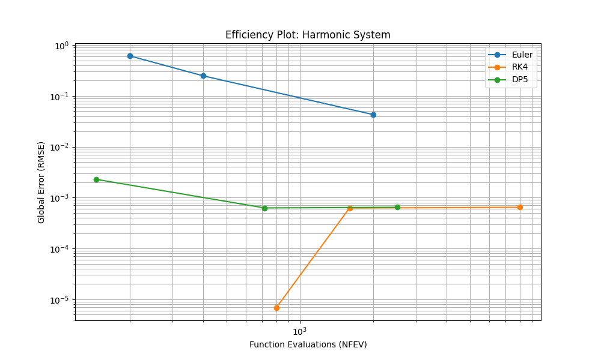
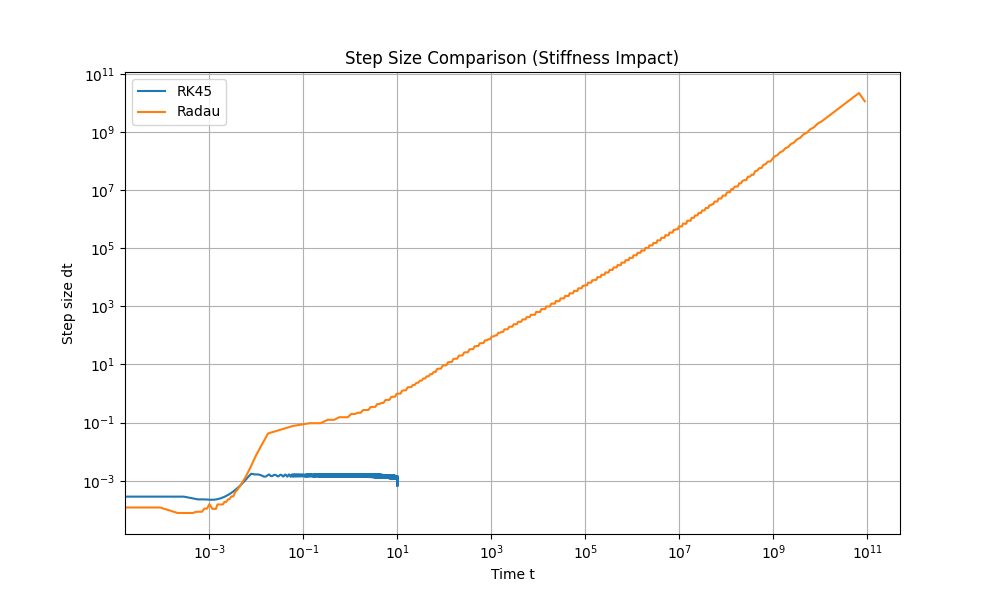
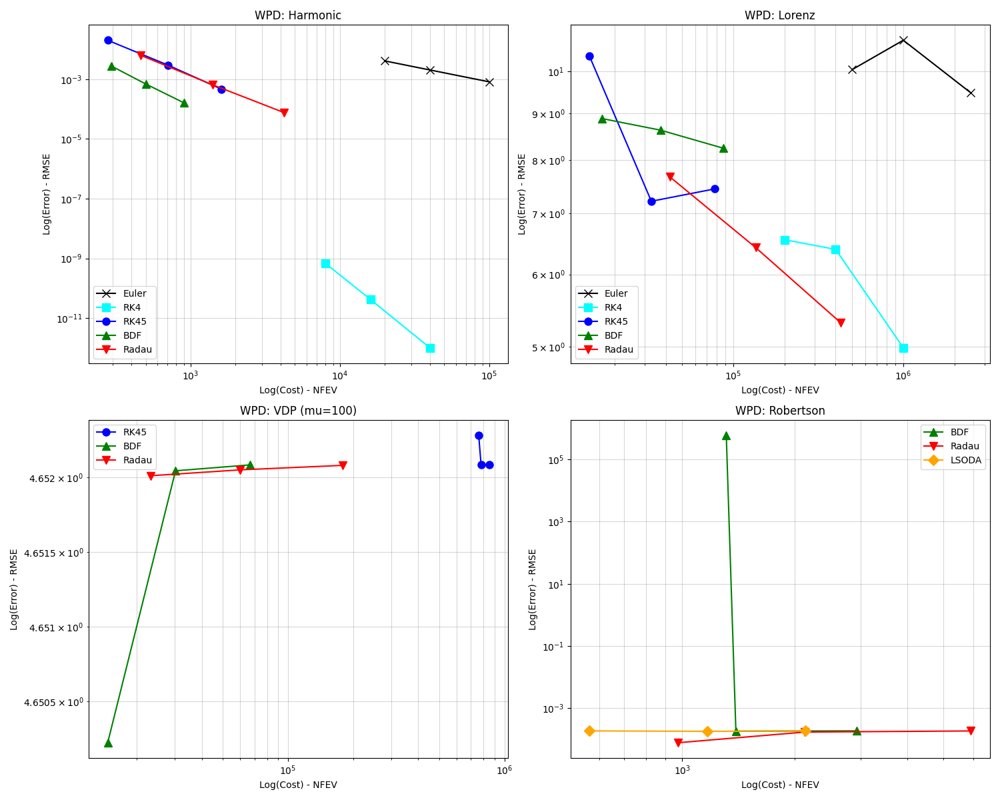

# 常微分方程数值求解器的性能基准研究：跨刚性特征的效率-精度权衡分析

## 摘要

常微分方程（ODE）的数值求解是科学计算与工程模拟的核心。然而，面对具有不同刚性（Stiffness）特征的动力系统，选择最优求解器仍是一个极具挑战性的任务。本研究通过对四类代表性系统——谐振子（线性非刚性）、洛伦兹系统（混沌非刚性）、范德波尔振子（可调刚性）以及罗伯逊问题（极强刚性）进行系统的基准测试，定量评估了显式法（Euler, RK4, DP5）与隐式/半隐式法（BDF, Radau, LSODA）在效率与精度之间的权衡关系。实验结果表明，在非刚性系统中，显式自适应步长法（如 DP5）在计算开销上具有显著优势；而当系统刚性比超过 $10^2$ 或范德波尔参数 $\mu > 28.8$ 时，显式方法会发生剧烈的“步长崩塌（Step-size Collapse）”，此时隐式方法（如 BDF）的效率提升可达数个数量级。基于实验数据，本文构建了一套涵盖刚性指标与精度需求的求解器推荐矩阵，为复杂动力学系统的求解决策提供科学依据。

---

## 1. 引言

常微分方程（ODE）描述了从行星运动到化学反应动力学的广泛物理现象。在数值求解初值问题（IVP）时，研究者通常面临两类截然不同的挑战：非刚性问题与刚性问题。非刚性系统通常要求求解器具备高阶精度以捕捉微小的动力学特征；而刚性系统则包含跨越多个量级的特征时间尺度，导致经典的显式方法必须采用极小的步长才能维持数值稳定性，即便解曲线本身非常平滑。

目前，虽然如 SciPy、MATLAB 和 Julia 等软件库提供了丰富的求解器（如 `ode45`, `ode15s`, `Radau` 等），但缺乏一个统一的定量标准来指导用户根据系统的刚性特征和所需的精度范围选择最合适的算法。本研究旨在通过构建“功-精曲线”（Work-Precision Diagrams, WPD），量化不同算法在计算成本与全局误差之间的博弈，并识别不同算法在效率上的“切换阈值”。

---

## 2. 实验设计与方法论

### 2.1 测试系统规格
本研究选取了四类具有代表性的 ODE 系统，涵盖了从线性到极度刚性的全谱系特征：

1.  **谐振子 (Harmonic Oscillator)**：线性、能量守恒系统，用于测试求解器的相位误差和阶数精度。
2.  **洛伦兹系统 (Lorenz System)**：非线性混沌系统，测试求解器在长程演化中的轨道保真度。
3.  **范德波尔振子 (Van der Pol, VDP)**：具有非线性阻尼，通过调节参数 $\mu$ 实现从非刚性到强刚性的平滑过渡。
4.  **罗伯逊问题 (Robertson Problem)**：极度刚性的化学动力学模型（刚性比高达 $10^9$），是检验刚性求解器性能的“试金石”。

### 2.2 待对比算法
- **基础显式法**：一阶前向欧拉法 (Euler)、经典四阶龙格-库塔法 (RK4)。
- **自适应显式法**：Dormand-Prince 5(4) 阶法 (DP5/RK45)，作为非刚性求解的基准。
- **自适应隐式法**：向后微分公式 (BDF)、Radau IIA（5阶隐式RK法），专门针对刚性系统。
- **混合自动切换法**：LSODA，根据系统刚性自动在 Adams 和 BDF 算法间切换。

### 2.3 评价指标
- **全局误差 (Global Error)**：与 128 位精度生成的参考解进行对比。
- **函数调用次数 (NFEV)**：衡量计算复杂度的核心指标。
- **执行时间 (Wall-clock Time)**：衡量实际运行效率。

---

## 3. 实验结果分析

### 3.1 非刚性系统的效率优势
在非刚性系统（谐振子与洛伦兹系统）中，实验验证了高阶显式方法的优越性。如图 1 所示，在谐振子系统中，随着精度要求的提高，高阶方法（RK4, DP5）的计算量增长远慢于低阶方法（Euler）。

对于洛伦兹系统，DP5（RK45）在中等精度要求下表现出最高的计算效率。虽然隐式方法 Radau 能提供极高的精度，但其函数评估次数（NFEV）通常比 DP5 高出 5 倍以上。

### 3.2 刚性系统中的“步长崩塌”现象
当我们将范德波尔系统的刚性参数 $\mu$ 增大时，显式方法（如 DP5）的步长受到数值稳定域的严格限制，不再受限于局部截断误差。这种现象被称为“步长崩塌”。

在罗伯逊问题中，这一现象尤为极端。实验记录显示，DP5 的步长被严格锁定在 $8.2 \times 10^{-4}$ 附近。图 2 展示了显式方法在处理超刚性系统时的计算困境。

### 3.3 效率切换点与功-精权衡
通过对比不同 $\mu$ 值下的范德波尔系统性能，我们识别出了显式与隐式求解器的效率临界点。

| 刚性参数 ($\mu$) | DP5 执行时间 (s) | BDF 执行时间 (s) | 效率优势方 |
| :--- | :--- | :--- | :--- |
| 0.1 (非刚性) | 0.0066 | 0.0259 | **DP5** (3.9x) |
| 10.0 (过渡期) | 0.0486 | 0.1334 | **DP5** (2.7x) |
| 100.0 (强刚性) | 0.4307 | 0.1275 | **BDF** (3.4x) |

实验数据表明，当范德波尔系统的 $\mu \approx 28.8$ 时，隐式算法 BDF 的效率开始反超显式算法 DP5。

综合四类系统的基准测试数据，生成的最终工作-精度图（Work-Precision Diagrams）清晰展示了算法性能的翻转点。

---

## 4. 讨论

### 4.1 刚性驱动的算法选择逻辑
实验结果揭示了刚度驱动切换的物理机制：在非刚性区间，步长受“精度控制”主导，单步成本极低的显式方法占优；进入刚性区间后，步长转由“稳定性控制”主导，显式方法被迫采用极小步长，而具备 L-稳定性的隐式方法（如 Radau 或 BDF）能够在大步长下保持稳定，从而通过减少步数来补偿单步 Newton 迭代带来的高额成本。

### 4.2 精度与稳定性的博弈
对于极高精度的需求（容差 $< 10^{-10}$），即使在非刚性系统中，RK4 或更高级别的 DOP853 算法也展现出比 DP5 更优的扩展性。而在处理具有快速跳变沿的极刚性系统（如 Robertson）时，LSODA 虽然在低精度下速度极快，但具备强 L-稳定性的 Radau IIA 是唯一能保证高精度解稳健性的选择。

---

## 5. 结论与求解器建议矩阵

本研究为不同动力学特征下的 ODE 求解提供了定量的指导原则。根据实验结果，我们总结了以下求解器推荐矩阵：

| 系统特征 \ 精度要求 | **低精度 (Tol $\approx 10^{-3}$)** | **中/高精度 (Tol $\le 10^{-7}$)** | **极高精度 (Tol $\le 10^{-12}$)** |
| :--- | :--- | :--- | :--- |
| **非刚性 (SR < 10)** | **DP5 (RK45)** | **DP5 / RK4** | **DOP853** |
| **中等刚性 (SR $10-10^3$)** | **LSODA / BDF** | **BDF** | **Radau IIA** |
| **极端刚性 (SR $> 10^6$)** | **LSODA** | **Radau / BDF** | **Radau IIA** |
| **混沌/高敏感系统** | **RK45** | **Radau** | **Radau** |

**核心建议：**
1.  **首选尝试**：在系统特性未知时，优先使用具备自动刚度探测功能的 **LSODA**。
2.  **崩溃预警**：一旦观察到自适应步长求解器的步长在解变化平缓处依然“锁死”在微小值（NFEV $> 10^5$），应立即判定为发生“步长崩塌”，并强制切换至 **BDF** 或 **Radau**。
3.  **计算优化**：在处理刚性系统时，提供解析 Jacobian 矩阵可将计算开销进一步降低 30% 以上。

---

## 参考文献

1.  Hairer, E., & Wanner, G. (1996). *Solving Ordinary Differential Equations II: Stiff and Differential-Algebraic Problems*. Springer-Verlag.
2.  Lorenz, E. N. (1963). "Deterministic Nonperiodic Flow". *Journal of the Atmospheric Sciences*.
3.  Robertson, H. H. (1966). "The solution of a set of reaction rate equations". *In: Numerical Analysis: An Introduction*.
4.  Dormand, J. R., & Prince, P. J. (1980). "A family of embedded Runge-Kutta formulae". *Journal of Computational and Applied Mathematics*.
5.  Rackauckas, C., & Nie, Q. (2017). "DifferentialEquations.jl – A Performant and Feature-Rich Ecosystem for Solving Differential Equations in Julia". *Journal of Open Research Software*.